# BUKU PANDUAN PENGGUNAAN RESMI E-LEARNING UNIVERSITAS ACHMAD YANI (UAY)
**Pedoman Praktis Penggunaan Sistem Pembelajaran Digital Kampus Berbasis Peran**
*Edisi Ramah Pengguna · Terbit: Oktober 2026 · Target Pembaca: Dosen Pengampu, Mahasiswa, Admin Program Studi, & Pimpinan Kampus*

---

## KATA PENGANTAR

Sistem **E-Learning Universitas Achmad Yani (UAY)** yang beralamat resmi di **https://e-learning.uay.ac.id** hadir sebagai sarana pembelajaran digital terpadu untuk mempermudah kegiatan perkuliahan, presensi kelas, pembagian materi, pengumpulan tugas, dan rekapitulasi nilai akhir.

Buku panduan ini disusun khusus agar **sangat mudah dipahami oleh pengguna non-teknis** (Bapak/Ibu Dosen, Saudara/i Mahasiswa, Staf Administrasi Tata Usaha, dan Pimpinan Universitas). Seluruh langkah disajikan secara langsung (*how to use*), bertahap, dan dilengkapi **tangkapan layar antarmuka asli sistem** sehingga Anda dapat langsung mengikuti panduan tanpa kebingungan.

---

## KAMUS ISTILAH SISTEM (GLOSARIUM AWAM)

Untuk memudahkan pembacaan, berikut arti istilah yang ada di sistem dalam bahasa sehari-hari:

| Istilah di Layar | Nama Sehari-hari | Penjelasan Sederhana |
|:---|:---|:---|
| **Akun Kampus (SSO)** | Akun Resmi Mahasiswa / Dosen | Anda cukup menggunakan satu akun resmi UAY (NIM untuk mahasiswa atau email `@uay.ac.id` untuk dosen/staf) untuk membuka semua layanan kampus. |
| **Kelas / Rombel** | Kelas Perkuliahan | Ruang belajar daring untuk satu mata kuliah pada semester aktif (contoh: *Algoritma & Pemrograman - Kelas A*). |
| **Presensi Mandiri** | Absensi Mandiri Mahasiswa | Fitur di mana mahasiswa mencatat kehadirannya sendiri dari ponsel/laptop dengan mengetik 6 digit kode angka atau memindai barcode QR di kelas. |
| **Lembar Roster** | Lembar Absensi Manual Dosen | Daftar seluruh mahasiswa di kelas. Dosen menggunakannya jika ada mahasiswa yang izin resmi, sakit, atau ponselnya bermasalah. |
| **Batas Hadir 75%** | Syarat Minimal Mengikuti Ujian | Aturan resmi universitas: mahasiswa wajib hadir minimal 75% perkuliahan agar berhak mengikuti Ujian Akhir Semester (UAS). |
| **Tugas Kuliah** | Tempat Pengumpulan Tugas | Halaman tempat dosen memberikan instruksi soal dan mahasiswa mengunggah lembar jawaban (PDF/Word). |
| **Kunci Unduhan** | Syarat Selesai Belajar | Pengaturan agar mahasiswa menyimak modul bacaan atau menonton video sampai selesai sebelum tombol download materi aktif. |
| **Buku Nilai (Gradebook)** | Lembar Nilai Akhir Dosen | Tempat dosen menentukan persentase bobot penilaian (Presensi, Tugas, Kuis, UTS, UAS) dan menghitung Nilai Akhir serta Huruf Mutu secara otomatis. |
| **Kloning Kelas** | Salin Materi ke Semester Baru | Fitur praktis bagi dosen untuk menyalin seluruh bahan kuliah ke semester berikutnya hanya dengan 1 kali klik. |
| **Pusat Bantuan** | Layanan Bantuan Pengguna | Menu bantuan terpadu di dalam sistem dan jalur kontak langsung ke Tim Helpdesk TIK UAY. |

---

## DAFTAR ISI PANDUAN

1. [BAB 1: PANDUAN KILAT 3 MENIT (MULAI HARI INI)](#bab-1-panduan-kilat-3-menit-mulai-hari-ini)
   - 1.1 [Panduan Cepat Dosen: Mengajar & Buka Presensi di Kelas](#11-panduan-cepat-dosen-mengajar--buka-presensi-di-kelas)
   - 1.2 [Panduan Cepat Mahasiswa: Masuk Kuliah, Absen, & Kumpul Tugas](#12-panduan-cepat-mahasiswa-masuk-kuliah-absen--kumpul-tugas)
   - 1.3 [Panduan Cepat Admin Prodi: Membuka Kelas Semester Baru](#13-panduan-cepat-admin-prodi-membuka-kelas-semester-baru)
2. [BAB 2: CARA MASUK KE SISTEM (LOGIN AKUN KAMPUS)](#bab-2-cara-masuk-ke-sistem-login-akun-kampus)
   - 2.1 [Langkah-Langkah Masuk Akun](#21-langkah-langkah-masuk-akun)
   - 2.2 [Bila Lupa Kata Sandi](#22-bila-lupa-kata-sandi)
   - 2.3 [Keluar Akun dengan Aman (Logout)](#23-keluar-akun-dengan-aman-logout)
3. [BAB 3: PERAN PENGGUNA DI KAMPUS](#bab-3-peran-pengguna-di-kampus)
4. [BAB 4: PANDUAN LENGKAP UNTUK MAHASISWA](#bab-4-panduan-lengkap-untuk-mahasiswa)
   - 4.1 [Melihat Beranda & Mata Kuliah Aktif](#41-melihat-beranda--mata-kuliah-aktif)
   - 4.2 [Cara Presensi Mandiri (Kode 6-Digit & Barcode QR)](#42-cara-presensi-mandiri-kode-6-digit--barcode-qr)
   - 4.3 [Membaca Materi & Menonton Video Pembelajaran](#43-membaca-materi--menonton-video-pembelajaran)
   - 4.4 [Cara Mengirimkan Berkas Tugas Kuliah](#44-cara-mengirimkan-berkas-tugas-kuliah)
   - 4.5 [Mengerjakan Kuis & Ujian Online](#45-mengerjakan-kuis--ujian-online)
   - 4.6 [Memeriksa Rekap Kehadiran Sendiri (Batas 75%)](#46-memeriksa-rekap-kehadiran-sendiri-batas-75)
   - 4.7 [Melihat Nilai Akhir & Catatan Masukan Dosen](#47-melihat-nilai-akhir--catatan-masukan-dosen)
5. [BAB 5: PANDUAN LENGKAP UNTUK DOSEN PENGAMPU](#bab-5-panduan-lengkap-untuk-dosen-pengampu)
   - 5.1 [Tampilan Utama Dosen & Memilih Kelas](#51-tampilan-utama-dosen--memilih-kelas)
   - 5.2 [Membuka Presensi di Layar Proyektor Kelas](#52-membuka-presensi-di-layar-proyektor-kelas)
   - 5.3 [Mengoreksi Kehadiran Manual di Lembar Roster (Izin / Sakit)](#53-mengoreksi-kehadiran-manual-di-lembar-roster-izin--sakit)
   - 5.4 [Melihat Rekapitulasi Presensi Semester & Kelayakan Ujian](#54-melihat-rekapitulasi-presensi-semester--kelayakan-ujian)
   - 5.5 [Mengunggah Bahan Kuliah (Dokumen PDF, Slide PPT, & Video)](#55-mengunggah-bahan-kuliah-dokumen-pdf-slide-ppt--video)
   - 5.6 [Membuat Tugas Perkuliahan](#56-membuat-tugas-perkuliahan)
   - 5.7 [Memeriksa & Menilai Tugas Mahasiswa](#57-memeriksa--menilai-tugas-mahasiswa)
   - 5.8 [Mengatur Bobot Nilai & Ekspor ke Excel (Buku Nilai)](#58-mengatur-bobot-nilai--ekspor-ke-excel-buku-nilai)
   - 5.9 [Menyalin Materi ke Semester Baru (Fitur Kloning Kelas)](#59-menyalin-materi-ke-semester-baru-fitur-kloning-kelas)
6. [BAB 6: PANDUAN UNTUK PENGELOLA PRODI (ADMIN PRODI)](#bab-6-panduan-untuk-pengelola-prodi-admin-prodi)
   - 6.1 [Membuka Kelas Kuliah Semester Baru](#61-membuka-kelas-kuliah-semester-baru)
   - 6.2 [Menugaskan Dosen Pengampu (Termasuk Dosen Lintas Prodi)](#62-menugaskan-dosen-pengampu-termasuk-dosen-lintas-prodi)
   - 6.3 [Mendaftarkan Mahasiswa ke Dalam Kelas](#63-mendaftarkan-mahasiswa-ke-dalam-kelas)
   - 6.4 [Mencetak Rekap Kehadiran & Nilai Program Studi](#64-mencetak-rekap-kehadiran--nilai-program-studi)
7. [BAB 7: PANDUAN PENGURUS & PIMPINAN UNIVERSITAS](#bab-7-panduan-pengurus--pimpinan-universitas)
   - 7.1 [Pemantauan Keaktifan Kuliah Seluruh Fakultas](#71-pemantauan-keaktifan-kuliah-seluruh-fakultas)
   - 7.2 [Penetapan Kalender Semester & Standar Nilai Huruf Mutu](#72-penetapan-kalender-semester--standar-nilai-huruf-mutu)
8. [BAB 8: ATURAN AKADEMIK & STANDAR NILAI UAY](#bab-8-aturan-akademik--standar-nilai-uay)
   - 8.1 [Tabel Konversi Nilai Angka ke Huruf Mutu](#81-tabel-konversi-nilai-angka-ke-huruf-mutu)
   - 8.2 [Ketentuan Wajib Kehadiran Minimal 75%](#82-ketentuan-wajib-kehadiran-minimal-75)
9. [BAB 9: PERTANYAAN SERING DITANYAKAN (FAQ)](#bab-9-pertanyaan-sering-ditanyakan-faq)
10. [BAB 10: PUSAT BANTUAN & KONTAK RESMI TIK UAY](#bab-10-pusat-bantuan--kontak-resmi-tik-uay)

---

## BAB 1: PANDUAN KILAT 3 MENIT (MULAI HARI INI)

### 1.1 Panduan Cepat Dosen: Mengajar & Buka Presensi di Kelas
Jika Bapak/Ibu Dosen saat ini sudah berada di ruang kuliah dan ingin membuka absensi kelas dalam waktu singkat:

1. Buka peramban internet di laptop Anda, masuk ke **https://e-learning.uay.ac.id**.
2. Klik tombol **"Masuk dengan Akun Kampus"** menggunakan email resmi `@uay.ac.id`.
3. Klik mata kuliah yang sedang berlangsung $
ightarrow$ Pilih menu tab **"Presensi"**.
4. Klik tombol **"+ Buka Presensi Baru"** $
ightarrow$ Atur waktu pengisian (misal: *15 menit*) $
ightarrow$ Klik **"Buka Presensi Sekarang"**.
5. Hubungkan laptop ke layar proyektor kelas. Layar akan langsung menampilkan **6 Angka Kode Kehadiran Besar** dan **Barcode QR** untuk mahasiswa.

> **💡 Tips Cepat Dosen:**
> Bila ada mahasiswa yang tidak membawa HP atau kehabisan paket data, buka tab **"Lembar Presensi (Roster)"**, cari nama mahasiswa tersebut, lalu pilih status **"Hadir"** secara manual.

---

### 1.2 Panduan Cepat Mahasiswa: Masuk Kuliah, Absen, & Kumpul Tugas
Bagi Saudara/i Mahasiswa:

1. **Cara Mengisi Absen Kuliah**:
   - Buka **https://e-learning.uay.ac.id** di ponsel/laptop Anda $
ightarrow$ Masuk dengan NIM Anda.
   - Buka mata kuliah yang sedang diajarkan saat ini.
   - Klik tombol **"Isi Presensi Mandiri"**.
   - Ketik **6 digit kode angka** yang ada di layar proyektor dosen $
ightarrow$ Klik **"Kirim Presensi"**.
2. **Cara Mengumpulkan Tugas**:
   - Buka mata kuliah $
ightarrow$ Klik judul tugas pada pertemuan yang bersangkutan.
   - Klik **"Pilih File"** $
ightarrow$ Pilih berkas tugas Anda (disarankan format **PDF**).
   - Klik tombol **"Kirim Tugas"** $
ightarrow$ Pastikan muncul tanda centang hijau *"Sudah Dikumpulkan Tepat Waktu"*.
3. **Cara Mengecek Kehadiran Sendiri**:
   - Buka tab **"Presensi"** di kelas.
   - Lencana **HIJAU** ($\ge 75\%$) berarti Anda **Aman Mengikuti Ujian (UAS)**.
   - Lencana **MERAH** ($< 75\%$) berarti kehadiran Anda kurang dan berisiko tidak boleh ikut UAS.

---

### 1.3 Panduan Cepat Admin Prodi: Membuka Kelas Semester Baru
Untuk staf tata usaha atau pengelola prodi menjelang perkuliahan semester baru:
1. Masuk ke **https://e-learning.uay.ac.id** dengan akun staf prodi Anda.
2. Buka menu **"Kelas"** di bilah kiri $
ightarrow$ Klik tombol **"+ Buka Kelas Perkuliahan Baru"**.
3. Pilih mata kuliah dari kurikulum prodi, beri nama rombongan belajar (contoh: *Kelas A - Pagi*), dan pilih semester aktif.
4. Klik tab **"Peserta & Pengampu"**:
   - Klik **"+ Tambah Dosen"** untuk menugaskan dosen pengampu (bisa dosen satu prodi maupun dosen lintas fakultas).
   - Klik **"+ Tambah Mahasiswa"** untuk memasukkan daftar mahasiswa sesuai KRS yang disetujui.

---

## BAB 2: CARA MASUK KE SISTEM (LOGIN AKUN KAMPUS)

### 2.1 Langkah-Langkah Masuk Akun
1. Buka peramban internet (Google Chrome, Mozilla Firefox, Safari, atau Microsoft Edge) pada laptop atau ponsel Anda.
2. Ketik alamat situs: **https://e-learning.uay.ac.id**
3. Di halaman utama, Anda akan melihat tampilan gerbang masuk resmi Universitas Achmad Yani.

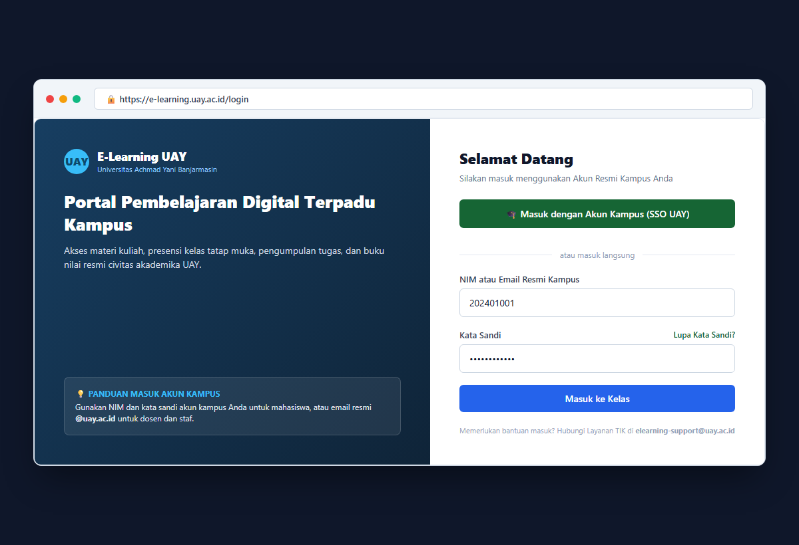
*Gambar 2.1: Tampilan Halaman Masuk Resmi E-Learning UAY (https://e-learning.uay.ac.id/login)*

4. Untuk masuk:
   - Klik tombol hijau **"Masuk dengan Akun Kampus (SSO UAY)"** atau masukkan data Anda pada formulir yang tersedia.
   - **Mahasiswa**: Masukkan **NIM** dan kata sandi akun kampus Anda.
   - **Dosen & Tenaga Kependidikan**: Masukkan **Email Resmi Kampus** (`nama@uay.ac.id`) dan kata sandi akun Anda.
5. Klik tombol **"Masuk ke Kelas"**. Sistem akan mengenali peran Anda secara otomatis dan membuka halaman belajar yang sesuai.

### 2.2 Bila Lupa Kata Sandi
Jika Anda tidak dapat mengingat kata sandi akun Anda:
1. Klik tautan **"Lupa Kata Sandi?"** yang ada di bawah kolom isian sandi.
2. Masukkan NIM atau email kampus yang terdaftar. Petunjuk pemulihan sandi akan dikirim ke email pemulihan Anda.
3. Anda juga dapat langsung mengunjungi **Pusat Layanan TIK UAY** di Gedung Rektorat Lantai 2 untuk bantuan reset sandi.

### 2.3 Keluar Akun dengan Aman (Logout)
Bila Anda menggunakan komputer bersama di laboratorium kampus atau perpustakaan:
1. Klik foto inisial profil Anda di sudut kanan atas layar.
2. Pilih menu bertanda merah **"Keluar" (Logout)**.
3. Menutup peramban saja tidak cukup; selalu pastikan Anda sudah menekan tombol Keluar agar akun belajar Anda terlindungi dari penggunaan orang lain.

---

## BAB 3: PERAN PENGGUNA DI KAMPUS

Sistem E-Learning UAY membagi kewenangan ke dalam 4 kelompok pengguna:

| Peran Pengguna | Penjelasan Peran di Kampus | Contoh Pengguna |
|:---|:---|:---|
| **Mahasiswa** | Mengikuti perkuliahan, mengisi kehadiran mandiri, mengunduh bahan ajar, mengumpulkan tugas, mengikuti ujian, dan melihat nilai. | Seluruh mahasiswa aktif UAY |
| **Dosen Pengampu** | Mengajar mata kuliah, membuka presensi di layar proyektor, mengoreksi absensi manual, membagikan materi, membuat tugas & kuis, dan mengolah nilai akhir. | Dosen tetap & dosen luar prodi |
| **Admin Program Studi** | Menyiapkan rombel kelas tiap semester, menugaskan dosen pengampu, mendaftarkan mahasiswa sesuai KRS, dan mencetak rekap prodi. | Staf Tata Usaha / Admin Prodi |
| **Pimpinan & Pengurus** | Memantau aktivitas perkuliahan seluruh fakultas secara umum melalui layar statistik terpadu. | Rektorat, Dekanat, & Tim TIK |

---

## BAB 4: PANDUAN LENGKAP UNTUK MAHASISWA

### 4.1 Melihat Beranda & Mata Kuliah Aktif
Setelah Anda berhasil masuk, Anda akan langsung disambut oleh **Beranda Mahasiswa**.

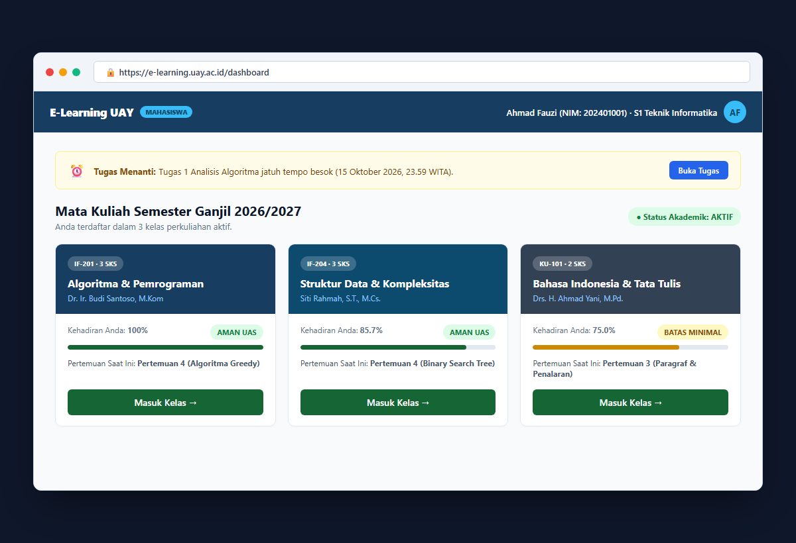
*Gambar 4.1: Tampilan Beranda Mahasiswa dengan Kartu Mata Kuliah dan Pengingat Tugas*

Pada halaman ini terdapat 3 bagian utama:
1. **Pemberitahuan Tugas Mendatang**: Kotak kuning di bagian atas yang mengingatkan tugas apa saja yang harus dikumpulkan dalam waktu dekat beserta batas waktu penyerahannya.
2. **Kartu Mata Kuliah**: Daftar mata kuliah yang Anda program pada semester ini. Setiap kartu menampilkan:
   - Nama mata kuliah, kode MK, dan bobot SKS.
   - Nama dosen pengampu.
   - Persentase kehadiran Anda saat ini (misal: *100% Aman UAS*).
   - Judul pertemuan kuliah yang sedang berjalan.
3. **Tombol "Masuk Kelas"**: Klik tombol ini untuk membuka halaman pertemuan dan bahan belajar mata kuliah tersebut.

---

### 4.2 Cara Presensi Mandiri (Kode 6-Digit & Barcode QR)
Ketika dosen mengumumkan bahwa sesi absensi kelas telah dibuka:
1. Masuk ke mata kuliah yang sedang berlangsung di kelas.
2. Di bagian atas halaman kelas, perhatikan kotak bertuliskan **"Sesi Presensi Pertemuan Telah Dibuka"**.
3. Klik tombol biru **"Isi Presensi Sekarang"**.
4. Jendela pengisian akan muncul di layar ponsel/laptop Anda:

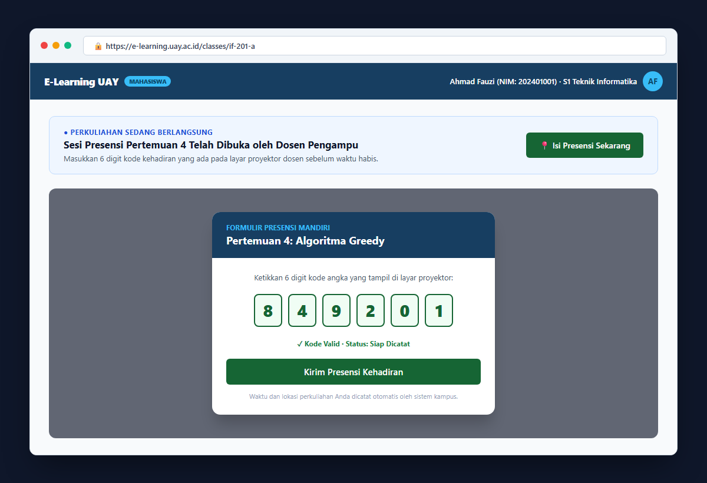
*Gambar 4.2: Tampilan Formulir Presensi Mandiri Mahasiswa dengan Masukan 6 Angka*

5. Perhatikan layar proyektor dosen di depan kelas:
   - Ketikkan **6 digit kode angka** yang tertera di proyektor (misalnya: `8 4 9 2 0 1`).
   - Atau klik ikon kamera untuk memindai **Barcode QR** yang tampil di proyektor.
6. Klik tombol hijau **"Kirim Presensi Kehadiran"**.
7. Sistem akan memverifikasi kode Anda. Bila sukses, status kehadiran Anda langsung berubah menjadi **"HADIR"**.

> **💡 Catatan Penting Mahasiswa:**
> Sesi presensi memiliki batas waktu (biasanya 15 menit). Jangan menunda pengisian kode. Jika ponsel Anda mati atau kuota mendadak habis, segera beritahukan dosen pengampu di kelas agar dosen dapat mencatat nama Anda secara langsung.

---

### 4.3 Membaca Materi & Menonton Video Pembelajaran
Di dalam setiap pertemuan, Bapak/Ibu Dosen menyediakan bahan perkuliahan:
- **Dokumen Bacaan (PDF & Word)**: Anda dapat langsung membaca isi modul di peramban tanpa harus mengunduhnya terlebih dahulu.
- **Slide Presentasi (PPT / PPTX)**: Salindia materi kuliah dapat dipelajari lembar demi lembar.
- **Video Pembelajaran**: Putar video penjelasan kuliah secara normal. Sistem menghitung durasi tontonan asli Anda. Hindari mempercepat secara paksa ke detik terakhir karena sistem membutuhkan bukti tontonan agar materi tercatat selesai.
- **Syarat Unduh Materi**: Bila dosen mengaktifkan aturan penyelesaian, Anda wajib menyimak modul bacaan atau menonton video hingga selesai sebelum tombol download materi menjadi aktif.

---

### 4.4 Cara Mengirimkan Berkas Tugas Kuliah
Ketika ada tugas yang diberikan oleh dosen:
1. Buka mata kuliah $
ightarrow$ Klik judul tugas pada pertemuan yang ditentukan.
2. Baca instruksi tugas, batas waktu pengumpulan, dan format berkas yang diminta.
3. Klik tombol **"Pilih File"**, lalu pilih lembar jawaban tugas Anda dari laptop atau ponsel (format **PDF** sangat disarankan).
4. Klik tombol hijau **"Kirim Tugas"**.

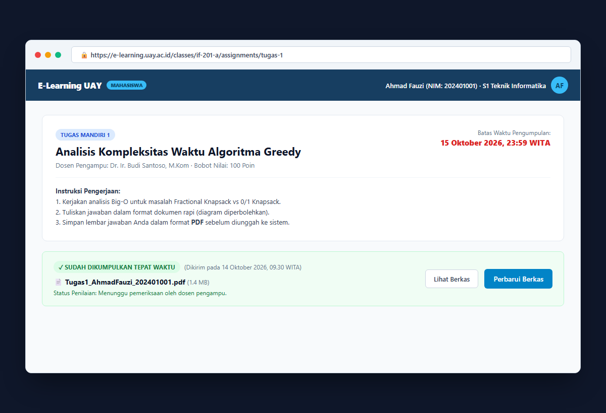
*Gambar 4.3: Halaman Pengumpulan Tugas Mahasiswa dengan Bukti Waktu Kirim Berkas*

5. Setelah berkas terkirim, layar akan menampilkan tanda bukti pengumpulan hijau bertuliskan: **"SUDAH DIKUMPULKAN TEPAT WAKTU"** lengkap dengan tanggal, jam, dan ukuran berkas.
6. Selama batas waktu akhir belum terlewati, Anda masih dapat memperbarui atau menukar berkas bila ada revisi jawaban.

---

### 4.5 Mengerjakan Kuis & Ujian Online
1. Pada pertemuan yang memiliki kuis atau ujian daring, klik tombol **"Mulai Ujian"**.
2. Perhatikan durasi sisa waktu di pojok atas (misal: *60 Menit*).
3. Kerjakan soal satu demi satu.
4. **Penyimpanan Otomatis (Auto-Save)**: Setiap kali Anda memilih opsi jawaban atau mengetik esai, sistem langsung menyimpannya secara otomatis ke server kampus. Jika koneksi internet Anda terputus sejenak, jawaban Anda tidak akan hilang.
5. Setelah seluruh butir soal terjawab, klik tombol **"Kumpulkan dan Selesaikan Ujian"**.

---

### 4.6 Memeriksa Rekap Kehadiran Sendiri (Batas 75%)
1. Klik tab **"Presensi"** di dalam mata kuliah Anda.
2. Layar akan menampilkan daftar seluruh pertemuan dari awal hingga akhir semester beserta status kehadiran Anda.
3. Perhatikan lencana kelayakan:
   - **Lencana Hijau (LAYAK UJIAN)**: Persentase kehadiran Anda $\ge 75\%$. Anda berhak mengikuti Ujian Akhir Semester (UAS).
   - **Lencana Merah (TIDAK LAYAK)**: Persentase kehadiran Anda $< 75\%$. Jika Anda pernah berhalangan hadir karena sakit atau ada tugas dinas kampus, segera serahkan surat bukti resmi kepada dosen pengampu agar status ketidakhadiran Anda diubah menjadi "Sakit" atau "Izin".

---

### 4.7 Melihat Nilai Akhir & Catatan Masukan Dosen
- Buka tab **"Buku Nilai"** di kelas untuk memantau nilai tugas, kuis, nilai UTS, dan nilai UAS.
- Anda dapat mengklik setiap tugas untuk membaca **catatan masukan dan saran evaluasi** yang dituliskan oleh Bapak/Ibu Dosen agar Anda mengetahui aspek mana yang perlu ditingkatkan pada tugas berikutnya.

---

## BAB 5: PANDUAN LENGKAP UNTUK DOSEN PENGAMPU

### 5.1 Tampilan Utama Dosen & Memilih Kelas
Saat Bapak/Ibu Dosen masuk ke E-Learning UAY:
1. Anda akan melihat seluruh kelas perkuliahan yang Anda ampu pada semester aktif ini.
2. Jika Bapak/Ibu mengajar di beberapa program studi sekaligus, Anda dapat menyaring kelas berdasarkan nama prodi.
3. Setiap kelas dilengkapi indikator jumlah peserta mahasiswa dan jumlah tugas yang siap dinilai.

---

### 5.2 Membuka Presensi di Layar Proyektor Kelas
Ketika perkuliahan tatap muka di kelas dimulai:
1. Sambungkan laptop Bapak/Ibu ke proyektor kelas.
2. Buka mata kuliah $
ightarrow$ Klik menu tab **"Presensi"** $
ightarrow$ Klik tombol hijau **"+ Buka Presensi Baru"**.
3. Ketikkan topik perkuliahan hari ini (contoh: *Pertemuan 4: Algoritma Greedy*).
4. Tentukan batas waktu absensi (misalnya: *15 Menit*).
5. Klik **"Buka Presensi Sekarang"**. Layar laptop akan berpindah ke **Mode Layar Proyektor**:

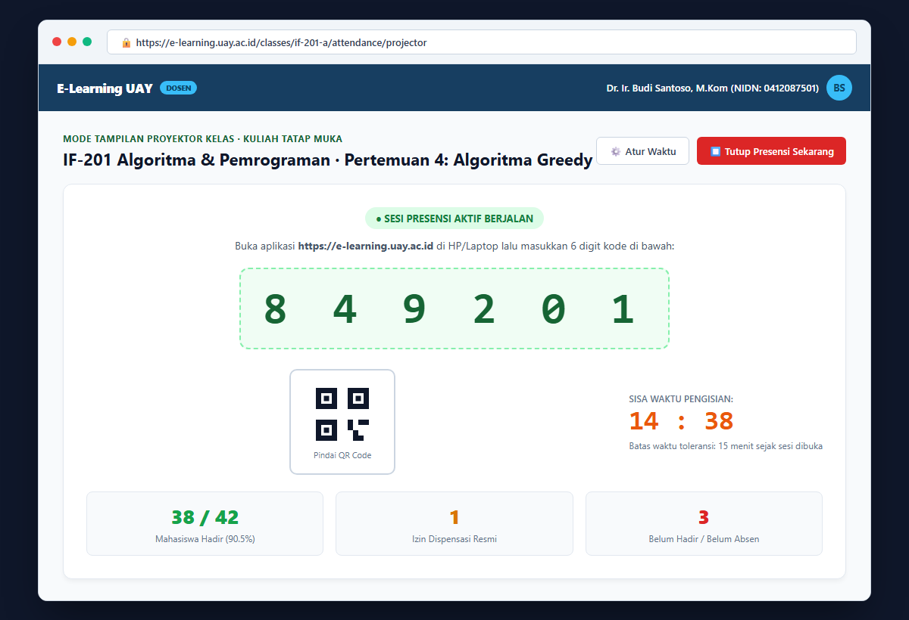
*Gambar 5.1: Mode Layar Proyektor Kelas Menampilkan 6 Digit Kode Angka, Barcode QR, dan Penghitung Hadir Waktu Nyata*

6. Pada layar proyektor tampak:
   - **6 Digit Angka Besar**: Mahasiswa cukup mengetik angka ini di ponsel mereka.
   - **Barcode QR**: Mahasiswa dapat memindainya langsung menggunakan kamera HP.
   - **Penghitung Waktu Mundur**: Menampilkan sisa waktu toleransi presensi.
   - **Live Counter Mahasiswa Hadir**: Menampilkan jumlah mahasiswa yang telah berhasil check-in secara langsung (misal: *38 dari 42 Mahasiswa Hadir*).
7. Setelah waktu habis atau seluruh mahasiswa sudah hadir, Bapak/Ibu dapat menekan tombol merah **"Tutup Presensi Sekarang"**.

---

### 5.3 Mengoreksi Kehadiran Manual di Lembar Roster (Izin / Sakit)
Bila terdapat mahasiswa yang tidak hadir karena sakit, ada dispensasi kegiatan kampus, atau mengalami kendala gawai:
1. Klik tab **"Lembar Presensi (Roster)"** pada pertemuan yang bersangkutan.

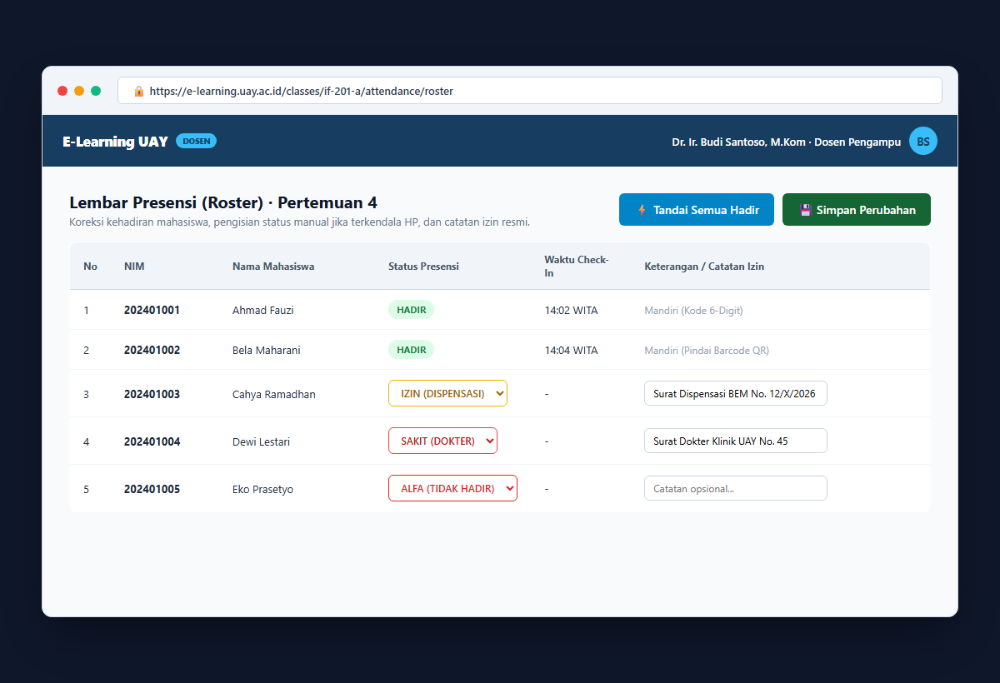
*Gambar 5.2: Lembar Presensi Roster Dosen untuk Pengisian Status Hadir, Izin, Sakit, atau Alfa*

2. Pada baris nama mahasiswa terkait, klik kolom status dan ubah menjadi:
   - **HADIR**: Jika mahasiswa berada di kelas namun terkendala baterai HP/kuota internet.
   - **IZIN**: Jika mahasiswa memiliki surat dispensasi kegiatan resmi organisasi/fakultas.
   - **SAKIT**: Jika mahasiswa melampirkan surat keterangan dokter dari klinik/rumah sakit.
   - **ALFA**: Jika mahasiswa tidak hadir tanpa ada pemberitahuan.
3. Ketikkan nomor surat izin/sakit pada kolom keterangan untuk bukti arsip perkuliahan.
4. **Tombol "Tandai Semua Hadir"**: Bila seluruh kelas hadir tanpa terkecuali, klik tombol ini sekali saja untuk menghemat waktu, lalu klik **"Simpan Perubahan"**.

---

### 5.4 Melihat Rekapitulasi Presensi Semester & Kelayakan Ujian
Bapak/Ibu dapat memantau kedisiplinan perkuliahan mahasiswa sepanjang semester:
1. Klik tab **"Rekap Presensi"** di kelas Anda.

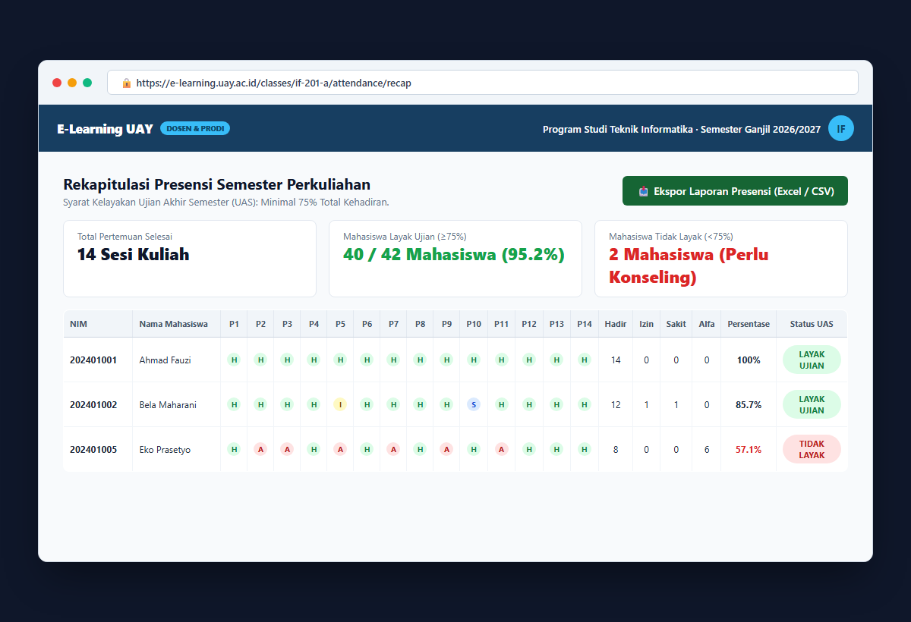
*Gambar 5.3: Rekapitulasi Presensi Perkuliahan Semester dengan Indikator Batas 75% Kelayakan Ujian*

2. Sistem menampilkan matriks lengkap kehadiran dari Pertemuan 1 hingga Pertemuan 14/16:
   - Total Hadir, Izin, Sakit, dan Alfa masing-masing mahasiswa.
   - Kalkulasi persentase kehadiran kumulatif otomatis.
   - **Lencana Hijau (LAYAK UJIAN)**: Mahasiswa memenuhi syarat kehadiran $\ge 75\%$.
   - **Lencana Merah (TIDAK LAYAK)**: Mahasiswa dengan kehadiran $< 75\%$ yang perlu konseling akademik.
3. Klik tombol hijau **"Ekspor Data Presensi (Excel / CSV)"** untuk mengunduh berkas laporan kehadiran sebagai lampiran Berita Acara Perkuliahan (BAP).

---

### 5.5 Mengunggah Bahan Kuliah (Dokumen PDF, Slide PPT, & Video)
Untuk menambahkan bahan ajar pada pertemuan tertentu:
1. Pada pertemuan yang dituju, klik tombol **"+ Tambah Bahan Ajar"**.

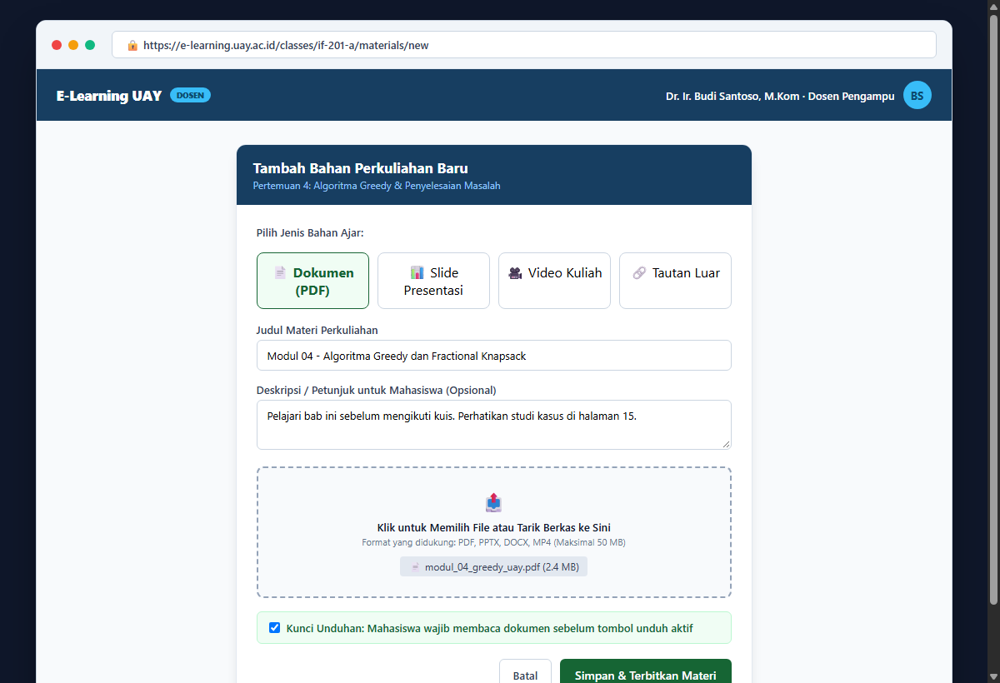
*Gambar 5.4: Jendela Pilihan Tambah Materi Perkuliahan (PDF, Slide PPT, Video, atau Link)*

2. Pilih jenis materi yang ingin dibagikan:
   - **📄 Dokumen**: Untuk modul ajar, silabus, atau bacaan ilmiah (format PDF atau DOCX).
   - **📊 Slide**: Untuk bahan tayang presentasi kuliah (format PPTX atau PDF).
   - **🎥 Video**: Untuk rekaman kuliah atau tutorial video (format MP4 atau tautan video).
   - **🔗 Tautan Luar**: Untuk referensi website perpustakaan atau artikel luar.
3. Masukkan **Judul Materi** dan petunjuk belajar singkat bagi mahasiswa.
4. Tarik berkas dari folder laptop Anda ke kotak unggah (*dropzone*).
5. **Opsi Kunci Unduhan**: Centang kotak *"Mahasiswa wajib membaca/menonton sebelum mengunduh"* jika Bapak/Ibu ingin memastikan mahasiswa menyimak materi terlebih dahulu.
6. Klik tombol **"Simpan & Terbitkan Materi"**.

---

### 5.6 Membuat Tugas Perkuliahan
1. Klik tombol **"+ Tambah Tugas"** pada pertemuan terkait.
2. Tuliskan **Judul Tugas** dan rincian instruksi soal pengerjaan.
3. Atur tanggal dan waktu pengumpulan:
   - **Tenggat Waktu Normal (Due Date)**: Batas waktu penyerahan wajar.
   - **Batas Toleransi Keterlambatan (Cut-off Date)**: Waktu setelah sistem menolak pengumpulan berkas tambahan.
4. Tentukan batas ukuran berkas dan jenis dokumen yang diperbolehkan (misal: *Wajib PDF*).
5. Klik **"Simpan Tugas"**.

---

### 5.7 Memeriksa & Menilai Tugas Mahasiswa
Ketika mahasiswa telah mengumpulkan jawaban:
1. Buka tugas tersebut $
ightarrow$ Klik tab **"Pengumpulan"**.
2. Klik nama mahasiswa yang ingin dinilai. Layar akan menampilkan **Tampilan Pemeriksaan Khusus**:

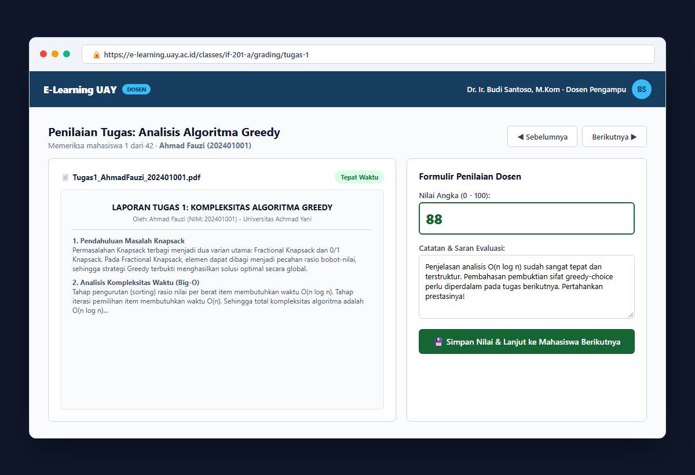
*Gambar 5.5: Layar Penilaian Tugas Dosen dengan Pratinjau Dokumen PDF, Nilai Angka, dan Kolom Catatan Evaluasi*

3. **Pratinjau Dokumen**: Berkas PDF mahasiswa langsung tampil di panel sebelah kiri tanpa perlu Bapak/Ibu unduh satu per satu.
4. **Formulir Nilai**: Masukkan nilai angka (skala 0 sampai 100) di panel sebelah kanan.
5. **Catatan Evaluasi**: Ketikkan saran perbaikan dan masukan bagi mahasiswa agar mereka memahami aspek evaluasi dari Bapak/Ibu.
6. Klik tombol hijau **"Simpan Nilai & Lanjut ke Mahasiswa Berikutnya"**.

---

### 5.8 Mengatur Bobot Nilai & Ekspor ke Excel (Buku Nilai)
Sistem menyediakan **Buku Nilai (Gradebook)** yang secara otomatis mengolah seluruh nilai mahasiswa:
1. Buka tab **"Buku Nilai"** di kelas Anda.

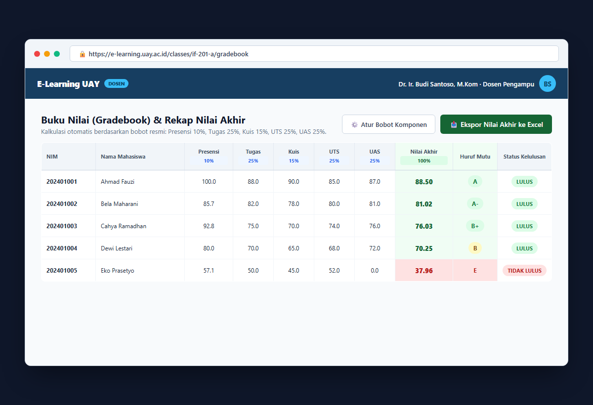
*Gambar 5.6: Buku Nilai (Gradebook) dengan Pengaturan Bobot Komponen, Kalkulasi Otomatis, dan Konversi Huruf Mutu*

2. Klik **"Atur Bobot Komponen"** untuk menentukan persentase setiap unsur penilaian (total wajib berjumlah 100%):
   - Contoh komposisi standar UAY:
     - Presensi Kehadiran: **10%**
     - Tugas & Praktikum: **25%**
     - Kuis Online: **15%**
     - Ujian Tengah Semester (UTS): **25%**
     - Ujian Akhir Semester (UAS): **25%**
3. Sistem secara otomatis menghitung:
   - **Nilai Akhir Angka** (0.00 – 100.00).
   - **Huruf Mutu Resmi** (A, A-, B+, B, B-, C+, C, D, E) sesuai rentang nilai resmi UAY.
   - **Status Kelulusan** (LULUS / TIDAK LULUS).
4. Klik tombol **"Ekspor Nilai Akhir ke Excel"** untuk mengunduh rekapitulasi nilai lengkap siap serah ke bagian akademik prodi/fakultas.

---

### 5.9 Menyalin Materi ke Semester Baru (Fitur Kloning Kelas)
Saat memasuki tahun ajaran atau semester baru, Bapak/Ibu tidak perlu mengetik ulang materi silabus dari nol:
1. Buka kelas semester terdahulu yang materinya ingin digunakan kembali.
2. Klik tombol **"Kloning Kelas Ini"** pada menu pengaturan kelas.
3. Beri nama rombel baru (misal: *Kelas A - Semester Ganjil 2026/2027*).
4. Seluruh modul, susunan pertemuan, tugas, dan kuis akan disalin secara otomatis dalam status draf rapi. Data mahasiswa lama dan presensi lama otomatis dibersihkan sehingga kelas baru langsung siap diajarkan.

---

## BAB 6: PANDUAN UNTUK PENGELOLA PRODI (ADMIN PRODI)

### 6.1 Membuka Kelas Kuliah Semester Baru
Bagi staf tata usaha atau admin program studi:
1. Masuk ke sistem $
ightarrow$ Buka menu **"Kelas"** di bilah navigasi kiri.

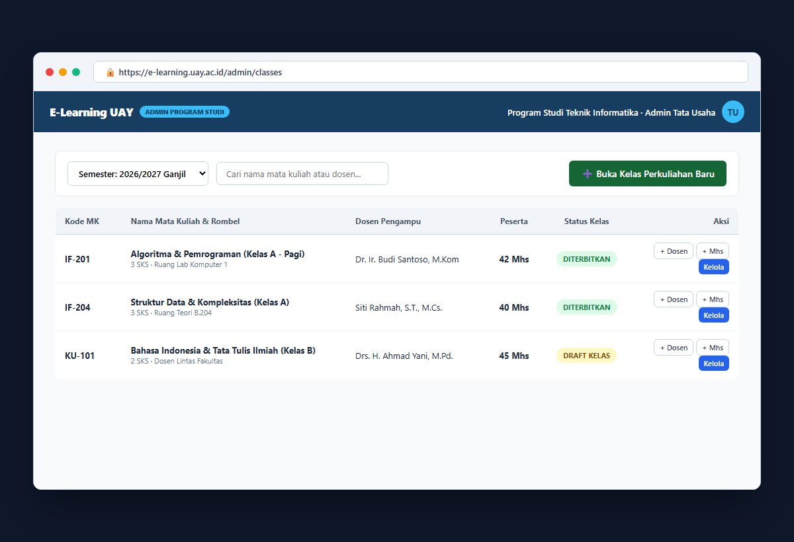
*Gambar 6.1: Layar Pengelolaan Kelas Program Studi oleh Admin Tata Usaha*

2. Klik tombol hijau **"+ Buka Kelas Perkuliahan Baru"**.
3. Pilih nama mata kuliah dari katalog kurikulum prodi yang telah ditetapkan.
4. Beri nama rombongan belajar (contoh: *Kelas A - Pagi*).
5. Pilih tahun ajaran dan semester (misal: *2026/2027 Ganjil*), lalu klik **"Simpan"**.

---

### 6.2 Menugaskan Dosen Pengampu (Termasuk Dosen Lintas Prodi)
1. Buka kelas yang baru dibuat $
ightarrow$ Pilih tab **"Peserta & Pengampu"**.
2. Klik tombol **"+ Tambah Dosen"**.
3. Ketikkan nama atau NIDN dosen pengampu.
4. **Dosen Lintas Prodi/Fakultas**: Jika mata kuliah diampu oleh dosen dari program studi atau fakultas lain (contoh: dosen Bahasa Indonesia, Agama, atau Bahasa Inggris), Anda cukup mengetikkan nama beliau di pencarian. Sistem mendukung penuh penugasan dosen lintas unit tanpa kendala.

---

### 6.3 Mendaftarkan Mahasiswa ke Dalam Kelas
1. Pada tab **"Peserta & Pengampu"**, klik tombol **"+ Tambah Mahasiswa"**.
2. Pilih mahasiswa yang telah menyetujui Kartu Rencana Studi (KRS) untuk mata kuliah tersebut.
3. Mahasiswa yang ditambahkan akan otomatis melihat mata kuliah ini saat mereka masuk ke portal E-Learning UAY.
4. Jika ada mahasiswa yang membatalkan KRS atau cuti kuliah, Anda dapat menonaktifkan status mahasiswa tersebut dari daftar rombel kelas.

---

### 6.4 Mencetak Rekap Kehadiran & Nilai Program Studi
Admin prodi dapat memantau keterlaksanaan perkuliahan di lingkungan prodinya:
- Buka tab **"Rekap Presensi"** dan **"Buku Nilai"** di kelas yang diinginkan.
- Unduh laporan ke format Excel untuk keperluan arsip Berita Acara Perkuliahan (BAP) dan kelengkapan dokumen akreditasi program studi.

---

## BAB 7: PANDUAN PENGURUS & PIMPINAN UNIVERSITAS

### 7.1 Pemantauan Keaktifan Kuliah Seluruh Fakultas
Bagi pimpinan universitas (Rektorat & Dekanat):
- Sistem menyajikan ringkasan statistik keaktifan perkuliahan seluruh fakultas secara waktu nyata:
  - Jumlah kelas perkuliahan yang aktif per semester.
  - Jumlah materi kuliah dan tugas yang dibagikan dosen setiap pekannya.
  - Rata-rata tingkat kehadiran mahasiswa di setiap program studi.
- Informasi disajikan dalam bentuk grafik eksekutif yang bersih, mudah dipantau, dan akuntabel.

### 7.2 Penetapan Kalender Semester & Standar Nilai Huruf Mutu
Pengurus universitas menetapkan semester yang sedang berjalan dan memastikan rentang huruf mutu akademik berlaku seragam di seluruh fakultas di lingkungan UAY.

---

## BAB 8: ATURAN AKADEMIK & STANDAR NILAI UAY

### 8.1 Tabel Konversi Nilai Angka ke Huruf Mutu
Sesuai Peraturan Akademik Universitas Achmad Yani, rentang konversi nilai akhir adalah:

| Rentang Nilai Angka Akhir | Huruf Mutu | Angka Bobot Mutu | Keterangan Kelulusan |
|:---:|:---:|:---:|:---|
| **85,00 s.d. 100** | **A** | **4,00** | Sangat Baik (Istimewa) |
| **80,00 s.d. 84,99** | **A-** | **3,75** | Sangat Baik |
| **75,00 s.d. 79,99** | **B+** | **3,50** | Baik Sekali |
| **70,00 s.d. 74,99** | **B** | **3,00** | Baik |
| **65,00 s.d. 69,99** | **B-** | **2,75** | Cukup Baik |
| **60,00 s.d. 64,99** | **C+** | **2,50** | Cukup |
| **55,00 s.d. 59,99** | **C** | **2,00** | Lulus (Batas Minimal Lulus) |
| **45,00 s.d. 54,99** | **D** | **1,00** | Kurang (Perlu Ujian Ulang) |
| **Di bawah 45,00** | **E** | **0,00** | Tidak Lulus (Wajib Mengulang) |

---

### 8.2 Ketentuan Wajib Kehadiran Minimal 75%
1. Mahasiswa wajib menghadiri **minimal 75%** dari total seluruh pertemuan kuliah semester.
2. Mahasiswa yang persentase kehadirannya di bawah 75% **tidak diperbolehkan mengikuti Ujian Akhir Semester (UAS)**.
3. Rumus persentase kehadiran:
   $$\text{Persentase Kehadiran} = \frac{\text{Jumlah Hadir} + \text{Jumlah Sakit/Izin Resmi}}{\text{Total Pertemuan Selesai}} \times 100\%$$
4. Mahasiswa yang berhalangan hadir karena sakit atau izin resmi wajib menyerahkan surat keterangan kepada dosen pengampu agar dicatat ke lembar Roster sebelum penutupan nilai semester.

---

## BAB 9: PERTANYAAN SERING DITANYAKAN (FAQ)

### 9.1 Kendala Saat Masuk Akun
- **Tanya: Saya tidak bisa masuk ke akun E-Learning UAY.**
  - **Jawaban**: Pastikan Anda membuka situs resmi **https://e-learning.uay.ac.id**. Gunakan NIM dan kata sandi akun kampus Anda untuk mahasiswa, atau email `@uay.ac.id` untuk dosen. Jika masih berkendala, gunakan menu *Lupa Kata Sandi* atau hubungi Helpdesk TIK.

### 9.2 Kendala Presensi Mahasiswa
- **Tanya: Muncul pesan "Kode Kadaluarsa atau Tidak Valid" saat memasukkan 6 angka.**
  - **Jawaban**: 
    1. Pastikan jam di ponsel Anda sudah disetel otomatis dari jaringan internet (WITA).
    2. Periksa apakah batas waktu absensi (15 menit) sudah ditutup dosen. Jika sudah ditutup, mintalah dosen untuk memasukkan kehadiran Anda lewat Lembar Presensi (Roster) manual di laptop dosen.
- **Tanya: Gambar Barcode QR di proyektor dosen tidak terbaca oleh kamera ponsel.**
  - **Jawaban**: Anda tidak harus memindai barcode. Cukup ketikkan **6 digit kode angka** yang tertulis besar di layar proyektor ke kotak presensi di ponsel Anda.

### 9.3 Kendala Mengunggah Tugas
- **Tanya: Muncul peringatan "Ukuran Berkas Terlalu Besar" saat mengumpulkan tugas.**
  - **Jawaban**: Batas berkas langsung di sistem adalah 25 MB. Jika Anda mengumpulkan tugas video atau dokumen berukuran besar, unggah berkas tersebut ke Google Drive akun kampus UAY Anda terlebih dahulu, lalu cantumkan tautan (link) Google Drive tersebut pada kolom tugas di sistem.

---

## BAB 10: PUSAT BANTUAN & KONTAK RESMI TIK UAY

Sistem E-Learning UAY menyediakan portal bantuan mandiri yang dapat diakses langsung dari menu aplikasi:

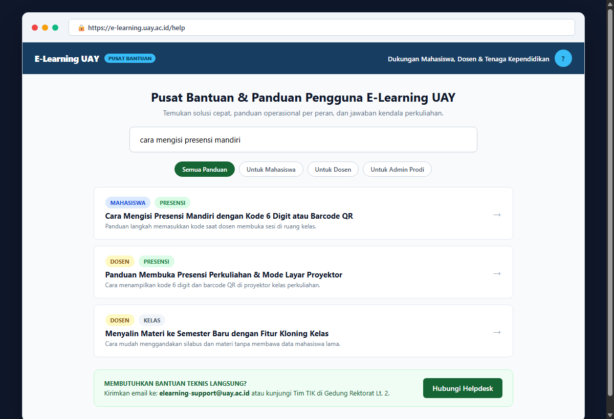
*Gambar 10.1: Pusat Bantuan Pengguna dengan Pencarian Topik Masalah dan Kontak Tim Helpdesk*

Bila Bapak/Ibu Dosen atau Saudara/i Mahasiswa membutuhkan asistensi lebih lanjut:

| Saluran Bantuan | Kontak & Lokasi | Jam Operasional |
|:---|:---|:---:|
| **Surel Bantuan E-Learning** | `elearning-support@uay.ac.id` | Senin – Jumat (08.00 – 16.00 WITA) |
| **Layanan Akun & Sandi Kampus** | `sso-admin@uay.ac.id` | Senin – Jumat (08.00 – 16.00 WITA) |
| **Layanan Tatap Muka** | Gedung Rektorat UAY Lantai 2 (Ruang TIK) | Jam Kerja Kantor Kampus |
| **Pusat Bantuan Mandiri di Aplikasi** | Menu **"Bantuan"** di sudut bilah kiri | 24 Jam Non-Stop |

---
*Diterbitkan oleh Pusat Data, Informasi, dan Pembelajaran Digital Universitas Achmad Yani (UAY) Banjarmasin.*
