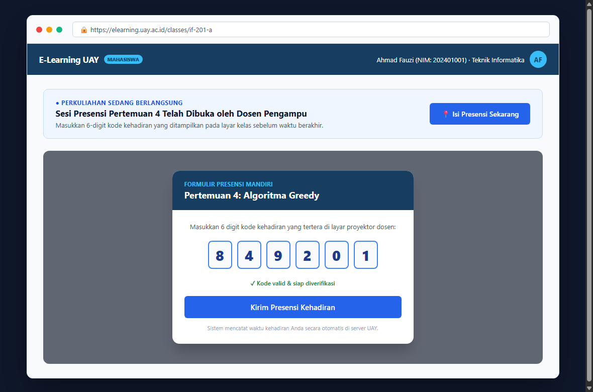
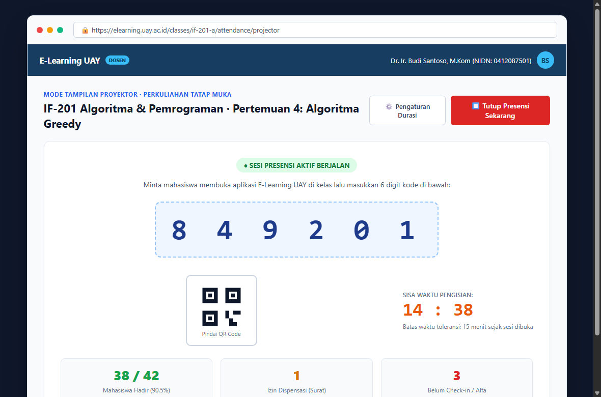
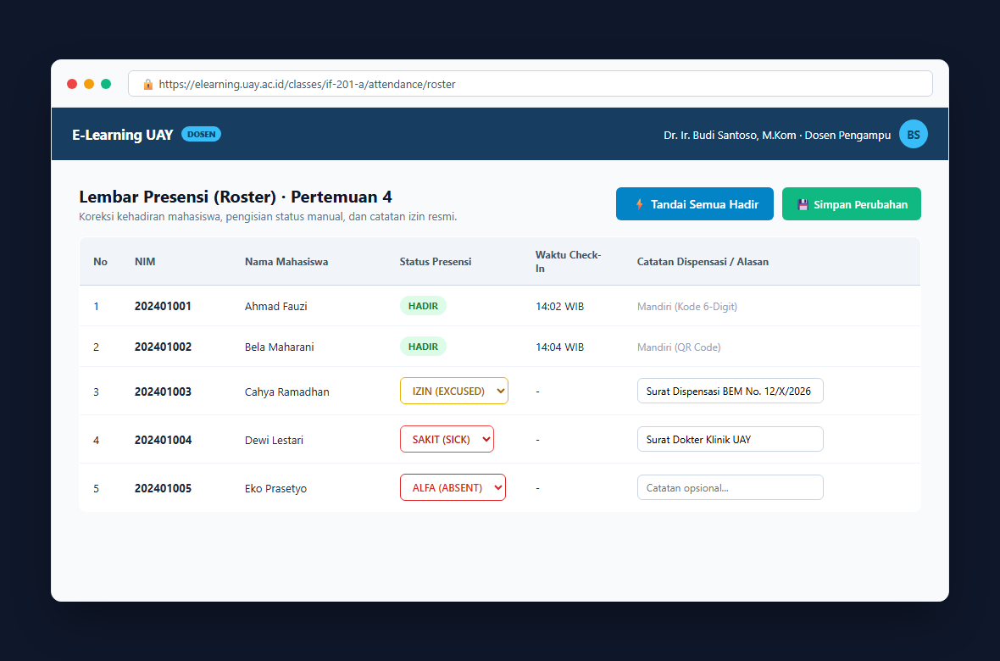
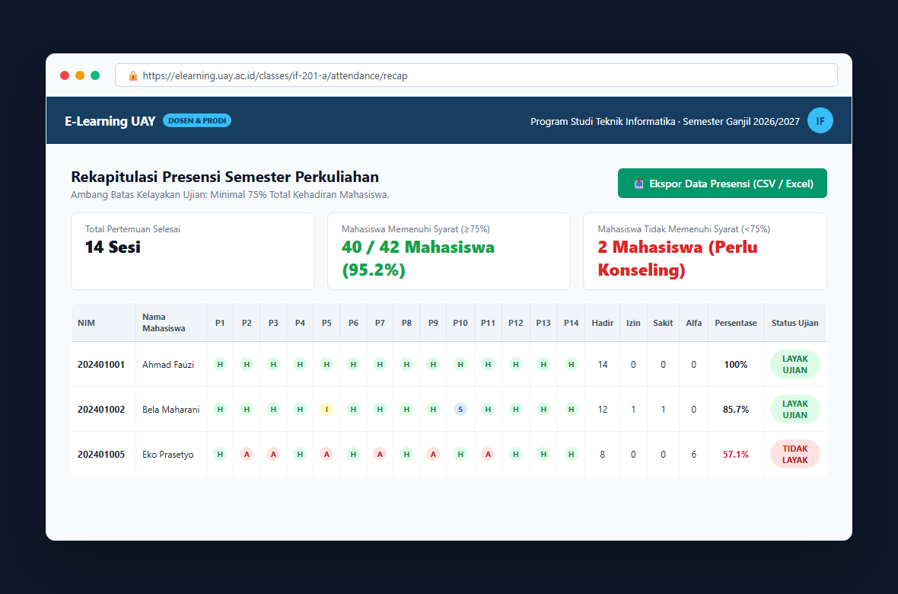
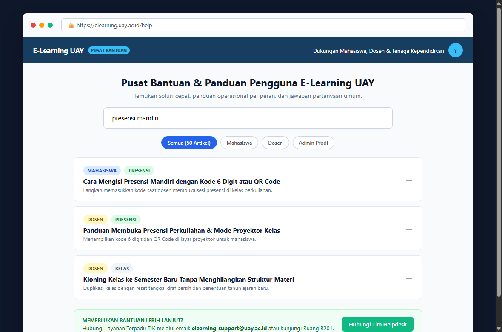

# PANDUAN OPERASIONAL PENGGUNA RESMI E-LEARNING UNIVERSITAS ACHMAD YANI (UAY)
**Dokumen Panduan Alur Kerja Non-Teknis & Petunjuk Pengoperasian Aplikasi**
*Versi Dokumen: 5.1 · Terbit: Oktober 2026 · Target Pembaca: Mahasiswa, Dosen, Admin Program Studi, & Pimpinan Universitas*

---

## DAFTAR ISI
1. [Pendahuluan & Konsep Dasar E-Learning UAY](#1-pendahuluan--konsep-dasar-e-learning-uay)
2. [Alur Autentikasi Tunggal (Single Sign-On / SSO UAY)](#2-alur-autentikasi-tunggal-single-sign-on--sso-uay)
3. [Panduan Operasional: Mahasiswa](#3-panduan-operasional-mahasiswa)
   - 3.1 [Navigasi Beranda & Dashboard Pembelajaran](#31-navigasi-beranda--dashboard-pembelajaran)
   - 3.2 [Mengisi Presensi Mandiri Perkuliahan (Kode 6-Digit & QR)](#32-mengisi-presensi-mandiri-perkuliahan-kode-6-digit--qr)
   - 3.3 [Mempelajari Materi Kuliah (PDF, Slide PPT, & Video)](#33-mempelajari-materi-kuliah-pdf-slide-ppt--video)
   - 3.4 [Mengerjakan Kuis Online & Meninjau Hasil](#34-mengerjakan-kuis-online--meninjau-hasil)
   - 3.5 [Mengunggah Tugas Perkuliahan & Melacak Nilai](#35-mengunggah-tugas-perkuliahan--melacak-nilai)
   - 3.6 [Memantau Syarat Kehadiran Ujian (Ambang Batas $\ge 75\%$)](#36-memantau-syarat-kehadiran-ujian-ambang-batas--75)
4. [Panduan Operasional: Dosen / Pengampu Kelas](#4-panduan-operasional-dosen--pengampu-kelas)
   - 4.1 [Dashboard Dosen & Multi-Afiliasi Program Studi](#41-dashboard-dosen--multi-afiliasi-program-studi)
   - 4.2 [Membuka Sesi Presensi Mandiri (Display Layar Proyektor)](#42-membuka-sesi-presensi-mandiri-display-layar-proyektor)
   - 4.3 [Pengisian & Koreksi Presensi Manual Per Mahasiswa](#43-pengisian--koreksi-presensi-manual-per-mahasiswa)
   - 4.4 [Aksi Cepat "Tandai Semua Hadir" & Catatan Izin/Sakit](#44-aksi-cepat-tandai-semua-hadir--catatan-izinsakit)
   - 4.5 [Mengelola Pertemuan & Mengunggah Materi (Tipe: Dokumen, Slide, Video, Lainnya)](#45-mengelola-pertemuan--mengunggah-materi-tipe-dokumen-slide-video-lainnya)
   - 4.6 [Membuat & Menilai Tugas serta Ujian Kuis](#46-membuat--menilai-tugas-serta-ujian-kuis)
   - 4.7 [Fitur Kloning Kelas: Pengaturan Tahun Ajaran & Reset Jadwal](#47-fitur-kloning-kelas-pengaturan-tahun-ajaran--reset-jadwal)
   - 4.8 [Rekapitulasi Presensi Semester & Ekspor CSV](#48-rekapitulasi-presensi-semester--ekspor-csv)
5. [Panduan Operasional: Administrator Program Studi](#5-panduan-operasional-administrator-program-studi)
   - 5.1 [Isolasi Data Pengguna & Kurikulum Per Program Studi](#51-isolasi-data-pengguna--kurikulum-per-program-studi)
   - 5.2 [Pencarian & Penugasan Dosen Lintas Program Studi](#52-pencarian--penugasan-dosen-lintas-program-studi)
   - 5.3 [Monitoring Kesiapan Perkuliahan & Pelaporan Akademik](#53-monitoring-kesiapan-perkuliahan--pelaporan-akademik)
6. [Panduan Operasional: Super Administrator & Pimpinan Universitas](#6-panduan-operasional-super-administrator--pimpinan-universitas)
   - 6.1 [Universal Scope & Pengaturan Hak Akses Global](#61-universal-scope--pengaturan-hak-akses-global)
   - 6.2 [Bridging Integrasi Dashboard Rektor UAY](#62-bridging-integrasi-dashboard-rektor-uay)
7. [Pusat Bantuan & Layanan Kendala (Help Center)](#7-pusat-bantuan--layanan-kendala-help-center)

---

## 1. PENDAHULUAN & KONSEP DASAR E-LEARNING UAY

Aplikasi **E-Learning Universitas Achmad Yani (UAY)** adalah platform pembelajaran digital resmi kampus yang dirancang untuk mendukung aktivitas perkuliahan tatap muka maupun daring.

### Nilai Utama Sistem:
1. **Terintegrasi Penuh (Zero-Password Lokal)**: Masuk cukup menggunakan satu akun email kampus UAY melalui SSO resmi.
2. **Terisolasi Rapi per Program Studi**: Mahasiswa dan admin prodi hanya berinteraksi dengan kurikulum dan data yang relevan dengan prodinya. Dosen yang mengajar di lebih dari satu prodi (multi-afiliasi) dapat berpindah konteks dengan lancar.
3. **Akuntabilitas Kehadiran Terstandar**: Mendukung pencatatan kehadiran mandiri maupun manual dengan batas kelayakan ujian minimal **75%**.
4. **Pemantauan Pimpinan Secara Real-Time**: Terhubung langsung dengan **Dashboard Rektor UAY** untuk monitoring mutu aktivitas perkuliahan berkala.

---

## 2. ALUR AUTENTIKASI TUNGGAL (SINGLE SIGN-ON / SSO UAY)

Sistem E-Learning UAY tidak menyimpan kata sandi pengguna secara lokal demi menjaga keamanan data akademik. Seluruh login dialihkan langsung ke Portal Resmi SSO UAY.

```
+---------------------+           +------------------------+           +-----------------------+
|  Browser Pengguna   |  ----->   |   Portal SSO Kampus    |  ----->   |   E-Learning UAY      |
|  (Buka E-Learning)  |           | (Keycloak + MFA 2-FA)  |           | (Sesi Aktif Otomatis) |
+---------------------+           +------------------------+           +-----------------------+
   Klik "Masuk SSO"                 Masukkan Email & Password              Langsung ke Dashboard
```

### Langkah Masuk:
1. Akses alamat web **E-Learning UAY** melalui peramban (browser) di komputer atau ponsel pintar.
2. Klik tombol utama **"Masuk dengan SSO UAY"**.
3. Sistem akan secara otomatis mengarahkan peramban Anda ke halaman login resmi universitas (`https://sso.uay.ac.id`).
4. Masukkan **Email Kampus** (atau NIM/NIDN) beserta kata sandi SSO Anda. Jika akun Anda mengaktifkan Autentikasi Dua Faktor (2FA), masukkan 6 digit kode dari aplikasi authenticator.
5. Setelah berhasil, Anda akan otomatis kembali ke E-Learning UAY dan diarahkan ke Dashboard sesuai peran masing-masing.

---

## 3. PANDUAN OPERASIONAL: MAHASISWA

### 3.1 Navigasi Beranda & Dashboard Pembelajaran
Setelah berhasil masuk, Anda akan disambut oleh halaman utama Mahasiswa:

```
+---------------------------------------------------------------------------------------+
| [LOGO UAY] E-Learning UAY      [Cari Mata Kuliah]          [Notifikasi] (Foto) NAMA   |
+---------------------------------------------------------------------------------------+
| Halo, Ahmad Fauzi (NIM: 202401001) · Program Studi Teknik Informatika                 |
+---------------------------------------------------------------------------------------+
| RINGKASAN AKADEMIK:                                                                   |
| [ 6 Kelas Aktif ]      [ 2 Tugas Menunggu ]      [ Rata-rata Kehadiran: 92% (Aman) ] |
+---------------------------------------------------------------------------------------+
| KELAS SEMESTER INI:                                                                   |
| +-------------------------+ +-------------------------+ +---------------------------+ |
| | Pemrograman Web Lanjut  | | Basis Data Relasional   | | Rekayasa Perangkat Lunak  | |
| | Dosen: Dr. Budi Santoso | | Dosen: Siti Aminah, M.T | | Dosen: Dr. Budi Santoso   | |
| | Progres: 80%            | | Progres: 65%            | | Progres: 90%              | |
| | [ Buka Kelas ]          | | [ Buka Kelas ]          | | [ Buka Kelas ]            | |
| +-------------------------+ +-------------------------+ +---------------------------+ |
+---------------------------------------------------------------------------------------+
```

### 3.2 Mengisi Presensi Mandiri Perkuliahan (Kode 6-Digit & QR)
Ketika dosen mengumumkan bahwa presensi perkuliahan telah dibuka di kelas:
1. Buka kelas mata kuliah yang sedang berlangsung.
2. Pada bagian atas halaman kelas, akan muncul kartu sorotan **"Presensi Perkuliahan Sedang Dibuka"**.
3. Klik tombol **"Isi Presensi Mandiri"**.
4. Jendela dialog akan terbuka. Masukkan **6 Digit Kode Kehadiran** (contoh: `892341`) yang ditampilkan dosen pada proyektor/layar presentasi.
   > **Catatan:** Kode bersifat *case-insensitive* (tidak terpengaruh huruf besar/kecil) dan spasi tidak sengaja akan otomatis dibersihkan oleh sistem.
5. Klik **"Kirim Presensi Sekarang"**.
6. Muncul pesan konfirmasi: *"Presensi Berhasil Dicatat: HADIR"*.


*Gambar 1: Dialog Pengisian Presensi Mandiri 6-Digit oleh Mahasiswa pada Peramban/Gawai.*

### 3.3 Mempelajari Materi Kuliah (PDF, Slide PPT, & Video)
Materi dalam E-Learning UAY tersusun rapi berdasarkan Pertemuan:
- **Dokumen Silabus & Modul (PDF)**: Klik berkas materi untuk membaca langsung di dalam penampil dokumen terintegrasi atau mengunduhnya untuk dipelajari offline.
- **Slide Presentasi (PPT/PDF Slide Deck)**: Anda dapat menavigasi slide per slide langsung di aplikasi tanpa perlu menginstal aplikasi pihak ketiga.
- **Video Pembelajaran**: Pemutar video terintegrasi dilengkapi kendali jeda (*pause*), percepat kecepatan (*speed*), dan resolusi. Progres menonton Anda tercatat secara otomatis ketika video diputar.

### 3.4 Mengerjakan Kuis Online & Meninjau Hasil
1. Klik judul kuis pada pertemuan yang ditentukan.
2. Periksa petunjuk pengerjaan: durasi pengerjaan (contoh: 45 menit), jumlah batas percobaan (*attempt*), dan batas akhir pengerjaan.
3. Klik **"Mulai Pengerjaan Kuis"**.
4. Kerjakan soal satu demi satu (Pilihan Ganda, Benar/Salah, Isian Singkat, atau Esai).
5. Jawaban Anda tersimpan otomatis (*auto-save*) setiap kali Anda memilih atau mengetik opsi.
6. Setelah selesai, klik **"Kumpulkan dan Selesaikan"**. Hasil skor instan (jika diaktifkan dosen) akan langsung muncul beserta rekapitulasi waktu.

### 3.5 Mengunggah Tugas Perkuliahan & Melacak Nilai
1. Klik item tugas pada pertemuan terkait.
2. Perhatikan instruksi tugas, rubrik penilaian, batas pengumpulan (*deadline*), dan batas toleransi keterlambatan (*cut-off*).
3. Seret dan lepas berkas dokumen laporan Anda (format PDF, DOCX, ZIP sesuai instruksi) ke area pengunggahan.
4. Klik **"Simpan & Kirim Tugas"**.
5. Setelah dosen memeriksa, Anda akan menerima notifikasi nilai beserta masukan/komentar koreksi dosen.

### 3.6 Memantau Syarat Kehadiran Ujian (Ambang Batas $\ge 75\%$)
Universitas Achmad Yani menerapkan aturan akademik ketat terkait kelayakan mengikuti Ujian Tengah Semester (UTS) dan Ujian Akhir Semester (UAS):
- **Wajib hadir minimal 75%** dari total sesi perkuliahan tatap muka.
- Buka tab **"Presensi"** di dalam kelas untuk melihat rekapitulasi pribadi:
  - Total Sesi Perkuliahan: misal 16 Sesi.
  - Jumlah Hadir / Izin / Sakit / Alfa.
  - **Status Kelayakan Ujian**:
    - $\ge 75\%$: **"MEMENUHI SYARAT UJIAN"** (Lencana Hijau).
    - $< 75\%$: **"BELUM MEMENUHI SYARAT UJIAN"** (Lencana Merah peringatan agar segera menghubungi dosen wali/pengampu).

---

## 4. PANDUAN OPERASIONAL: DOSEN / PENGAMPU KELAS

### 4.1 Dashboard Dosen & Multi-Afiliasi Program Studi
Bagi Dosen yang mengajar pada lebih dari satu Program Studi (misalnya mengampu mata kuliah di prodi *Teknik Informatika* sekaligus *Sistem Informasi*):
- Sistem secara otomatis mengenali seluruh prodi afiliasi Anda melalui token SSO.
- Pada daftar kelas, Anda dapat memfilter tampilan kelas berdasarkan program studi terkait dengan satu kali klik.

```
+---------------------------------------------------------------------------------------+
| [LOGO UAY] E-Learning UAY · Dashboard Dosen                [Notifikasi] (Foto) DOSEN  |
+---------------------------------------------------------------------------------------+
| Filter Program Studi: [ SEMUA PRODI ] [ Teknik Informatika ] [ Sistem Informasi ]     |
+---------------------------------------------------------------------------------------+
| KELAS AKTIF ANDA (SEMESTER GANJIL 2026/2027):                                         |
| +------------------------------------+ +--------------------------------------------+ |
| | IF-201 Algoritma & Pemrograman (A) | | SI-305 Manajemen Proyek TI (B)             | |
| | Prodi: Teknik Informatika          | | Prodi: Sistem Informasi                    | |
| | 42 Mahasiswa Terdaftar             | | 38 Mahasiswa Terdaftar                     | |
| | [ Buka Kelas ] [ Kelola Presensi ] | | [ Buka Kelas ] [ Kelola Presensi ]         | |
| +------------------------------------+ +--------------------------------------------+ |
+---------------------------------------------------------------------------------------+
```

### 4.2 Membuka Sesi Presensi Mandiri (Display Layar Proyektor)
Untuk memulai perkuliahan tatap muka dan membiarkan mahasiswa melakukan presensi mandiri:
1. Masuk ke kelas mata kuliah Anda, lalu pilih tab **"Presensi"**.
2. Klik tombol **"Buka Sesi Presensi Baru"**.
3. Isi parameter sesi:
   - **Judul Sesi**: contoh *"Pertemuan 5: Normalisasi Basis Data"*.
   - **Tipe**: Pilih *"Mandiri (Kode 6-Digit)"*.
   - **Durasi Aktif**: Pilih 15 Menit, 30 Menit, atau 60 Menit.
4. Klik **"Buka Presensi Sekarang"**.
5. Layar Anda akan memuat **Mode Tampilan Proyektor (Projector Mode)**:
   - Menampilkan kode 6 digit dalam ukuran besar (contoh: **4 1 8 9 2 0**).
   - Menampilkan QR Code yang dapat langsung dipindai mahasiswa dengan kamera ponsel.
   - Menampilkan hitung mundur waktu aktif (*countdown timer*).
   - Menampilkan jumlah mahasiswa yang telah berhasil check-in secara langsung (*live counter*).


*Gambar 2: Mode Tampilan Proyektor Sesi Presensi Aktif untuk Dosen di Ruang Kuliah.*

### 4.3 Pengisian & Koreksi Presensi Manual Per Mahasiswa
Jika ada mahasiswa yang mengalami kendala teknis (baterai habis, tidak membawa gawai, atau izin resmi):
1. Dosen dapat langsung beralih ke sub-tab **"Lembar Presensi (Roster)"**.
2. Cari nama atau NIM mahasiswa bersangkutan pada tabel.
3. Ubah dropdown status kehadiran:
   - **Hadir (PRESENT)**: Mahasiswa mengikuti perkuliahan.
   - **Izin (EXCUSED)**: Mahasiswa izin dispensasi kegiatan kampus / dinas.
   - **Sakit (SICK)**: Mahasiswa berhalangan karena sakit (lampirkan surat dokter).
   - **Alfa (ABSENT)**: Mahasiswa tidak hadir tanpa keterangan.
4. Masukkan catatan dispensasi pada kolom **Catatan** (misal: *"Surat dokter No. 042/KLINIK/X/2026"*).
5. Klik **"Simpan Perubahan Presensi"**.


*Gambar 3: Lembar Presensi (Roster) Kelas dengan Pengisian Status Manual & Catatan Dispensasi.*

### 4.4 Aksi Cepat "Tandai Semua Hadir" & Catatan Izin/Sakit
Pada kelas luring penuh di mana seluruh mahasiswa hadir:
- Dosen tidak perlu mengeklik satu per satu. Cukup klik tombol biru **"Tandai Semua Hadir"**.
- Seluruh peserta yang berstatus *Alfa* akan otomatis berubah menjadi *Hadir*.
- Jika ada 1-2 mahasiswa yang tidak masuk, dosen cukup mengganti status mahasiswa tersebut sebelum mengeklik Simpan.

### 4.5 Mengelola Pertemuan & Mengunggah Materi (Tipe: Dokumen, Slide, Video, Lainnya)
1. Pada tab **"Pertemuan"**, klik **"Tambah Pertemuan"** atau pilih pertemuan yang sudah ada.
2. Klik **"Tambah Konten Materi"**.
3. Pilih tipe materi yang sesuai pada dropdown:
   - **DOKUMEN**: Untuk silabus perkuliahan, modul ajar, dan handout (PDF/DOCX).
   - **SLIDE**: Untuk materi presentasi kuliah (PPT/PPTX/PDF Slide).
   - **VIDEO**: Untuk rekaman kuliah daring atau tautan video tutorial (MP4/YouTube).
   - **LAINNYA**: Untuk berkas praktikum, dataset, tautan repositori kode (*GitHub*), atau materi pendukung tambahan.
4. Tulis judul materi, instruksi, dan seret berkas materi ke area unggah.
5. Klik **"Simpan & Terbitkan"**.

### 4.6 Membuat & Menilai Tugas serta Ujian Kuis
- **Tugas**: Tentukan tanggal batas waktu pengumpulan (*Due Date*) dan batas penerimaan tugas terlambat (*Cut-off Date*). Berikan rubrik penilaian agar mahasiswa memahami kriteria evaluasi secara transparan.
- **Kuis & Bank Soal**: E-Learning UAY mendukung 8 variasi tipe pertanyaan: Pilihan Ganda, Pilihan Ganda Kompleks (Banyak Jawaban), Benar/Salah, Menjodohkan, Mengurutkan, Isian Singkat, Numerik, dan Esai Bebas. Dosen dapat mengacak urutan soal dan opsi jawaban untuk meminimalkan kecurangan.

### 4.7 Fitur Kloning Kelas: Pengaturan Tahun Ajaran & Reset Jadwal
Ketika memasuki semester baru dan Anda ingin menggunakan kembali silabus dan struktur pertemuan semester sebelumnya:
1. Buka kelas acuan yang ingin diduplikasi, lalu klik tombol **"Kloning Kelas Ini"**.
2. Jendela dialog kloning akan meminta input:
   - **Nama Kelas Baru**: contoh *"Pemrograman Web Lanjut (Kelas B)"*.
   - **Tahun Ajaran / Periode Semester Baru**: Pilih dari daftar terstandar, misalnya `2026/2027 Ganjil`.
3. **Mekanisme Otomatis Sistem E-Learning UAY saat Kloning**:
   - Konten materi, tugas, dan kuis disalin ke dalam status **Draf Bersih (Clean Draft)**.
   - Jadwal pengumpulan tugas dan kuis masa lalu otomatis di-reset ke status belum terjadwal agar tidak membingungkan mahasiswa baru.
   - Peserta kelas lama **TIDAK** diikutsertakan (kelas baru dimulai dengan 0 peserta), menjaga privasi dan kebersihan data antar-angkatan.

### 4.8 Rekapitulasi Presensi Semester & Ekspor CSV
1. Masuk ke tab **"Presensi"** $\rightarrow$ sub-tab **"Rekap Semester"**.
2. Anda akan disajikan matriks lengkap:
   - Nama & NIM Mahasiswa.
   - Kolom Pertemuan 1 hingga Pertemuan Terakhir beserta status masing-masing.
   - Total Persentase Kehadiran (%) dan Lencana Kelayakan Ujian.
3. Klik tombol **"Ekspor Data Presensi (CSV)"** untuk mengunduh rekapitulasi yang kompatibel dengan Microsoft Excel atau pelaporan berkas Berita Acara Perkuliahan (BAP).


*Gambar 4: Matriks Rekapitulasi Presensi Semester, Persentase Kehadiran, dan Status Kelayakan Ujian.*

---

## 5. PANDUAN OPERASIONAL: ADMINISTRATOR PROGRAM STUDI

### 5.1 Isolasi Data Pengguna & Kurikulum Per Program Studi
Sistem E-Learning UAY menerapkan prinsip pembatasan lingkup data ketat (*Department-Level Data Scoping*):
- Admin Prodi Teknik Informatika hanya dapat melihat mahasiswa, dosen, dan mata kuliah di lingkungan Prodi Teknik Informatika.
- Admin Prodi tidak dapat mengakses atau memodifikasi data program studi lain secara tidak sah.

### 5.2 Pencarian & Penugasan Dosen Lintas Program Studi
Jika suatu mata kuliah prodi diampu oleh dosen dari prodi lain (dosen lintas-afiliasi):
1. Admin Prodi membuka menu **"Kelola Kelas"** $\rightarrow$ **"Tetapkan Pengampu"**.
2. Di kotak pencarian dosen, masukkan NIDN atau Nama Dosen.
3. Dosen yang memiliki hak multi-afiliasi pada prodi tersebut akan muncul pada hasil pencarian.
4. Tetapkan peran sebagai *Dosen Utama* atau *Dosen Pendamping (Team Teaching)*.

### 5.3 Monitoring Kesiapan Perkuliahan & Pelaporan Akademik
Admin Prodi dapat memantau:
- Berapa banyak kelas yang sudah menerbitkan silabus dan materi di minggu pertama perkuliahan.
- Rasio kehadiran perkuliahan per semester sebagai laporan berkala kepada Ketua Program Studi dan Dekan Fakultas.

---

## 6. PANDUAN OPERASIONAL: SUPER ADMINISTRATOR & PIMPINAN UNIVERSITAS

### 6.1 Universal Scope & Pengaturan Hak Akses Global
- Pengguna dengan peran `SUPER_ADMIN` memiliki kewenangan universal lintas seluruh fakultas dan program studi.
- Mengelola pengaturan global, memantau log audit keamanan, dan sinkronisasi berkala dengan server Keycloak SSO kampus.

### 6.2 Bridging Integrasi Dashboard Rektor UAY
E-Learning UAY menyediakan jalur telemetri khusus (*Executive Bridging*) yang dikonsumsi oleh aplikasi **Dashboard Rektor UAY**:
- **Endpoint**: `GET /api/v1/integrations/rector/snapshot`
- **Keamanan**: Dilindungi oleh *Bearer Secret Token* universitas (`RECTOR_INTEGRATION_TOKEN`).
- **Data Telemetri yang Disajikan**:
  - Total kelas aktif per fakultas dan prodi.
  - Jumlah total materi terbit (Dokumen, Slide, Video, Lainnya).
  - Jumlah total tugas dan kuis yang diselenggarakan di seluruh kampus.
  - Rasio rata-rata partisipasi dan kehadiran mahasiswa universitas.

Pimpinan universitas (Rektor & Wakil Rektor) dapat langsung melihat grafik tren perkuliahan secara *real-time* tanpa perlu membuka kelas satu demi satu.

---

## 7. PUSAT BANTUAN & LAYANAN KENDALA (HELP CENTER)

Aplikasi E-Learning UAY dilengkapi dengan Pusat Bantuan komprehensif yang berisi lebih dari **50 Artikel Panduan Mandiri**.

### Cara Mengakses:
1. Klik tautan **"Bantuan"** pada navigasi atas atau menu samping aplikasi.
2. Anda dapat mencari solusi menggunakan kolom pencarian instan (contoh: ketik *"presensi"*, *"unggah tugas"*, *"lupa password"*).
3. Anda juga dapat memfilter artikel berdasarkan peran: **Mahasiswa**, **Dosen**, atau **Admin**.


*Gambar 5: Tampilan Antarmuka Pusat Bantuan & Direktori Artikel Panduan E-Learning UAY.*

### Jalur Kontak Layanan Bantuan (Helpdesk UAY):
- **Email Dukungan Akademik**: `elearning-support@uay.ac.id`
- **Helpdesk SSO & Akun**: `sso-admin@uay.ac.id`
- **Lokasi Fisik**: Layanan Terpadu TIK, Gedung Rektorat UAY Lantai 2, Kampus Terpadu Achmad Yani.

---
*Dokumen ini diterbitkan resmi oleh Tim Pengembangan Sistem Informasi & Pembelajaran Digital Universitas Achmad Yani.*
