# Panduan penggunaan E-Learning UAY

Edisi 7 Oktober 2026. Mencakup Mahasiswa, Dosen, Admin Prodi, Super Admin, dan Rektor. Buka Bantuan → Buka buku panduan (tab baru) untuk petunjuk yang sesuai dengan peran akun.

Panduan ini memakai konten yang sama dengan halaman Bantuan. Di aplikasi, panduan yang tampil mengikuti role akun. Nama, angka, dan tanggal pada gambar merupakan contoh.

Langkah disajikan sebagai daftar bernomor tanpa checklist. Tanggal dan jam mengikuti zona perangkat dengan offset sebenarnya; jadwal dikirim dan disimpan sebagai UTC.

## Daftar tutorial

- [U1 — Masuk dengan akun kampus](#tutorial-u1)
- [U2 — Navigasi menu dan pemulihan draf](#tutorial-u2)
- [U3 — Profil notifikasi bantuan dan keluar](#tutorial-u3)
- [M1 — Menemukan dan bergabung ke kelas](#tutorial-m1)
- [M2 — Mengisi presensi satu klik atau kode](#tutorial-m2)
- [M3 — Mempelajari materi teks PDF dan video](#tutorial-m3)
- [M4 — Mengumpulkan tugas dan memeriksa versi](#tutorial-m4)
- [M5 — Mengerjakan kuis sampai terkumpul](#tutorial-m5)
- [M6 — Memeriksa nilai dan kehadiran](#tutorial-m6)
- [D1 — Menyiapkan kelas dan Section](#tutorial-d1)
- [D2 — Mengunggah Modul PDF dan bahan praktikum](#tutorial-d2)
- [D3 — Mengatur video dan tautan pembelajaran](#tutorial-d3)
- [D4 — Menyusun artikel teks dan impor artikel](#tutorial-d4)
- [D5 — Membuat tugas dengan tenggat dan toleransi](#tutorial-d5)
- [D6 — Memeriksa menilai dan menerbitkan tugas](#tutorial-d6)
- [D7 — Membuat kuis dan mengatur waktu hasil](#tutorial-d7)
- [D8 — Menyusun kunci soal objektif](#tutorial-d8)
- [D9 — Menyusun pasangan urutan uraian dan unggahan](#tutorial-d9)
- [D10 — Menilai kuis dan mengelola bank soal](#tutorial-d10)
- [D11 — Membuka sesi presensi dengan jadwal atau kode](#tutorial-d11)
- [D12 — Mengubah jadwal menutup dan memperpanjang presensi](#tutorial-d12)
- [D13 — Mengoreksi kehadiran manual dan ekspor rekap](#tutorial-d13)
- [D14 — Mengatur bobot dan sumber nilai kategori](#tutorial-d14)
- [D15 — Meninjau menghitung dan mempublikasikan nilai akhir](#tutorial-d15)
- [D16 — Mengelola peserta pengumuman berkas dan duplikasi](#tutorial-d16)
- [A1 — Memeriksa cakupan program studi](#tutorial-a1)
- [A2 — Menambahkan mata kuliah dan rombel](#tutorial-a2)
- [A3 — Mendaftarkan dan mengaktifkan peserta](#tutorial-a3)
- [A4 — Impor peserta nilai atau bank soal](#tutorial-a4)
- [A5 — Memantau kelas dan mengatur arsip](#tutorial-a5)
- [S1 — Meninjau administrasi seluruh program studi](#tutorial-s1)
- [S2 — Mengatur tahun ajaran dan banner semester](#tutorial-s2)
- [S3 — Menetapkan kebijakan skala nilai dan ambang hadir](#tutorial-s3)
- [R1 — Membuka pemantauan akademik](#tutorial-r1)
- [R2 — Memilih periode dan membaca ringkasan](#tutorial-r2)
- [R3 — Menelusuri dosen dan kelas](#tutorial-r3)
- [R4 — Membaca riwayat kegiatan dan rentang masuk](#tutorial-r4)
- [R5 — Mengunduh laporan dan memahami kendala](#tutorial-r5)

- [Konversi nilai](#konversi-nilai)
- [Solusi kendala](#solusi-kendala)

## U1 — Masuk dengan akun kampus

**Peran:** Super Admin, Admin Prodi, Dosen, Mahasiswa, Rektor.

**Tujuan:** Membuka ruang belajar dengan role yang diberikan kampus.

**Buka:** Portal E-Learning kemudian Masuk dengan SSO UAY

**Sebelum mulai:** Siapkan identitas dan kata sandi akun SSO kampus. Gunakan alamat portal yang diberikan kampus.

### Langkah

1. Buka portal E-Learning UAY. Klik Masuk dengan SSO UAY pada halaman utama.
2. Pada halaman SSO kampus, isi identitas akun dan kata sandi. Ikuti verifikasi tambahan jika diminta oleh SSO.
3. Setelah berhasil, tunggu sampai browser kembali ke Beranda E-Learning. Periksa nama dan role di kanan atas.
4. Pilih menu sesuai peran: Kelas saya untuk dosen atau mahasiswa, Kelola kelas untuk administrator, dan Pemantauan Akademik untuk rektor. Bila kelas belum tersedia, hubungi bagian akademik prodi.

**Periksa hasil:** Beranda tampil dengan identitas yang benar. Menu sesuai kewenangan akun.

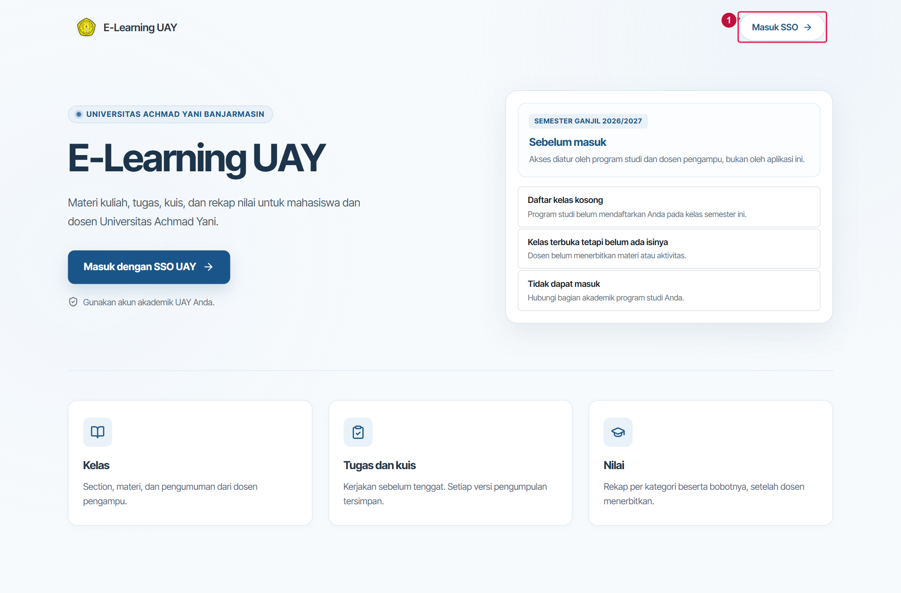

Penanda gambar: 1 Masuk SSO

### Input, pilihan, dan tombol

| Kontrol di layar | Nilai atau contoh | Fungsi dan akibat |
| --- | --- | --- |
| Masuk dengan SSO UAY | Tombol, tanpa input di E-Learning | Mengalihkan browser ke layanan SSO kampus. |
| Identitas SSO | Gunakan identitas yang ditetapkan kampus, misalnya NIM atau NIDN | Diisi di halaman SSO, bukan di formulir E-Learning. |
| Kata sandi SSO | Kata sandi milik akun kampus | Diproses oleh SSO. Pemulihan mengikuti fasilitas dan petugas SSO kampus. |
| Role pada profil | Mahasiswa, Dosen, Admin Prodi, Super Admin, atau Rektor | Ditetapkan SSO. Pengguna tidak memilih atau mengganti role melalui menu E-Learning. |

### Catatan penggunaan

Tangkapan layar tutorial menggunakan aplikasi lokal dengan data demo. Halaman pemilih akun uji pada SSO lokal bukan formulir login pengguna kampus.

Bila login gagal, periksa identitas di SSO dan gunakan layanan bantuan akun kampus. Jangan menggunakan akun demo sebagai akun perkuliahan.

## U2 — Navigasi menu dan pemulihan draf

**Peran:** Super Admin, Admin Prodi, Dosen, Mahasiswa.

**Tujuan:** Menemukan fitur yang dibutuhkan dan melanjutkan isian yang belum terkirim.

**Buka:** Bilah menu di kiri dan tab di dalam kelas

**Sebelum mulai:** Sudah masuk. Pada ponsel, buka tombol menu untuk melihat navigasi.

### Langkah

1. Klik Kelas saya untuk dosen/mahasiswa, atau Kelola kelas untuk admin. Cari kelas, lalu klik kartu kelas yang sesuai.
2. Di dalam kelas, pilih Materi & aktivitas, Presensi, Rekap nilai, atau Pengumuman. Pengelola juga melihat Peserta, Bank soal, Berkas, dan Jejak audit.
3. Saat mengisi editor, perhatikan status draf. Klik Simpan atau tombol publikasi agar perubahan terkirim ke server.
4. Jika muncul Ditemukan draf lokal yang lebih baru, pilih Pulihkan draf untuk melanjutkan atau Abaikan draf untuk memakai data server. Periksa kembali isian sebelum menyimpan.

**Periksa hasil:** Halaman yang dibuka sesuai kebutuhan. Perubahan penting memiliki pesan berhasil tersimpan.

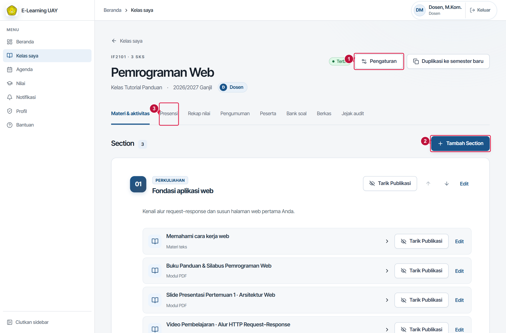

Penanda gambar: 1 Pengaturan kelas; 2 Tambah pertemuan; 3 Tab presensi

### Input, pilihan, dan tombol

| Kontrol di layar | Nilai atau contoh | Fungsi dan akibat |
| --- | --- | --- |
| Beranda | Menu | Ringkasan kelas, agenda, progres, atau pekerjaan yang perlu dinilai. |
| Agenda | Menu | Daftar tugas dan kuis berdasarkan jadwal yang ditetapkan pengajar. |
| Nilai / Rekap nilai | Menu dan tab kelas | Membuka nilai sesuai kelas dan hak akses akun. |
| Cari kelas | Teks, misalnya IF2101 | Menyaring nama, kode mata kuliah, atau nama kelas. |
| Filter status | Semua, Draf, Terbit, Diarsipkan sesuai tampilan | Membatasi daftar kelas pada status yang dipilih. |
| Pulihkan draf | Tombol saat pemulihan tersedia | Memasukkan draf lokal kembali ke editor. Belum mengirimkannya ke server. |
| Abaikan draf | Tombol saat pemulihan tersedia | Mengabaikan draf pemulihan dan kembali memakai data server. |
| Batal / Tutup | Tombol | Menutup editor. Jika ada perubahan, baca konfirmasi draf lokal yang muncul. |
| Simpan Sebagai Draf | Tombol pada editor konten | Menyimpan konten ke server tanpa menerbitkannya kepada mahasiswa. |
| Simpan dan Publikasikan | Tombol pada editor konten | Menyimpan dan menerbitkan konten. Akses tetap mengikuti status kelas, Section, dan jadwal. |
| Publikasikan / Tarik Publikasi | Tombol di daftar konten | Menampilkan konten atau menariknya kembali dari tampilan mahasiswa. |
| Baris per halaman dan Berikutnya | Pilihan jumlah baris / tombol navigasi | Mengubah tampilan daftar. Pilihan jumlah berbeda menurut halaman dan tidak menambah data. |

### Catatan penggunaan

Draf lokal hanya tersedia pada perangkat dan browser yang menyimpannya. Pesan draf lokal bukan bukti pekerjaan sudah diterima server.

## U3 — Profil notifikasi bantuan dan keluar

**Peran:** Super Admin, Admin Prodi, Dosen, Mahasiswa, Rektor.

**Tujuan:** Memeriksa identitas, membaca pemberitahuan, dan mengakhiri sesi.

**Buka:** Profil, Notifikasi, Bantuan, kemudian Keluar

**Sebelum mulai:** Sudah masuk dengan akun sendiri.

### Langkah

1. Buka Profil. Periksa nama, nomor identitas, role, dan afiliasi program studi. Jika tidak sesuai, hubungi bagian akademik/SSO.
2. Jika menu Notifikasi tersedia untuk peran Anda, buka pemberitahuan yang relevan. Gunakan Tandai dibaca atau Tandai semua dibaca bila tersedia.
3. Buka Bantuan dan cari kata kunci yang sesuai kebutuhan. Pilih artikel atau Buka buku panduan (tab baru). Panduan mengikuti peran akun yang sedang masuk.
4. Jika kendala berlanjut, catat nama kelas, aktivitas, waktu kejadian, pesan kesalahan, dan Nomor permintaan yang tampil. Sampaikan kepada petugas akademik prodi.
5. Klik Keluar pada bagian kanan atas setelah selesai. Pastikan halaman publik muncul kembali, terutama pada komputer bersama.

**Periksa hasil:** Identitas dikenali, notifikasi sudah ditinjau, dan sesi berakhir.

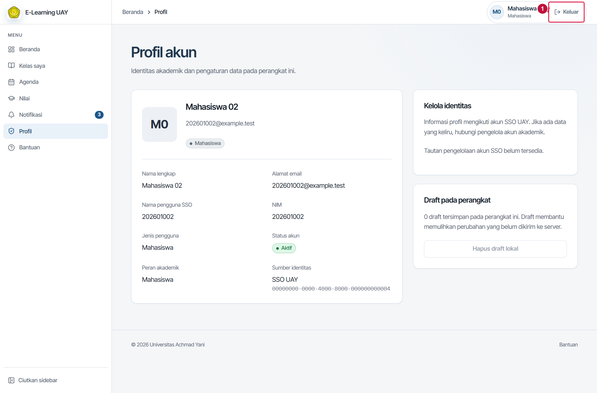

Penanda gambar: 1 Keluar

### Input, pilihan, dan tombol

| Kontrol di layar | Nilai atau contoh | Fungsi dan akibat |
| --- | --- | --- |
| Buka pengelolaan akun SSO | Tautan pada Profil bila tersedia | Membuka layanan akun kampus. Perubahan identitas dan akses mengikuti pengelola SSO. |
| Hapus semua draf lokal | Tombol pada Profil | Menghapus draf lokal akun dari browser ini. Pastikan pekerjaan yang dibutuhkan sudah disimpan terlebih dahulu. |
| Pencarian Bantuan | Teks, misalnya kode presensi | Mencari artikel bantuan yang tersedia untuk role Anda. |
| Tandai semua dibaca | Tombol pada Notifikasi bila menu tersedia | Mengubah status semua notifikasi menjadi dibaca, bukan menghapus isi aktivitas. |
| Keluar | Tombol | Mengakhiri sesi E-Learning. Menutup tab saja tidak sama dengan menekan Keluar. |
| Buka buku panduan (tab baru) | Tautan pada Bantuan | Membuka panduan sesuai peran dalam tab baru tanpa kotak centang. |

### Catatan penggunaan

Tanggal dan jam mengikuti zona perangkat dengan offset sebenarnya, misalnya GMT+7 atau GMT+8. Input jadwal memakai waktu perangkat dan dikirim ke server sebagai UTC. Pastikan zona perangkat sesuai lokasi Anda.

## M1 — Menemukan dan bergabung ke kelas

**Peran:** Mahasiswa.

**Tujuan:** Membuka kelas semester yang benar atau mendaftar dengan kunci dari pengajar.

**Buka:** Kelas saya kemudian kartu kelas atau Gabung kelas

**Sebelum mulai:** Akun mahasiswa aktif. Untuk pendaftaran mandiri, kelas harus menerima pendaftaran dan Anda memiliki kuncinya.

### Langkah

1. Klik Kelas saya. Ketik kode atau nama mata kuliah pada pencarian. Periksa nama rombel dan tahun akademik pada kartu.
2. Klik kartu kelas jika sudah terdaftar. Jika belum terdaftar dan pengajar memberikan kunci, klik Gabung kelas.
3. Pilih kelas dari daftar, atau gunakan Kode / ID Kelas bila pilihan tersebut ditampilkan. Salin ID/kode rujukan yang diberikan pengajar secara tepat.
4. Masukkan Kunci pendaftaran mandiri yang diberikan pengajar, lalu klik Gabung kelas pada dialog.
5. Periksa kelas sudah muncul dalam daftar Anda. Buka Materi & aktivitas. Bila tetap kosong, minta pengajar memeriksa status publikasi.

**Periksa hasil:** Kartu kelas tersedia pada Kelas saya dan dapat dibuka.

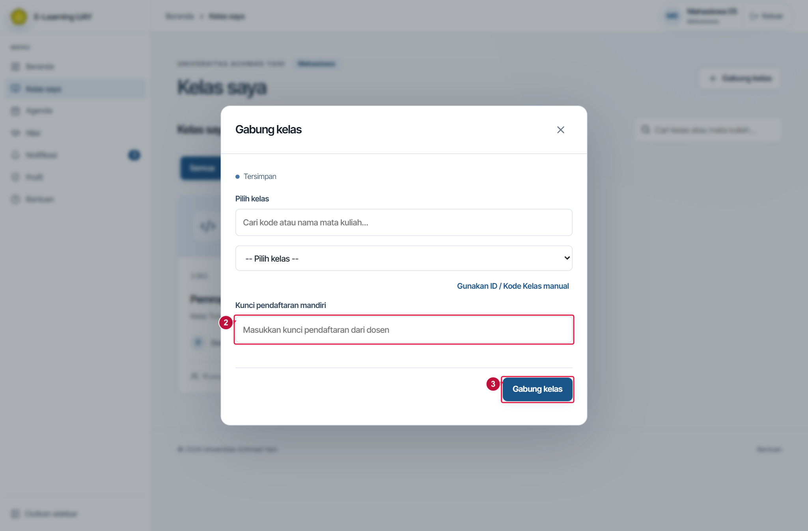

Penanda gambar: 2 Kunci; 3 Gabung

### Input, pilihan, dan tombol

| Kontrol di layar | Nilai atau contoh | Fungsi dan akibat |
| --- | --- | --- |
| Pilih kelas | Pilihan kelas yang tersedia | Menentukan kelas tujuan. Periksa mata kuliah, rombel, dan semester. |
| Kode / ID Kelas | Identitas kelas yang diberikan pengajar | Dipakai bila kelas dicari lewat identitas langsung. Jangan mengisi NIM atau menebak ID. |
| Kunci pendaftaran mandiri | Teks sesuai kunci pengajar, contoh latihan UAY2026 | Membuktikan izin pendaftaran mandiri. Kunci berbeda dari kode presensi. |
| Gabung kelas | Tombol setelah isian valid | Mendaftarkan akun Anda ke kelas tujuan. |
| Partisipasi dinonaktifkan | Status pada kartu/halaman kelas | Akses materi, tugas, dan kuis dibatasi sampai pengelola mengaktifkan kembali kepesertaan. |

### Catatan penggunaan

Kelas yang tidak menerima pendaftaran mandiri perlu didaftarkan oleh dosen/admin. Kepesertaan kelas tidak menggantikan prosedur KRS kampus.

## M2 — Mengisi presensi satu klik atau kode

**Peran:** Mahasiswa.

**Tujuan:** Mencatat kehadiran pada sesi kuliah yang benar.

**Buka:** Kelas saya kemudian kelas kemudian Presensi

**Sebelum mulai:** Terdaftar aktif pada kelas terbit dan sesi presensi sudah dibuka pengajar.

### Langkah

1. Buka tab Presensi. Cocokkan judul sesi dan tanggal perkuliahan dengan kelas yang sedang diikuti.
2. Untuk sesi tanpa kode, klik Konfirmasi Hadir (1-Klik). Pada dialog, periksa sesi lalu klik Konfirmasi Hadir Saya (1-Klik).
3. Untuk sesi dengan kode, klik Isi Presensi (Kode). Masukkan enam karakter kode dari layar pengajar, misalnya AB7K92. Kode 6 karakter dapat berisi huruf dan angka.
4. Pada dialog kode, klik Simpan semua perubahan untuk mengirim presensi. Tunggu respons sebelum menutup dialog.
5. Periksa status sesi berubah menjadi Hadir dan waktu pengisian tercatat. Jika sesi tertutup atau kode salah, hubungi pengajar.

**Periksa hasil:** Status Hadir tampil pada sesi yang dipilih.

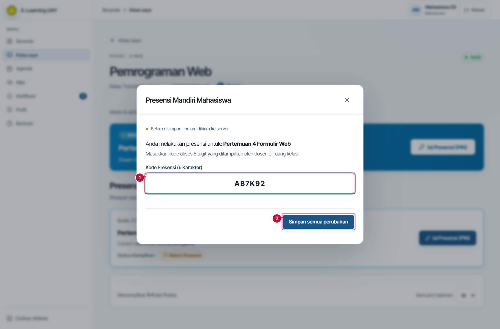

Penanda gambar: 1 Kode; 2 Kirim

### Input, pilihan, dan tombol

| Kontrol di layar | Nilai atau contoh | Fungsi dan akibat |
| --- | --- | --- |
| Kode Presensi (6 Karakter) | Enam karakter tanpa spasi, contoh AB7K92 | Diisi hanya jika sesi memerlukan kode. Gunakan kode yang sedang berlaku, bukan kunci pendaftaran kelas. |
| Konfirmasi Hadir (1-Klik) | Tombol pada sesi tanpa kode | Membuka konfirmasi presensi tanpa memasukkan kode. |
| Isi Presensi (Kode) | Tombol pada sesi dengan kode | Membuka isian kode untuk sesi aktif. |
| Simpan semua perubahan pada dialog kode | Tombol setelah kode/konfirmasi valid | Mencatat kehadiran di server. Periksa status sesudah respons diterima. |
| Belum Presensi | Status ketika sesi masih terbuka | Pengisian Anda belum tercatat Hadir untuk sesi ini. |
| Hadir / Izin / Sakit / Tidak Hadir (Alpa) / Terlambat | Status kehadiran | Izin, sakit, atau koreksi manual ditetapkan pengajar melalui lembar presensi. |
| Konfirmasi Hadir Saya (1-Klik) | Tombol dialog sesi tanpa kode | Mengirim konfirmasi kehadiran langsung tanpa isian kode. |

### Catatan penggunaan

Sesi dapat dibuka sepanjang hari sampai ditutup pengajar atau dibatasi jam mulai/selesai. Tidak semua sesi memiliki durasi 15 menit.

Gunakan isian kode yang tersedia. Tampilan Kode Proyektor pada versi ini tidak menyediakan alur pemindaian QR bagi mahasiswa.

## M3 — Mempelajari materi teks PDF dan video

**Peran:** Mahasiswa.

**Tujuan:** Menyelesaikan bahan belajar dan memeriksa progresnya.

**Buka:** Kelas kemudian Materi & aktivitas kemudian judul materi

**Sebelum mulai:** Section dan materi sudah terbit serta berada dalam jadwal akses.

### Langkah

1. Klik judul materi pada Section yang sesuai. Untuk materi teks, baca seluruh bagian dan centang daftar langkah yang diminta.
2. Klik Tandai selesai setelah materi teks/praktikum tanpa berkas selesai dipelajari. Periksa tanda Selesai saat kembali ke daftar.
3. Untuk Modul PDF, gunakan Sebelumnya, Berikutnya, atau nomor Halaman untuk membaca halaman. Progres mengikuti halaman yang dibaca dan disimpan.
4. Untuk video unggahan, tekan Play dan tonton secara normal. Perhatikan Ditonton dan persentase progres. Video sematan menyediakan Tandai Selesai Menonton setelah Anda selesai menonton.
5. Jika materi memiliki berkas, klik Unduh sesuai aturan yang berlaku. Bila tombol terkunci, selesaikan syarat membaca/menonton dahulu, lalu coba lagi.

**Periksa hasil:** Progres materi tersimpan dan status selesai/unduhan sesuai syarat tampil.

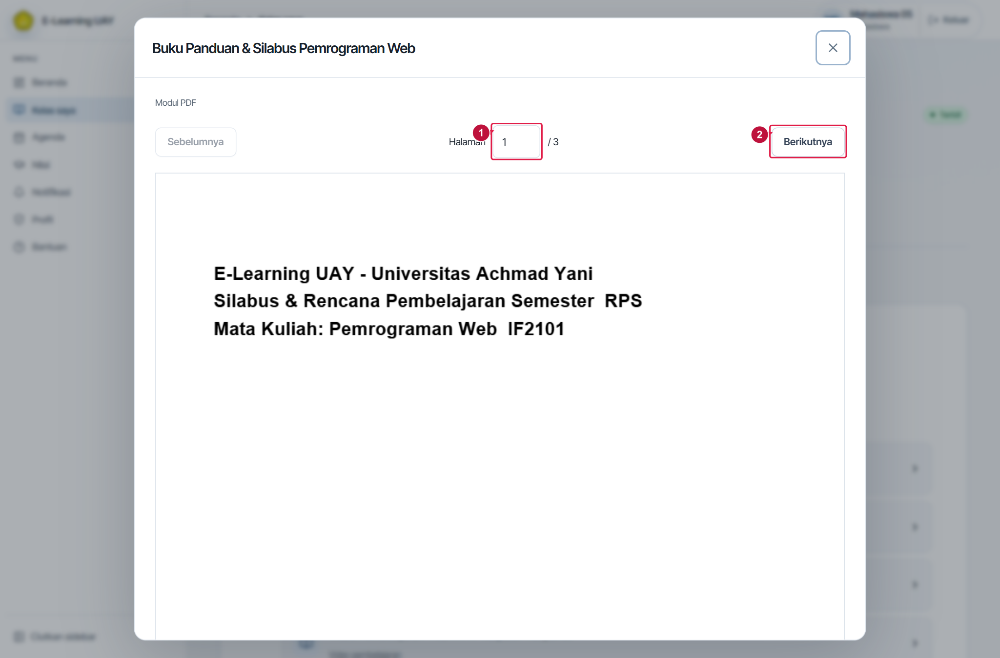

Penanda gambar: 1 Nomor halaman; 2 Berikutnya

### Input, pilihan, dan tombol

| Kontrol di layar | Nilai atau contoh | Fungsi dan akibat |
| --- | --- | --- |
| Daftar langkah | Checkbox pada materi teks | Centang langkah yang benar-benar selesai. Dapat menjadi syarat saat menandai materi selesai. |
| Tandai selesai | Tombol materi yang mendukung | Mencatat penyelesaian materi teks dan beberapa jenis materi tautan/praktikum. |
| Halaman | Bilangan halaman 1 sampai jumlah halaman | Menampilkan halaman PDF yang dipilih. |
| Sebelumnya / Berikutnya | Tombol pembaca PDF | Berpindah halaman. Baca semua halaman yang diwajibkan. |
| Play / Pause / posisi pemutaran | Kontrol pemutar video | Memulai atau menjeda video. Pada video unggahan, lompatan melewati tontonan yang tercatat dan kecepatan di atas 1x dibatasi. |
| Tandai Selesai Menonton | Tombol video sematan | Mencatat penyelesaian video sematan setelah ditonton. Perilakunya berbeda dari pelacakan video unggahan. |
| Unduh | Tombol jika berkas tersedia | Mengambil berkas. Ketersediaannya mengikuti izin kelas, jadwal, status berkas, dan syarat progres. |

### Catatan penggunaan

Modul yang ditampilkan pada pembaca dokumen adalah PDF. Ubah bahan Word atau PowerPoint ke PDF jika pengajar ingin menampilkannya sebagai Modul PDF.

## M4 — Mengumpulkan tugas dan memeriksa versi

**Peran:** Mahasiswa.

**Tujuan:** Mengirim jawaban dalam format yang diterima sebelum batas pengumpulan.

**Buka:** Kelas kemudian Materi & aktivitas kemudian judul tugas

**Sebelum mulai:** Tugas terbit dan dibuka. Siapkan jawaban dengan format yang diizinkan.

### Langkah

1. Buka tugas. Baca Petunjuk tugas, Nilai maksimum, Format yang diterima, Tenggat, Batas akhir toleransi, dan Batas versi pengumpulan.
2. Jika TEXT diizinkan, isi Jawaban atau catatan. Jika LINK diizinkan, isi Tautan hasil pekerjaan. Untuk berkas, klik Cari berkas atau seret berkas ke area unggah.
3. Tunggu unggahan selesai dan nama berkas tampil. Periksa berkas yang dipilih dan pastikan pengajar dapat membuka tautan Anda.
4. Klik Kumpulkan tugas. Tunggu pesan Tugas berhasil dikumpulkan.
5. Periksa Riwayat pengumpulan: nomor Versi, waktu Dikumpulkan, status Tepat waktu/Terlambat, dan berkas atau jawaban. Untuk revisi, kirim versi baru selama batas versi dan jadwal masih mengizinkan.

**Periksa hasil:** Versi baru tercatat pada Riwayat pengumpulan. Bukti unggah saja belum berarti tugas dikumpulkan.

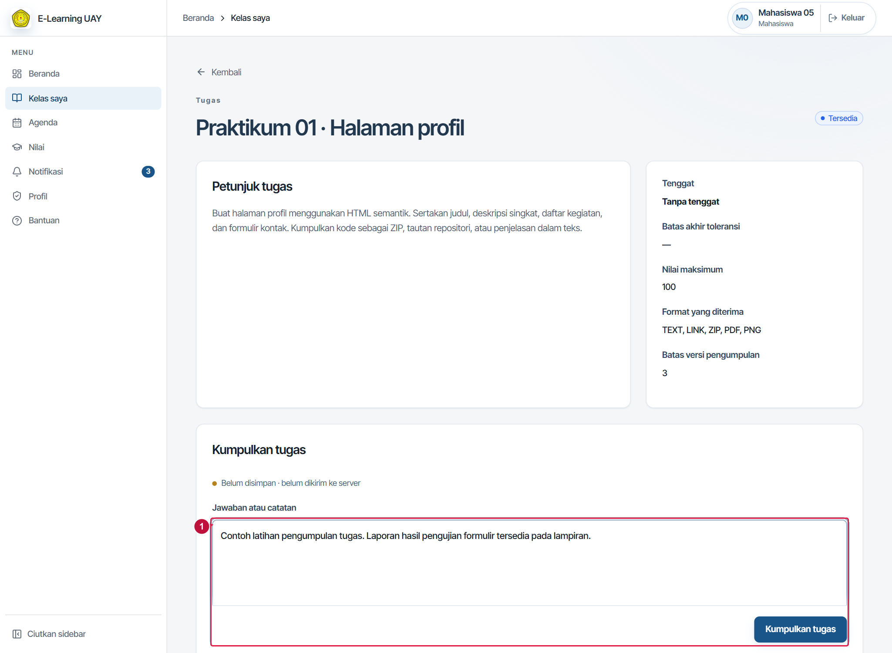

Penanda gambar: 1 Jawaban

### Input, pilihan, dan tombol

| Kontrol di layar | Nilai atau contoh | Fungsi dan akibat |
| --- | --- | --- |
| Jawaban atau catatan | Teks bila TEXT diterima, contoh Ringkasan hasil praktikum | Mengirim jawaban/catatan sebagai bagian pengumpulan. |
| Tautan hasil pekerjaan | URL lengkap bila LINK diterima, contoh https://contoh.invalid/hasil | Mengirim lokasi pekerjaan. Gunakan tautan pekerjaan Anda yang dapat diakses pengajar. |
| Cari berkas / area seret berkas | Berkas sesuai Format yang diterima, ikuti batas ukuran pada layar | Mengunggah berkas sebelum pengumpulan. Berkas harus selesai diproses sebelum dikirim. |
| Kumpulkan tugas | Tombol | Membuat satu versi pengumpulan di server. |
| Tenggat | Tanggal dan jam pada tugas | Batas pengumpulan tepat waktu. Sesudahnya dapat ditandai terlambat jika diizinkan. |
| Batas akhir toleransi | Tanggal dan jam jika ditetapkan | Batas terakhir penerimaan, termasuk pengumpulan terlambat. |
| Batas versi pengumpulan | Jumlah kesempatan, misalnya 3 | Membatasi banyaknya versi. Versi yang sudah dikirim tidak diganti melalui perubahan draf. |

### Catatan penggunaan

Jika tombol pengumpulan ditutup, periksa tenggat, toleransi, jumlah versi, status kelas, dan penguncian nilai akhir. Mintalah arahan pengajar bila perlu.

## M5 — Mengerjakan kuis sampai terkumpul

**Peran:** Mahasiswa.

**Tujuan:** Memulai atau melanjutkan kuis serta memastikan jawaban diterima.

**Buka:** Kelas kemudian judul kuis

**Sebelum mulai:** Kuis terbit, jadwal dibuka, kesempatan masih tersedia, koneksi stabil.

### Langkah

1. Buka kuis. Periksa waktu pengerjaan, waktu tutup, kesempatan pengerjaan, dan petunjuknya.
2. Klik Mulai kuis. Jika sudah ada pengerjaan aktif, klik Lanjutkan pengerjaan untuk melanjutkan jawaban yang tersimpan.
3. Jawab soal sesuai jenisnya. Pilihan tunggal/benar-salah memakai satu pilihan. Pilihan jamak memakai checkbox. Menjodohkan memakai pasangan, mengurutkan memakai urutan, dan uraian/isian memakai teks.
4. Perhatikan pesan Jawaban tersimpan di server. Jika muncul Jawaban belum tersimpan, periksa koneksi dan ulangi penyimpanan sebelum lanjut.
5. Sebelum waktu habis, tinjau jawaban lalu klik Kumpulkan kuis. Baca dialog konfirmasi dan setujui bila jawaban sudah selesai.
6. Periksa Riwayat pengerjaan. Jawaban yang terkumpul tidak dapat diubah. Jika waktu habis, server mengumpulkan jawaban yang sudah tersimpan.

**Periksa hasil:** Pengerjaan berstatus selesai/terkumpul pada riwayat. Nilai terlihat sesuai kebijakan publikasi hasil.

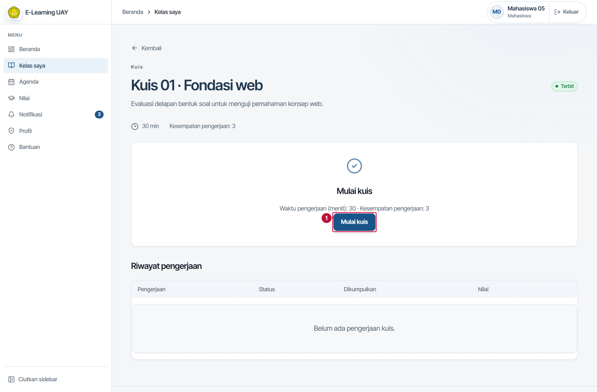

Penanda gambar: 1 Mulai

### Input, pilihan, dan tombol

| Kontrol di layar | Nilai atau contoh | Fungsi dan akibat |
| --- | --- | --- |
| Mulai kuis | Tombol ketika akses dibuka | Membuat pengerjaan baru dan mulai menghitung waktu sesuai mode kuis. |
| Lanjutkan pengerjaan | Tombol ketika ada pengerjaan aktif | Membuka pengerjaan yang sama. Bukan menambah durasi. |
| Sisa waktu | Penghitung waktu | Mengikuti mode durasi sejak mulai atau akhir serentak yang ditetapkan pengajar. |
| Pilihan jawaban | Radio/checkbox/dropdown sesuai soal | Radio memilih satu, checkbox dapat memilih beberapa. Ikuti instruksi soal. |
| Jawaban uraian / isian | Teks sesuai soal dan batas kata | Isian singkat diperiksa dengan kunci, uraian menunggu penilaian pengajar. |
| Unggah berkas | Berkas pada soal tipe unggah | Pilih file sesuai instruksi lalu tunggu selesai unggah agar tercatat sebagai jawaban. |
| Kumpulkan kuis | Tombol dan konfirmasi | Mengakhiri pengerjaan. Jawaban tidak bisa diedit setelah terkumpul. |

### Catatan penggunaan

Nilai yang belum terlihat tidak selalu berarti jawaban hilang. Jawaban uraian/berkas mungkin menunggu koreksi dan hasil mungkin belum dipublikasikan.

## M6 — Memeriksa nilai dan kehadiran

**Peran:** Mahasiswa.

**Tujuan:** Membaca hasil belajar serta mengajukan koreksi dengan bukti yang jelas.

**Buka:** Kelas kemudian Rekap nilai dan Presensi

**Sebelum mulai:** Pengajar sudah menerbitkan hasil yang hendak Anda lihat.

### Langkah

1. Buka Rekap nilai pada kelas. Baca nilai kategori, bobot, Nilai akhir, Huruf, dan Indeks mutu yang tersedia.
2. Untuk umpan balik tugas, buka tugas dan lihat versi yang sudah dinilai. Untuk hasil kuis, buka kuis dan Riwayat pengerjaan.
3. Jika tertulis Nilai akhir belum diterbitkan atau nilai akan terlihat setelah dipublikasikan, tunggu publikasi pengajar.
4. Buka Presensi dan cocokkan status setiap sesi. Jika ada kekeliruan, catat tanggal, judul sesi, dan bukti kehadiran untuk pengajar.
5. Jika hasil tidak sesuai, sampaikan kelas, aktivitas, versi/pengerjaan, dan bagian nilai yang dipersoalkan kepada pengajar.

**Periksa hasil:** Anda mengetahui status nilai dan sesi kehadiran yang perlu diklarifikasi.

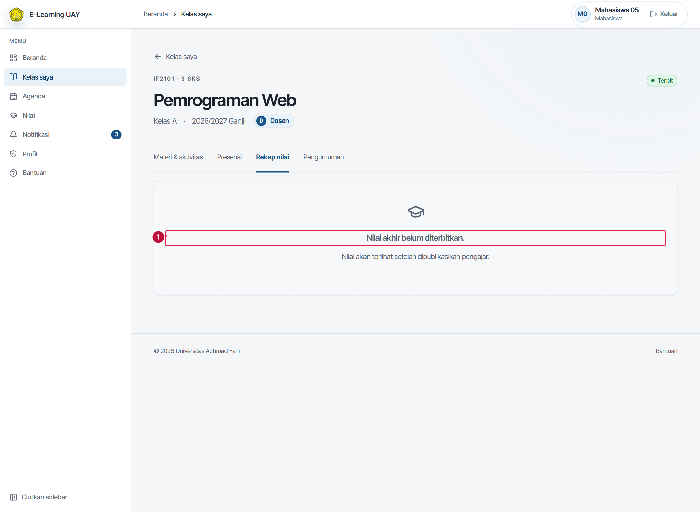

Penanda gambar: 1 Status publikasi

### Input, pilihan, dan tombol

| Kontrol di layar | Nilai atau contoh | Fungsi dan akibat |
| --- | --- | --- |
| Nilai akhir | Skor skala 0 sampai 100 | Hasil kategori dikalikan bobotnya. Terlihat setelah penerbitan sesuai kebijakan. |
| Bobot kategori | Persentase tiap kategori | Besarnya kontribusi komponen terhadap nilai akhir. |
| Huruf / Indeks mutu | Misalnya A- / 3,75 pada skala 2026.1 | Konversi berdasarkan versi skala kelas. Nilai historis memakai skala yang berlaku saat diterbitkan. |
| Umpan balik | Catatan pengajar | Masukan untuk jawaban tugas atau soal yang sudah dipublikasikan. |
| Persentase kehadiran | Hadir dan Terlambat dibanding total sesi pada rekap | Izin dan Sakit dicatat terpisah. Mintalah penjelasan pengajar untuk kelayakan ujian pada kelas. |

### Catatan penggunaan

Jangan menyimpulkan kelayakan hanya dari warna lencana. Periksa data sesi dan keputusan akademik pengajar.

## D1 — Menyiapkan kelas dan Section

**Peran:** Dosen.

**Tujuan:** Menyusun pertemuan agar mahasiswa dapat mengikuti urutan belajar.

**Buka:** Kelas saya kemudian kelas kemudian Materi & aktivitas

**Sebelum mulai:** Ditugaskan sebagai pengampu. Kelas/mata kuliah belum diarsipkan.

### Langkah

1. Buka kartu kelas. Pastikan nama rombel dan tahun akademik benar. Klik Tambah Section.
2. Isi Judul Section, misalnya Pertemuan 4 Pengolahan Formulir. Tulis tujuan belajar pada Deskripsi dan pilih Jenis Section.
3. Isi Dibuka pada dan Ditutup pada bila akses pertemuan harus dijadwalkan. Biarkan kosong bila tidak perlu batas waktu.
4. Klik Simpan Sebagai Draf untuk menyiapkan dahulu, atau Simpan dan Publikasikan bila pertemuan sudah siap.
5. Periksa Section muncul. Gunakan Pindah ke atas/bawah untuk mengatur urutannya. Terbitkan kelas dan isi di dalamnya agar mahasiswa memperoleh akses.

**Periksa hasil:** Section tersusun dengan jenis, jadwal, dan status yang sesuai.

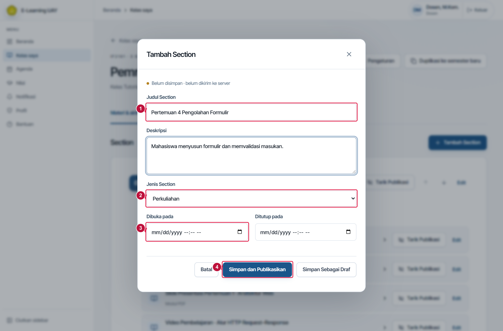

Penanda gambar: 1 Judul; 2 Jenis; 3 Jadwal; 4 Publikasi

### Input, pilihan, dan tombol

| Kontrol di layar | Nilai atau contoh | Fungsi dan akibat |
| --- | --- | --- |
| Judul Section | Teks wajib, contoh Pertemuan 4 Pengolahan Formulir | Nama pertemuan yang terlihat dalam kelas. |
| Deskripsi | Teks tujuan atau ringkasan pertemuan | Memberi petunjuk isi dan hasil belajar. |
| Jenis Section | Perkuliahan, Praktikum, Seminar, Lokakarya, Ujian, Lainnya | Mengelompokkan jenis kegiatan. Pilih yang sesuai kegiatan nyata. |
| Dibuka pada | Tanggal dan jam opsional, contoh 12 Oktober 2026 08.00 | Awal akses Section sesuai jadwal. |
| Ditutup pada | Tanggal dan jam sesudah waktu buka, atau kosong | Akhir jendela akses Section. |
| Edit | Tombol pada Section | Mengubah metadata, jenis, atau jadwal Section. |
| Pindah ke atas / bawah | Tombol pada Section | Mengubah urutan Section. |
| Simpan Sebagai Draf / Simpan dan Publikasikan | Tombol editor | Draf untuk persiapan, publikasi untuk akses mahasiswa sesuai kelas dan jadwal. |

### Catatan penggunaan

Konten terbit di dalam Section draf tetap belum dapat diakses mahasiswa. Periksa tiga lapis: kelas, Section, dan kontennya.

## D2 — Mengunggah Modul PDF dan bahan praktikum

**Peran:** Dosen.

**Tujuan:** Membagikan dokumen yang bisa dipelajari mahasiswa melalui kelas.

**Buka:** Section kemudian Materi kemudian Tambah materi

**Sebelum mulai:** Siapkan PDF final dan jumlah halaman yang benar. Ikuti batas unggahan yang ditampilkan.

### Langkah

1. Pada Section tujuan, klik Materi. Isi Judul yang jelas dan pilih Modul PDF.
2. Klik Cari berkas atau seret PDF ke area unggah. Tunggu nama berkas tampil dan unggahan selesai.
3. Isi Jumlah halaman sesuai PDF sebenarnya, misalnya 12. Tentukan jadwal buka/tutup jika perlu.
4. Klik Simpan dan Publikasikan. Buka kembali materi untuk memastikan dokumen tampil dan jumlah halamannya benar.
5. Untuk dataset atau berkas praktikum, pilih Praktikum & dataset. Unggah berkas dan susun petunjuk praktikum sebelum menerbitkan.

**Periksa hasil:** Materi terbit dalam Section yang tepat dan berkas dapat dibaca/diunduh sesuai syarat.

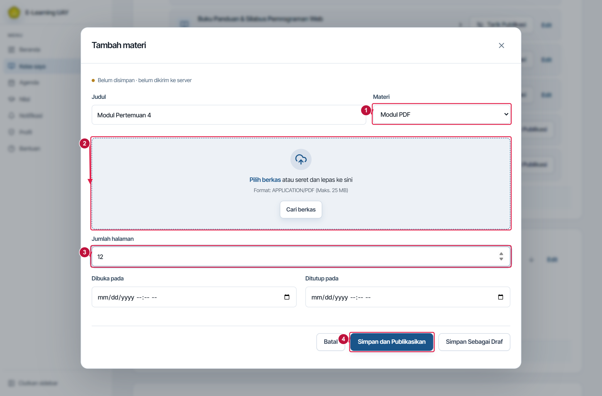

Penanda gambar: 1 Jenis materi; 2 Unggah; 3 Jumlah halaman; 4 Publikasi

### Input, pilihan, dan tombol

| Kontrol di layar | Nilai atau contoh | Fungsi dan akibat |
| --- | --- | --- |
| Judul | Teks wajib, contoh Modul Pertemuan 4 | Nama materi pada daftar kelas. |
| Materi | Modul PDF atau Praktikum & dataset | Modul PDF memakai pembaca halaman. Praktikum mendukung petunjuk dan berkas pendamping. |
| Cari berkas / seret berkas | PDF untuk Modul PDF, maksimum 50 MB | Mengunggah berkas ke kelas. Tunggu proses selesai sebelum menyimpan. |
| Jumlah halaman | Bilangan 1 sampai 10000, contoh 12 | Dipakai sebagai metadata pembaca/progres. Samakan dengan PDF sebenarnya. |
| Dibuka pada / Ditutup pada | Tanggal-jam opsional, akhir sesudah awal | Membatasi jadwal akses materi. |
| Simpan dan Publikasikan | Tombol | Menerbitkan materi sesudah unggahan dan metadata lengkap. |

### Catatan penggunaan

Jenis materi yang sudah disimpan tidak dapat diganti melalui editor yang sama. Buat materi baru bila jenisnya harus berubah.

Bahan PPTX/DOCX yang ingin dibaca sebagai Modul PDF perlu dikonversi ke PDF terlebih dahulu.

## D3 — Mengatur video dan tautan pembelajaran

**Peran:** Dosen.

**Tujuan:** Menyediakan video serta menetapkan syarat penyelesaian tontonan.

**Buka:** Section kemudian Materi kemudian Video pembelajaran

**Sebelum mulai:** Siapkan video unggahan atau tautan sematan. Ketahui durasi aslinya.

### Langkah

1. Klik Materi pada Section lalu pilih Video pembelajaran. Isi Judul.
2. Pilih salah satu sumber: URL Video Embed (YouTube / External), atau unggah MP4/WebM jika kolom URL kosong.
3. Isi Durasi (detik), misalnya 600 untuk video 10 menit. Isi Tonton minimal (%), misalnya 85 untuk ambang 85 persen.
4. Atur jadwal jika diperlukan lalu Simpan dan Publikasikan. Buka materi dan periksa sumber video dapat dimuat.
5. Untuk referensi/simulator/ruang daring, buat materi baru dan pilih Tautan referensi, Simulator virtual, atau Pertemuan daring. Masukkan Tautan lengkap lalu terbitkan.

**Periksa hasil:** Video atau tautan tersedia dengan jadwal dan syarat penyelesaian yang benar.

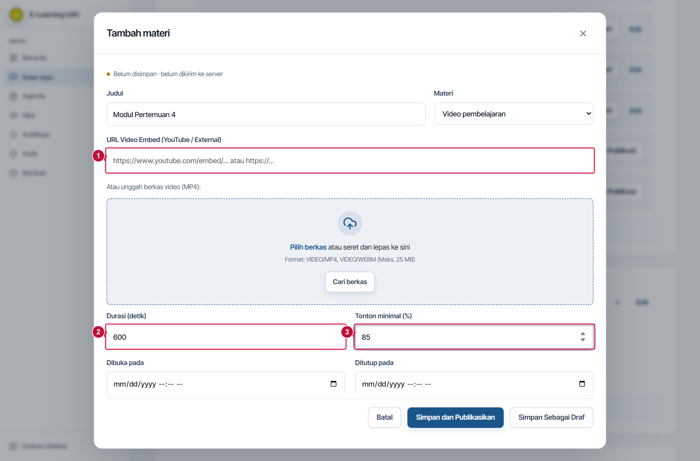

Penanda gambar: 1 URL video; 2 Durasi; 3 Ambang tonton

### Input, pilihan, dan tombol

| Kontrol di layar | Nilai atau contoh | Fungsi dan akibat |
| --- | --- | --- |
| URL Video Embed (YouTube / External) | URL sematan yang valid atau kosong untuk unggahan | Menggunakan sumber video eksternal. Contoh struktur https://www.youtube.com/embed/ID_VIDEO. |
| Berkas video | MP4/WebM, ikuti batas ukuran yang tampil | Digunakan saat URL kosong. Video unggahan mendukung pencatatan waktu tonton. |
| Durasi (detik) | Bilangan 1 sampai 36000, contoh 600 | Durasi acuan pelacakan. Isi detik, bukan menit. |
| Tonton minimal (%) | Bilangan 1 sampai 100, default 85 | Ambang tontonan untuk syarat progres video unggahan. |
| Tautan | URL lengkap untuk simulator, pertemuan daring, atau referensi | Menentukan halaman/ruang tujuan. Pastikan izin aksesnya sesuai mahasiswa. |
| Dibuka pada / Ditutup pada | Tanggal-jam opsional | Mengendalikan jendela akses materi. |

### Catatan penggunaan

Video sematan memiliki tombol Tandai Selesai Menonton dan tidak menggunakan pengamatan waktu pemutar yang sama dengan video unggahan. Pilih unggahan bila pelacakan waktu tonton dibutuhkan.

## D4 — Menyusun artikel teks dan impor artikel

**Peran:** Dosen.

**Tujuan:** Membuat materi teks dengan blok, lampiran, atau isi artikel dari JSON.

**Buka:** Section kemudian Materi kemudian Materi teks

**Sebelum mulai:** Siapkan isi materi dan berkas pendamping. Jika menggunakan JSON, periksa isinya terlebih dahulu.

### Langkah

1. Klik Materi, pilih Materi teks, dan isi Judul. Susun paragraf pertama pada editor blok.
2. Klik Tambah blok atau gunakan pemilih jenis blok. Tambahkan judul bagian, daftar langkah, tabel, kode, gambar, atau lampiran sesuai isi materi.
3. Untuk lampiran, klik Sisipkan lampiran kemudian unggah berkas pada blok yang muncul.
4. Jika memakai artikel dari AI, buka Panduan & artikel AI. Unduh Panduan, Prompt AI, atau Contoh JSON untuk memperoleh format yang benar.
5. Klik Pilih JSON atau tempel isi pada Atau tempel JSON dari AI. Klik Tambahkan ke draf, lalu periksa judul, isi, fakta, dan lampiran.
6. Atur jadwal lalu Simpan Sebagai Draf atau Simpan dan Publikasikan. Periksa tampilan artikel setelah disimpan.

**Periksa hasil:** Artikel tersusun, tersimpan, dan tampil sesuai status publikasi.

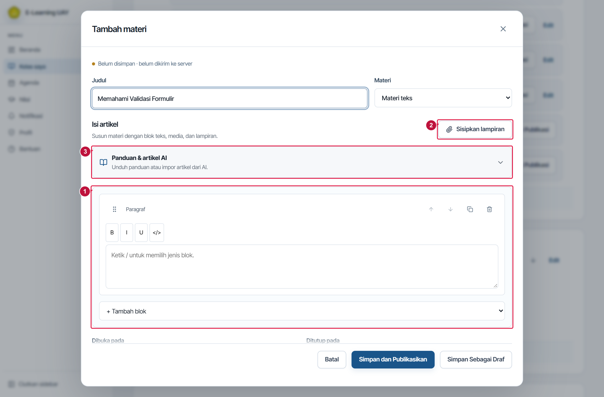

Penanda gambar: 1 Isi artikel; 2 Sisipkan lampiran; 3 Artikel AI

### Input, pilihan, dan tombol

| Kontrol di layar | Nilai atau contoh | Fungsi dan akibat |
| --- | --- | --- |
| Tambah blok | Jenis blok: paragraf, judul bagian, gambar, kode, rumus, catatan, daftar langkah, tabel, lampiran, media, garis | Menambah satu bagian isi. Maksimal 300 blok per artikel. |
| Tingkat judul | Tingkat heading yang tersedia | Membedakan hierarki bagian artikel. |
| Daftar langkah | Satu langkah per baris | Menghasilkan checklist bagi mahasiswa. |
| Tabel | Satu baris data per baris teks, kolom dipisah tab atau \| | Menghasilkan tabel pada materi. |
| Bahasa pemrograman / Nama berkas | Contoh javascript / validasi.js | Mengatur label dan tampilan blok kode atau berkas. |
| Rumus LaTeX | Contoh x^2 + y^2 | Menampilkan rumus pada blok matematika. |
| Deskripsi gambar / Keterangan | Teks deskripsi singkat | Memberi arti gambar dan caption untuk pembaca. |
| Tautan pada media sematan | URL media yang sesuai | Menyematkan sumber media pada artikel. |
| Pilih JSON / tempel JSON | JSON maksimal 1 MB sesuai template artikel | Memasukkan isi artikel untuk ditinjau. |
| Tambahkan ke draf | Tombol setelah JSON valid | Menambahkan blok di akhir isi. Judul yang sudah diisi tetap digunakan. Belum menerbitkan artikel. |
| Hapus / Duplikasi / Pindah ke atas / bawah | Kontrol pada blok | Menghapus, menyalin, atau mengatur urutan blok dalam draf. |

### Catatan penggunaan

Periksa hasil impor sebelum menerbitkan. Artikel dari AI tetap membutuhkan pemeriksaan isi oleh pengajar.

## D5 — Membuat tugas dengan tenggat dan toleransi

**Peran:** Dosen.

**Tujuan:** Menentukan instruksi serta batas pengumpulan yang dapat diikuti mahasiswa.

**Buka:** Section kemudian Tugas kemudian Tambah tugas

**Sebelum mulai:** Siapkan instruksi, kategori nilai, format jawaban, dan jadwal tugas.

### Langkah

1. Klik Tugas pada Section. Isi Judul dan Petunjuk tugas yang menjelaskan pekerjaan dan bukti yang harus dikumpulkan.
2. Pilih Kategori nilai sesuai komponen penilaian. Isi Nilai maksimum, misalnya 100, dan Batas versi pengumpulan, misalnya 3.
3. Atur Dibuka pada, Tenggat, dan Batas akhir toleransi bila diperlukan. Contoh tenggat 16 Oktober 2026 23.59, toleransi 17 Oktober 2026 23.59.
4. Centang format yang diterima. Contoh PDF dan ZIP untuk laporan serta kode sumber. Atur Izinkan pengumpulan terlambat sesuai ketentuan tugas.
5. Klik Simpan Sebagai Draf untuk ditinjau atau Simpan dan Publikasikan untuk membuka tugas sesuai jadwal. Buka tugas lagi untuk memeriksa seluruh aturan.

**Periksa hasil:** Tugas muncul dengan instruksi, kategori, format, dan jadwal yang benar.

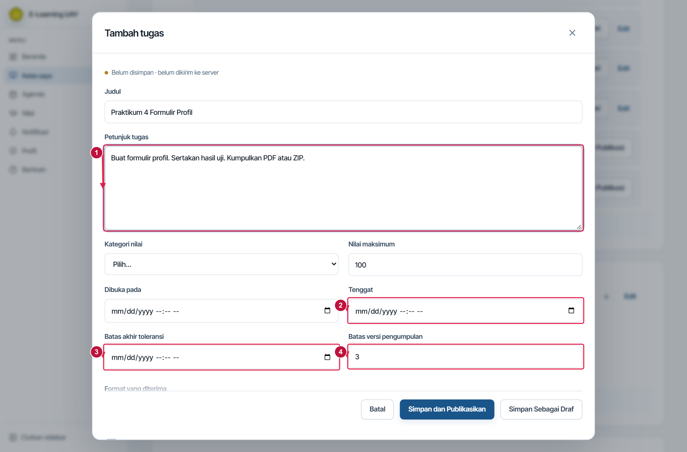

Penanda gambar: 1 Instruksi; 2 Tenggat; 3 Batas toleransi; 4 Versi

### Input, pilihan, dan tombol

| Kontrol di layar | Nilai atau contoh | Fungsi dan akibat |
| --- | --- | --- |
| Judul | Teks wajib, maksimum 200 karakter | Nama tugas yang dikenali mahasiswa. |
| Petunjuk tugas | Teks wajib, contoh Buat formulir profil dan laporan uji | Menjelaskan pekerjaan, keluaran, dan cara penilaian. |
| Kategori nilai | Pilihan kategori kelas, misalnya Tugas | Menghubungkan tugas ke komponen nilai. Kategori progres tidak digunakan untuk tugas. |
| Nilai maksimum | 1 sampai 1000, default 100 | Batas skor tugas. Skor komponen dinormalisasi ketika dihitung ke skala 100. |
| Dibuka pada | Tanggal-jam opsional | Awal penerimaan pengumpulan. |
| Tenggat | Tanggal-jam opsional | Batas tepat waktu. Pengumpulan sesudahnya mengikuti izin keterlambatan. |
| Batas akhir toleransi | Tanggal-jam sesudah tenggat atau kosong | Batas terakhir menerima tugas, termasuk tugas terlambat. |
| Batas versi pengumpulan | Bilangan 1 sampai 20, default 3 | Jumlah versi yang boleh dikirim tiap mahasiswa. |
| Format yang diterima | Centang minimal satu: TEXT, LINK, PDF, ZIP, PNG, JPG, PY, CPP, DOCX, CSV | TEXT membuka jawaban teks, LINK membuka URL, lainnya mengizinkan jenis berkas terkait. |
| Izinkan pengumpulan terlambat | ON = diizinkan setelah tenggat sampai batas toleransi. OFF = ditutup saat tenggat. Default ON | Menentukan apakah versi terlambat masih diterima. Tidak menghapus batas akhir toleransi. |

### Catatan penggunaan

Contoh nilai pada tutorial adalah bahan latihan. Sesuaikan dengan ketentuan kelas dan jadwal nyata.

## D6 — Memeriksa menilai dan menerbitkan tugas

**Peran:** Dosen.

**Tujuan:** Memberi skor dan umpan balik yang dapat dilihat mahasiswa.

**Buka:** Kelas kemudian judul tugas kemudian pengumpulan mahasiswa

**Sebelum mulai:** Mahasiswa sudah mengumpulkan. Kelas dan aktivitas masih dapat dikelola.

### Langkah

1. Buka tugas. Pilih mahasiswa dan versi pengumpulan yang hendak dinilai. Periksa waktu, status terlambat, jawaban, tautan, dan berkas.
2. Buka atau unduh berkas jawaban. Cocokkan pekerjaan dengan petunjuk dan rubrik Anda.
3. Isi Nilai dalam rentang 0 sampai Nilai maksimum tugas, misalnya 85 dari 100. Tulis Umpan balik yang menjelaskan hasil.
4. Jika mengubah nilai yang sudah dinilai atau terbit, isi Alasan koreksi minimal lima karakter, misalnya Koreksi sesuai hasil telaah ulang.
5. Klik Simpan semua perubahan pada panel penilaian. Gunakan Publikasikan nilai atau publikasi semua nilai bila sudah siap ditampilkan.
6. Periksa status publikasi. Nilai tersimpan tetapi belum terbit belum dapat dibaca mahasiswa.

**Periksa hasil:** Skor dan umpan balik tersimpan serta tersedia bagi mahasiswa setelah publikasi.

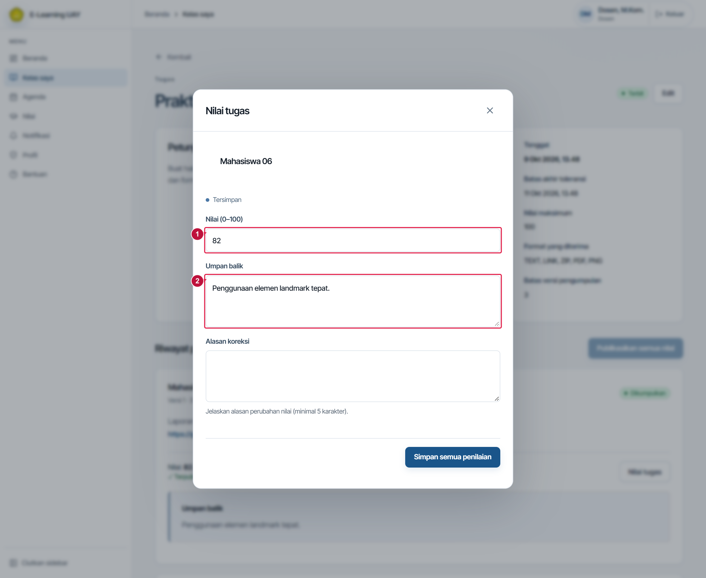

Penanda gambar: 1 Skor; 2 Umpan balik

### Input, pilihan, dan tombol

| Kontrol di layar | Nilai atau contoh | Fungsi dan akibat |
| --- | --- | --- |
| Versi pengumpulan | Pilih versi yang hendak diperiksa | Memastikan Anda menilai jawaban yang benar, bukan hanya berkas terakhir yang terlihat. |
| Nilai | Angka 0 sampai maksimum tugas, contoh 85 dari 100 | Menyimpan skor pekerjaan mahasiswa. |
| Umpan balik | Catatan hasil, contoh Validasi sudah benar, tambahkan uji kolom kosong | Memberi arahan perbaikan. Ditampilkan mengikuti publikasi nilai. |
| Alasan koreksi | Teks minimal 5 karakter saat diwajibkan | Mencatat dasar perubahan pada jejak audit, termasuk koreksi nilai terbit. |
| Simpan semua perubahan | Tombol panel penilaian | Menyimpan nilai dan masukan. Periksa status publikasinya. |
| Publikasikan nilai / Publikasikan semua nilai | Tombol publikasi hasil yang tersedia | Membuka hasil penilaian kepada mahasiswa. |

### Catatan penggunaan

Selesaikan penilaian pengumpulan yang masuk sebelum menerbitkan nilai akhir kelas.

## D7 — Membuat kuis dan mengatur waktu hasil

**Peran:** Dosen.

**Tujuan:** Menentukan kuis yang dapat dikerjakan dan dinilai sesuai jadwal.

**Buka:** Section kemudian Kuis kemudian Tambah kuis

**Sebelum mulai:** Siapkan soal, kunci/rubrik, kategori nilai, durasi, dan kebijakan hasil.

### Langkah

1. Klik Kuis pada Section. Isi Judul, Deskripsi, dan Kategori nilai.
2. Pilih Perhitungan poin. Untuk Total wajib 100, pastikan jumlah poin soal tepat 100. Untuk Normalisasi ke skala 100, sistem mengubah proporsi skor menjadi skala 100.
3. Isi Waktu pengerjaan, Kesempatan pengerjaan, dan Nilai minimum kelulusan. Pilih Perhitungan waktu dan tentukan waktu buka/tutup.
4. Pilih Publikasi hasil. Jika Sesuai jadwal, isi Jadwal publikasi hasil. Atur Acak urutan soal dan Acak pilihan jawaban.
5. Tambahkan minimal satu soal. Isi kunci atau rubrik setiap soal. Gunakan Genapkan ke 100 poin bila ingin menyeimbangkan total poin.
6. Periksa total poin, jadwal, dan kunci, lalu Simpan Sebagai Draf atau Simpan dan Publikasikan.

**Periksa hasil:** Kuis memiliki soal valid dan pengaturan waktu/hasil yang sesuai.

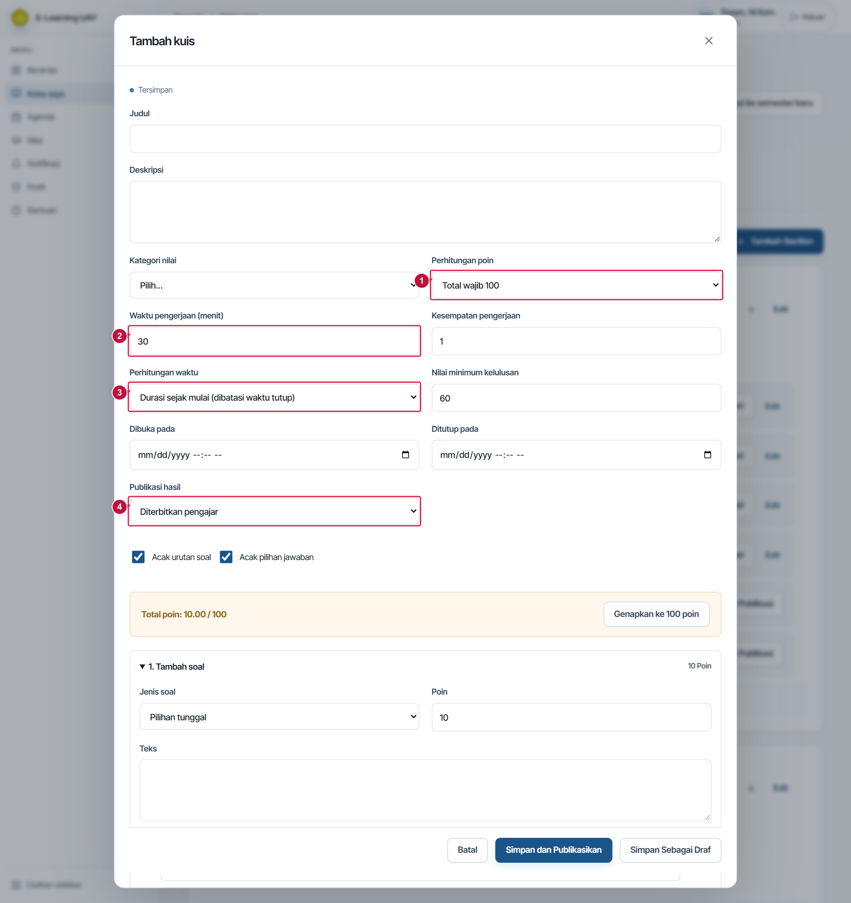

Penanda gambar: 1 Perhitungan poin; 2 Durasi menit; 3 Mode waktu; 4 Publikasi hasil

### Input, pilihan, dan tombol

| Kontrol di layar | Nilai atau contoh | Fungsi dan akibat |
| --- | --- | --- |
| Judul / Deskripsi | Judul wajib, deskripsi petunjuk kuis | Menjelaskan topik dan cara pengerjaan. |
| Kategori nilai | Kategori kelas yang bukan progres | Menentukan komponen rekap nilai untuk kuis. |
| Perhitungan poin | Total wajib 100 (STRICT) atau Normalisasi ke skala 100 (NORMALIZED) | STRICT menolak total selain 100. NORMALIZED memakai skor diperoleh dibagi total poin lalu dikali 100. |
| Waktu pengerjaan (menit) | 1 sampai 300, default 30 | Durasi pengerjaan. Satuan menit. |
| Kesempatan pengerjaan | 1 sampai 10, default 1 | Membatasi jumlah pengerjaan mahasiswa. |
| Perhitungan waktu | Durasi sejak mulai atau Berakhir serentak pada waktu tutup | Durasi sejak mulai tetap dibatasi waktu tutup. Mode serentak memakai waktu tutup bersama. |
| Nilai minimum kelulusan | 0 sampai 100, default 60 | Ambang kelulusan kuis pada skala 100. |
| Dibuka pada / Ditutup pada | Tanggal-jam. Ditutup pada wajib untuk mode serentak | Menentukan jendela kuis. Batas waktu tutup dapat memotong durasi yang tersisa. |
| Publikasi hasil | Diterbitkan pengajar, Otomatis setelah dinilai, Sesuai jadwal, Disembunyikan | Manual membutuhkan publikasi. Otomatis menunggu penilaian lengkap. Jadwal menunggu waktu rilis. Disembunyikan menahan hasil dari mahasiswa. |
| Jadwal publikasi hasil | Tanggal-jam wajib bila Sesuai jadwal | Waktu hasil mulai dapat ditampilkan setelah memenuhi syarat penilaian. |
| Acak urutan soal | ON default = urutan soal diacak. OFF = mengikuti susunan | Mengubah urutan soal pada pengerjaan mahasiswa. |
| Acak pilihan jawaban | ON default = pilihan diacak. OFF = susunan asli | Mengacak opsi jenis soal yang mendukung. |
| Genapkan ke 100 poin | Tombol | Mendistribusikan poin agar total 100. Periksa ulang poin dan rubrik sesudahnya. |
| Tambah soal / Gunakan soal bank | Tombol | Menambah soal baru atau mengambil soal dari bank. Kuis mendukung 1 sampai 200 soal. |

### Catatan penggunaan

Contoh: mahasiswa mulai 09.50, durasi 30 menit, waktu tutup 10.00. Pengerjaan hanya tersedia sampai 10.00.

## D8 — Menyusun kunci soal objektif

**Peran:** Dosen.

**Tujuan:** Membuat soal pilihan dan isian yang memiliki kunci jelas.

**Buka:** Editor kuis atau Bank soal kemudian Tambah soal

**Sebelum mulai:** Editor kuis/bank soal terbuka. Siapkan pertanyaan dan jawaban yang benar.

### Langkah

1. Klik Tambah soal. Pilih Jenis soal, isi Poin dan Teks pertanyaan.
2. Untuk Pilihan tunggal atau Benar / salah, isi opsi lalu pilih satu Jawaban benar. Untuk Pilihan jamak, centang semua opsi yang benar.
3. Untuk Isian singkat, masukkan jawaban yang diterima, dipisah | bila lebih dari satu. Contoh HTTP | Hypertext Transfer Protocol.
4. Jika isian berupa angka, isi Jawaban numerik dan Toleransi numerik, misalnya 3.14 dan 0.01. Atur pemeriksaan huruf besar/kecil bila relevan.
5. Tulis Penjelasan jawaban bila diperlukan. Periksa kunci sebelum menyimpan kuis atau bank soal.

**Periksa hasil:** Soal objektif memiliki opsi, kunci, dan poin sesuai maksud penilaian.

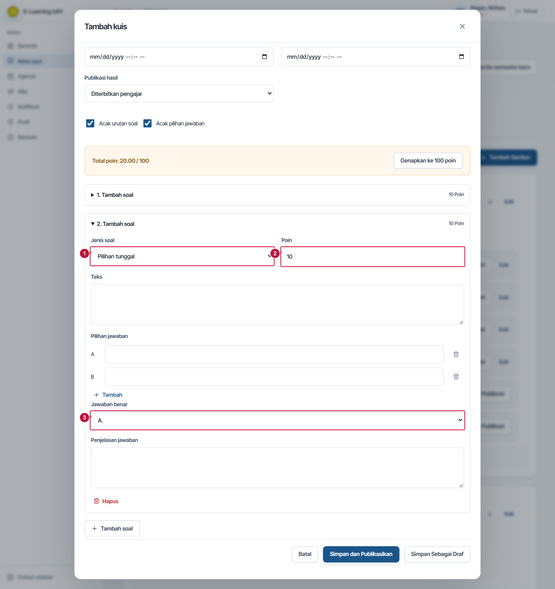

Penanda gambar: 1 Jenis soal; 2 Poin soal; 3 Kunci jawaban

### Input, pilihan, dan tombol

| Kontrol di layar | Nilai atau contoh | Fungsi dan akibat |
| --- | --- | --- |
| Jenis soal | Pilihan tunggal, Pilihan jamak, Benar / salah, Isian singkat | Menentukan kontrol jawaban serta aturan kunci. |
| Poin | Bilangan 1 sampai 1000 per soal | Skor maksimum soal sebelum normalisasi total kuis. |
| Teks | Pertanyaan wajib | Isi soal yang dijawab mahasiswa. |
| Pilihan jawaban | Teks setiap opsi, gunakan Tambah untuk opsi baru | Menyediakan pilihan. Isi semua opsi yang dipakai dan hapus opsi kosong. |
| Jawaban benar | Satu opsi untuk tunggal/benar-salah, beberapa checkbox untuk jamak | Menentukan kunci penilaian otomatis. |
| Nilai parsial pilihan jamak | ON = memberikan kredit parsial sesuai aturan pilihan jamak. OFF = menilai kecocokan lengkap | Gunakan ON hanya jika penilaian sebagian sesuai rancangan soal. |
| Jawaban benar pada isian | Teks alternatif dipisah \|, contoh GET \| get | Daftar jawaban yang diterima pada isian singkat. |
| Jawaban numerik (opsional) | Angka, contoh 3.14 | Mengaktifkan pencocokan numerik pada soal yang membutuhkan angka. |
| Toleransi numerik | Angka 0 atau lebih, contoh 0.01 | Rentang selisih angka yang diterima. |
| Perhatikan huruf besar/kecil | ON = peka huruf. OFF = tidak peka huruf | Menentukan apakah GET dan get dianggap sama. |
| Penjelasan jawaban | Teks penjelasan | Materi pembahasan terkait jawaban benar. |

### Catatan penggunaan

Coba baca soal sebagai mahasiswa. Pertanyaan, pilihan, dan kunci harus saling konsisten.

## D9 — Menyusun pasangan urutan uraian dan unggahan

**Peran:** Dosen.

**Tujuan:** Membuat soal yang memerlukan pasangan, susunan, atau koreksi manual.

**Buka:** Editor kuis atau Bank soal kemudian Jenis soal

**Sebelum mulai:** Pertanyaan dan rancangan penilaian sudah siap.

### Langkah

1. Untuk Menjodohkan, isi item kiri dan Deskripsi item kanan. Pilih pasangan benar pada Kunci jawaban setiap item.
2. Untuk Mengurutkan, isi seluruh item lalu tentukan Kunci jawaban urutan pertama sampai terakhir. Gunakan setiap item satu kali.
3. Untuk Uraian, isi pertanyaan, Poin, Batas kata, dan Rubrik penilaian. Contoh dua baris: Ketepatan konsep | 15 dan Contoh penerapan | 10.
4. Untuk Unggah berkas, jelaskan berkas yang diminta dalam pertanyaan dan tetapkan rubrik koreksi. Mahasiswa akan menggunakan kontrol unggah.
5. Periksa jumlah poin rubrik sesuai poin soal. Simpan editor kuis/bank setelah seluruh soal ditinjau.

**Periksa hasil:** Pasangan/urutan lengkap dan soal manual mempunyai rubrik yang dapat digunakan pengajar.

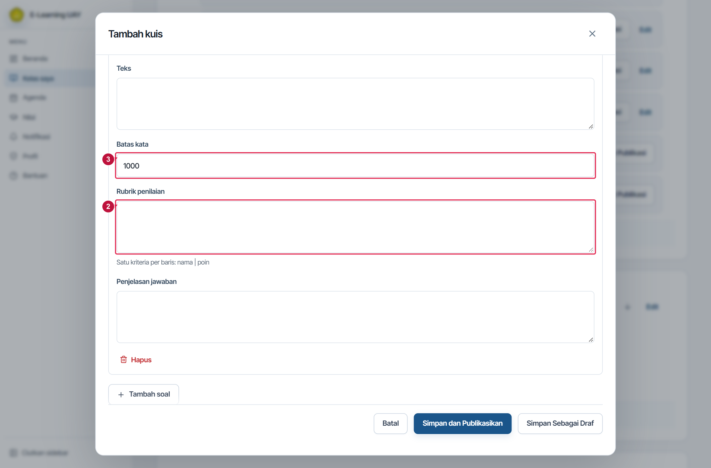

Penanda gambar: 2 Rubrik; 3 Batas kata

### Input, pilihan, dan tombol

| Kontrol di layar | Nilai atau contoh | Fungsi dan akibat |
| --- | --- | --- |
| Menjodohkan | Item kiri, deskripsi kanan, dan satu pasangan benar tiap item | Kunci pasangan menentukan kecocokan jawaban mahasiswa. |
| Mengurutkan | Urutan lengkap tanpa item ganda | Kunci menyatakan posisi item dari awal sampai akhir. |
| Uraian | Jawaban teks yang dinilai pengajar | Memerlukan penilaian manual, tidak cukup hanya skor otomatis kuis. |
| Unggah berkas | Jawaban berupa file | Pengajar memeriksa berkas lalu memberi skor sesuai rubrik. |
| Batas kata | 1 sampai 10000, default 1000 | Metadata/batas teks pada soal manual. Sesuaikan dengan panjang jawaban yang diminta. |
| Rubrik penilaian | Satu kriteria per baris: nama \| poin, contoh Analisis \| 15 | Membagi skor manual ke kriteria. Total rubrik harus sesuai poin soal. |
| Penjelasan jawaban | Teks opsional | Memberi pembahasan soal. |

### Catatan penggunaan

Nilai uraian dan unggahan menunggu penilaian pengajar. Publikasi hasil otomatis tetap menunggu penilaian lengkap.

## D10 — Menilai kuis dan mengelola bank soal

**Peran:** Dosen.

**Tujuan:** Menyelesaikan koreksi kuis dan menyimpan soal yang dapat dipakai kembali.

**Buka:** Judul kuis untuk koreksi, tab Bank soal untuk pustaka soal

**Sebelum mulai:** Pengerjaan sudah terkumpul. Untuk bank, akun dapat mengelola kelas.

### Langkah

1. Buka kuis dan pilih mode koreksi Per mahasiswa atau Per soal. Pilih pengerjaan/jawaban yang hendak dinilai.
2. Untuk soal manual, masukkan skor 0 sampai Poin soal. Isi Umpan balik. Jika ada rubrik, periksa skor tiap kriteria dan total.
3. Isi Alasan koreksi minimal lima karakter jika mengganti nilai sebelumnya/terbit. Simpan penilaian dan terbitkan hasil sesuai kebijakan kuis.
4. Untuk pustaka soal, buka Bank soal. Klik Buat bank soal, isi Judul, lalu Simpan semua perubahan.
5. Klik Tambah soal pada bank, isi soal dan kuncinya, lalu Simpan semua perubahan. Pada editor kuis, gunakan Gunakan soal bank untuk mengambil soal yang diperlukan.

**Periksa hasil:** Jawaban manual sudah dinilai dan soal dapat digunakan kembali melalui bank.

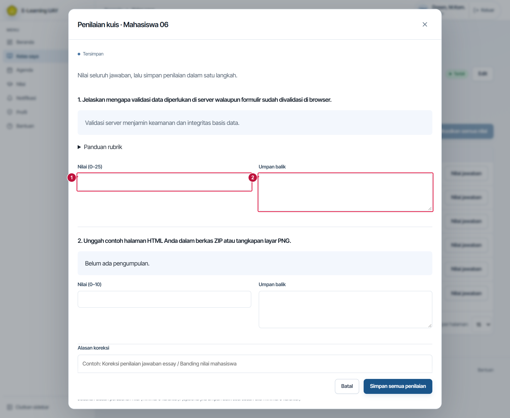

Penanda gambar: 1 Nilai soal; 2 Umpan balik

### Input, pilihan, dan tombol

| Kontrol di layar | Nilai atau contoh | Fungsi dan akibat |
| --- | --- | --- |
| Mode koreksi Per mahasiswa / Per soal | Pilihan tampilan | Mengubah pengelompokan koreksi, bukan nilai yang tersimpan. |
| Nilai jawaban | 0 sampai Poin soal | Skor soal manual. Skor total kuis mengikuti mode poin. |
| Umpan balik | Teks masukan | Penjelasan nilai pada jawaban. |
| Alasan koreksi | Teks minimal 5 karakter saat diwajibkan | Mencatat alasan mengganti nilai yang sudah ada. |
| Publikasikan nilai | Tombol jika kebijakan memungkinkan | Membuka hasil yang siap kepada mahasiswa. |
| Buat bank soal / Judul | Tombol dan teks judul | Membuat wadah soal reusable dalam kelas. |
| Tambah soal / Simpan | Tombol pada bank/editor | Menyimpan soal beserta opsi, kunci, dan rubrik. |
| Impor massal | Tombol bank soal | Memasukkan banyak soal melalui template dan pemeriksaan impor. |

### Catatan penggunaan

Bank soal tersimpan per kelas. Saat menggunakan soal bank, tinjau kembali poin dan kunci pada kuis tujuan.

## D11 — Membuka sesi presensi dengan jadwal atau kode

**Peran:** Dosen.

**Tujuan:** Menyiapkan presensi sesuai pelaksanaan pertemuan.

**Buka:** Kelas kemudian Presensi kemudian Buat Sesi Presensi

**Sebelum mulai:** Mahasiswa telah terdaftar aktif. Siapkan topik, tanggal, dan jam pertemuan.

### Langkah

1. Klik Buat Sesi Presensi. Isi Judul Sesi Presensi, Keterangan / Topik, dan Tanggal Perkuliahan.
2. Jika presensi akan dibuka sampai ditutup manual, biarkan Jadwalkan Waktu Presensi tidak dicentang. Untuk jendela waktu, centang dan isi Waktu Mulai serta Waktu Selesai, masing-masing berupa tanggal-jam perangkat. Untuk sesi melewati tengah malam, pilih tanggal selesai pada hari berikutnya.
3. Untuk presensi satu klik, biarkan Wajibkan Kode 6 Karakter (Proyektor) OFF. Untuk verifikasi kode, ubah menjadi ON.
4. Klik Buat & Buka Sesi. Periksa apakah sesi berstatus Sesi Dibuka atau Terjadwal sesuai waktunya.
5. Jika menggunakan kode, klik Kode Proyektor pada sesi dan tampilkan enam karakter kepada mahasiswa. Pantau jumlah Hadir, lalu tutup sesi setelah selesai.

**Periksa hasil:** Sesi benar tersedia dan menerima presensi sesuai mode/jadwal yang dipilih.

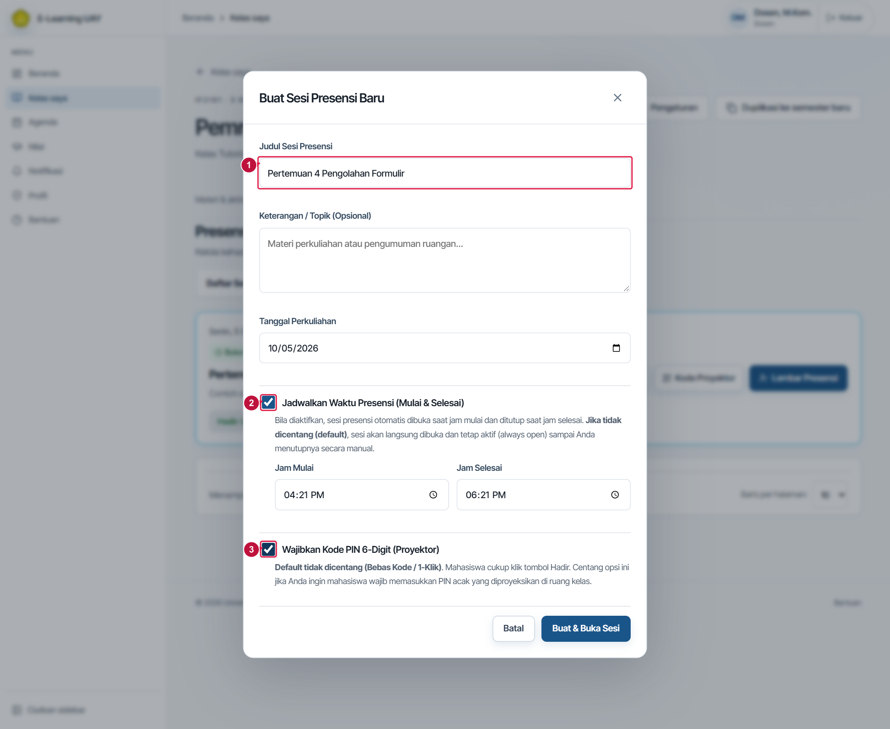

Penanda gambar: 1 Judul sesi; 2 Jadwal ON; 3 kode ON

### Input, pilihan, dan tombol

| Kontrol di layar | Nilai atau contoh | Fungsi dan akibat |
| --- | --- | --- |
| Judul Sesi Presensi | Teks wajib 2 sampai 200 karakter | Nama sesi, contoh Pertemuan 4 Formulir Web. |
| Keterangan / Topik (Opsional) | Teks maksimum 1000 karakter atau kosong | Ringkasan topik/catatan pertemuan. |
| Tanggal Perkuliahan | Tanggal kegiatan, contoh 12 Oktober 2026 | Mengaitkan sesi dengan hari perkuliahan. |
| Jadwalkan Waktu Presensi (Mulai & Selesai) | OFF default = buka manual sampai ditutup. ON = gunakan jam mulai/selesai | Menampilkan isian jam dan menerapkan jendela presensi. |
| Waktu Mulai / Waktu Selesai | Tanggal-jam lokal masing-masing; akhir tidak sebelum awal | Mengatur kapan mahasiswa dapat mengisi. Periksa zona waktu perangkat. |
| Wajibkan Kode 6 Karakter (Proyektor) | OFF default = satu klik. ON = wajib kode | Sistem menghasilkan kode acak enam karakter huruf/angka. |
| Buat & Buka Sesi | Tombol | Membuat sesi. Jadwal masa depan akan tampil terjadwal, bukan menerima pengisian segera. |
| Kode Proyektor | Tombol pada sesi | Menampilkan kode dan informasi sesi untuk dibagikan di kelas. |

### Catatan penggunaan

Default sesi baru adalah tanpa kode dan tanpa jadwal. Periksa kedua checkbox sebelum membuat sesi.

## D12 — Mengubah jadwal menutup dan memperpanjang presensi

**Peran:** Dosen.

**Tujuan:** Mengendalikan sesi yang sudah dibuat tanpa membuat sesi ganda.

**Buka:** Presensi kemudian Atur Jadwal pada sesi

**Sebelum mulai:** Sesi sudah tersedia. Pastikan Anda memilih judul/tanggal yang benar.

### Langkah

1. Klik Atur Jadwal pada sesi. Periksa status terbuka/tertutup.
2. Untuk mengganti status melalui dialog, klik Tutup Sesi atau Buka Sesi Sekarang. Lanjutkan Simpan Pengaturan untuk menyimpan perubahan dialog.
3. Centang Terapkan Jadwal Otomatis bila sesi perlu jam mulai/selesai. Isi tanggal dan jam yang benar. Jika jadwal dihapus, status mengikuti pilihan buka/tutup manual.
4. Untuk tambahan waktu cepat, klik +15 Menit atau +30 Menit. Aksi ini langsung menyimpan akhir waktu baru dan membuka sesi, tanpa menunggu tombol Simpan Pengaturan.
5. Jika kode perlu diganti, aktifkan kebijakan kode dan klik Acak Ulang Kode atau isi kode. Klik Simpan Pengaturan kemudian bagikan kode yang baru.
6. Kembali ke daftar dan periksa jadwal/status. Buka/tutup langsung pada kartu sesi juga tersedia.

**Periksa hasil:** Status, jadwal, dan kode terbaru berlaku pada sesi yang sama.

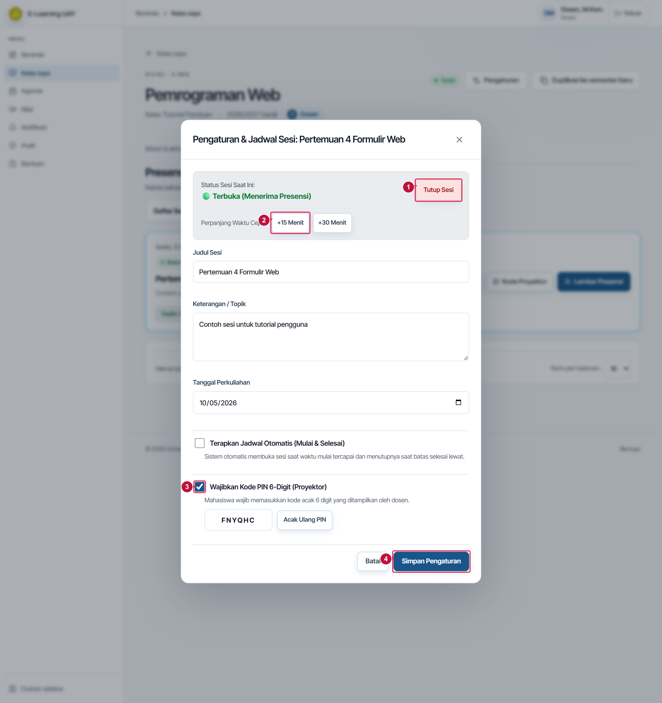

Penanda gambar: 1 Buka atau tutup sesi; 2 Perpanjang 15 menit; 3 Kebijakan kode; 4 Simpan pengaturan

### Input, pilihan, dan tombol

| Kontrol di layar | Nilai atau contoh | Fungsi dan akibat |
| --- | --- | --- |
| Tutup Sesi / Buka Sesi Sekarang dalam dialog | Pilihan status | Mengubah pilihan status pada form. Simpan Pengaturan agar tersimpan. |
| Buka Sesi / Tutup Sesi pada kartu | Tombol aksi langsung | Mengubah status sesi melalui aksi pada kartu. Periksa jendela jadwalnya. |
| +15 Menit / +30 Menit | Tombol aksi langsung | Menambah dari waktu akhir atau waktu sekarang yang lebih akhir dan langsung membuka sesi. |
| Terapkan Jadwal Otomatis (Mulai & Selesai) | ON = jam otomatis. OFF = hapus batas jam | Sesi terjadwal dapat dibuka kembali saat jadwal masih berjalan. Untuk menutup permanen, tinjau juga jadwal akhirnya. |
| Wajibkan Kode 6 Karakter (Proyektor) | ON = kode diperlukan. OFF = bebas kode | Mengubah metode presensi untuk mahasiswa. |
| Kode | Maksimal 6 karakter pada isian, contoh AB7K92, kosong untuk kode otomatis | Gunakan enam karakter agar sesuai petunjuk mahasiswa. |
| Acak Ulang Kode | Tombol | Menghasilkan kode baru pada draf dialog. Simpan sebelum membagikannya. |
| Simpan Pengaturan | Tombol | Menyimpan isian form jadwal, status, dan kode. |
| Batal | Tombol | Menutup tanpa menyimpan isian dialog. Aksi perpanjangan cepat yang sudah dijalankan tetap berlaku. |

### Catatan penggunaan

Mengganti kode membuat kode lama tidak berlaku bagi pengisian berikutnya. Beri tahu mahasiswa ketika kode diganti.

## D13 — Mengoreksi kehadiran manual dan ekspor rekap

**Peran:** Dosen.

**Tujuan:** Mencatat izin/sakit/koreksi kehadiran dan meninjau rekap kelas.

**Buka:** Presensi kemudian Lembar Presensi atau Rekapitulasi Kehadiran

**Sebelum mulai:** Sesi dan peserta sudah tersedia. Siapkan bukti alasan koreksi bila diperlukan.

### Langkah

1. Pilih sesi yang benar lalu klik Lembar Presensi. Cari baris nama dan NIM mahasiswa.
2. Klik Hadir, Izin, Sakit, Tidak Hadir (Alpa), atau Terlambat pada baris yang sesuai. Isi Catatan / Izin, misalnya nomor surat atau alasan.
3. Gunakan Tandai Semua Hadir hanya setelah memeriksa seluruh peserta. Koreksi kembali pengecualian seperti mahasiswa izin/sakit.
4. Klik Simpan Semua Perubahan. Buka kembali lembar untuk memastikan status tersimpan.
5. Pada tab Rekapitulasi Kehadiran, tinjau jumlah H, I, S, A, T, persentase, dan kelayakan. Klik Ekspor Rekap (CSV) untuk mengunduh rekap.

**Periksa hasil:** Status manual tersimpan dan rekap/CSV sesuai data sesi.

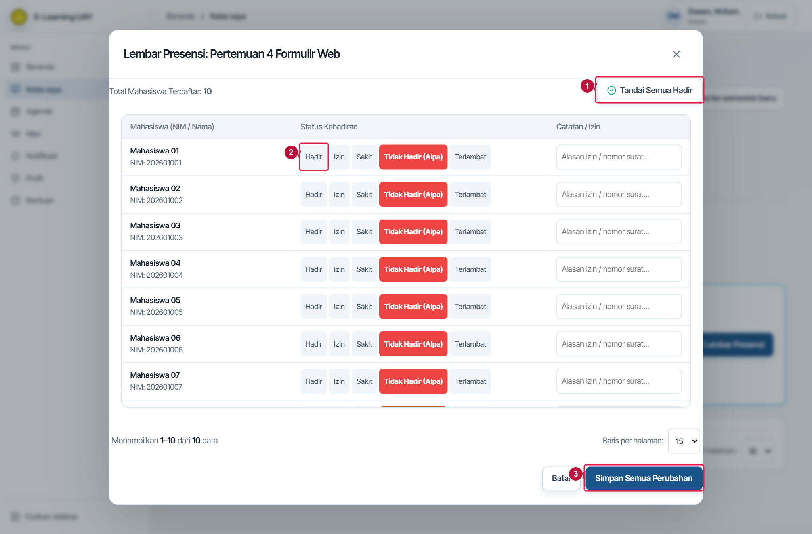

Penanda gambar: 1 Semua hadir; 2 Status; 3 Simpan

### Input, pilihan, dan tombol

| Kontrol di layar | Nilai atau contoh | Fungsi dan akibat |
| --- | --- | --- |
| Hadir / Izin / Sakit / Tidak Hadir (Alpa) / Terlambat | Pilih satu status per mahasiswa | Mengubah status baris dalam draf lembar presensi. |
| Catatan / Izin | Teks, contoh Surat izin 012/IF/2026 | Mencatat alasan atau referensi bukti. |
| Tandai Semua Hadir | Tombol | Mengubah semua peserta pada lembar menjadi Hadir dalam draf. Tinjau pengecualian sebelum menyimpan. |
| Simpan Semua Perubahan | Tombol | Menyimpan seluruh status dan catatan lembar ke server. |
| Rekapitulasi Kehadiran | Tab | Menampilkan rekap peserta aktif dari sesi kelas. |
| H / I / S / A / T | Kolom jumlah status | Hadir, Izin, Sakit, Alpa, Terlambat. |
| Persentase kehadiran | (Hadir + Terlambat) / total sesi x 100 | Pada rekap versi ini Izin dan Sakit tidak menambah persentase. |
| Ekspor Rekap (CSV) | Tombol | Mengunduh file CSV untuk dibuka di spreadsheet. Berbeda dari Ekspor Excel nilai. |

### Catatan penggunaan

Contoh: 6 Hadir + 1 Terlambat dari 8 sesi = 87,5 persen. Ambang kelayakan pada rekap mengikuti pengaturan Super Admin yang tersimpan dan ditampilkan pada rekap.

## D14 — Mengatur bobot dan sumber nilai kategori

**Peran:** Dosen.

**Tujuan:** Menetapkan cara komponen penilaian berkontribusi pada nilai akhir.

**Buka:** Kelas kemudian Rekap nilai kemudian Bobot penilaian

**Sebelum mulai:** Nilai akhir belum dikunci. Komponen penilaian kelas telah disepakati.

### Langkah

1. Buka Bobot penilaian. Pilih versi Kebijakan Konversi Huruf Mutu sesuai semester.
2. Isi nama kategori dan Bobot (%). Contoh Presensi 10, Tugas 20, Kuis 10, UTS 25, UAS 35. Total harus tepat 100 persen.
3. Pilih Sumber Kalkulasi Otomatis tiap kategori. Misalnya Presensi Kehadiran untuk Presensi dan Tugas Terstruktur untuk Tugas.
4. Tambahkan kategori bila dibutuhkan. Hapus kategori opsional yang tidak digunakan. Kategori UTS dan UAS wajib tersedia dan tidak dapat dihapus/diubah namanya.
5. Periksa total bobot dan versi skala, lalu klik Simpan semua perubahan. Kembali ke rekap untuk meninjau hasil/saran per kategori.

**Periksa hasil:** Bobot valid 100 persen dan sumber nilai tiap kategori sesuai rancangan.

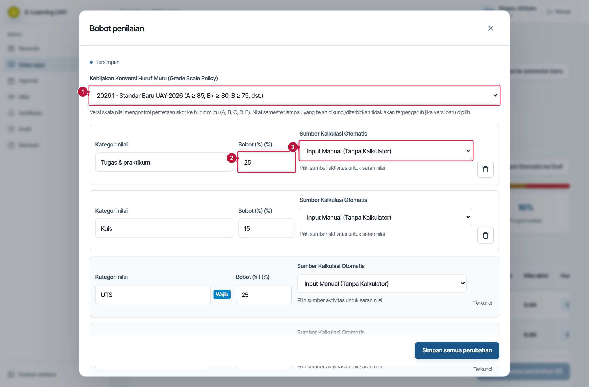

Penanda gambar: 1 Versi; 2 Bobot; 3 Sumber

### Input, pilihan, dan tombol

| Kontrol di layar | Nilai atau contoh | Fungsi dan akibat |
| --- | --- | --- |
| Kebijakan Konversi Huruf Mutu | Versi 2026.1 atau 2024.1 | Menentukan pemetaan skor ke huruf dan indeks mutu. Gunakan versi kebijakan yang berlaku. |
| Kategori nilai | Nama komponen, contoh Tugas | Label komponen pada rekap. UTS/UAS merupakan kategori wajib. |
| Bobot (%) | Angka 0 sampai 100, langkah 0,1, total semua kategori 100 | Kontribusi kategori. Bobot 20 berarti menyumbang 20 persen nilai akhir. |
| Sumber Kalkulasi Otomatis | Input Manual, Tugas Terstruktur, Kuis, Gabungan Tugas & Kuis, Progres Belajar Materi, Presensi Kehadiran | Menentukan sumber saran nilai. Saran perlu ditinjau/dipakai sebelum menjadi nilai draf manual. |
| Tambah kategori | Tombol | Menambah komponen baru. Atur bobot agar total tetap 100. |
| Hapus Kategori | Tombol kategori opsional | Menghapus kategori dari susunan bobot. Tidak tersedia untuk UTS/UAS. |
| Simpan semua perubahan | Tombol | Menerapkan susunan kategori dan versi skala pada kelas. |

### Catatan penggunaan

Bobot penilaian dinonaktifkan setelah nilai akhir dikunci. Tentukan bobot sebelum penerbitan akhir.

## D15 — Meninjau menghitung dan mempublikasikan nilai akhir

**Peran:** Dosen.

**Tujuan:** Memastikan komponen lengkap sebelum nilai resmi terlihat mahasiswa.

**Buka:** Kelas kemudian Rekap nilai

**Sebelum mulai:** Total bobot valid 100 persen. Penilaian tugas/kuis sudah ditinjau.

### Langkah

1. Periksa tiap baris mahasiswa dan komponen nilai. Klik nama/aksi rincian mahasiswa untuk membuka Rincian Nilai jika tersedia.
2. Pada rincian, periksa sumber kegiatan dan Gunakan Nilai Saran jika saran sesuai penilaian. Sesuaikan Nilai Akhir Bagian dalam rentang 0 sampai 100, lalu Simpan ke Draf.
3. Untuk banyak mahasiswa, Terapkan Kalkulasi Otomatis ke Draf dapat menerapkan saran sekaligus. Baca konfirmasinya dan tinjau hasil sebelum publikasi.
4. Jika mengedit sel nilai langsung, Simpan perubahan terlebih dahulu. Isi alasan koreksi minimal lima karakter bila diwajibkan.
5. Klik Hitung nilai akhir. Periksa skor, huruf, indeks mutu, dan komponen kosong. Selesaikan penilaian yang masih menunggu.
6. Jika sengaja menerima komponen kosong sebagai nol, centang persetujuan nilai kosong setelah meninjaunya. Klik Publikasikan nilai akhir ketika semua syarat terpenuhi.
7. Periksa status nilai akhir telah dikunci, lalu klik Ekspor Excel untuk mengunduh rekap. Koreksi setelah terbit harus memiliki alasan dan dapat memperbarui nilai terbit.

**Periksa hasil:** Nilai akhir terbit, komponen telah ditinjau, dan ekspor sesuai hasil kelas.

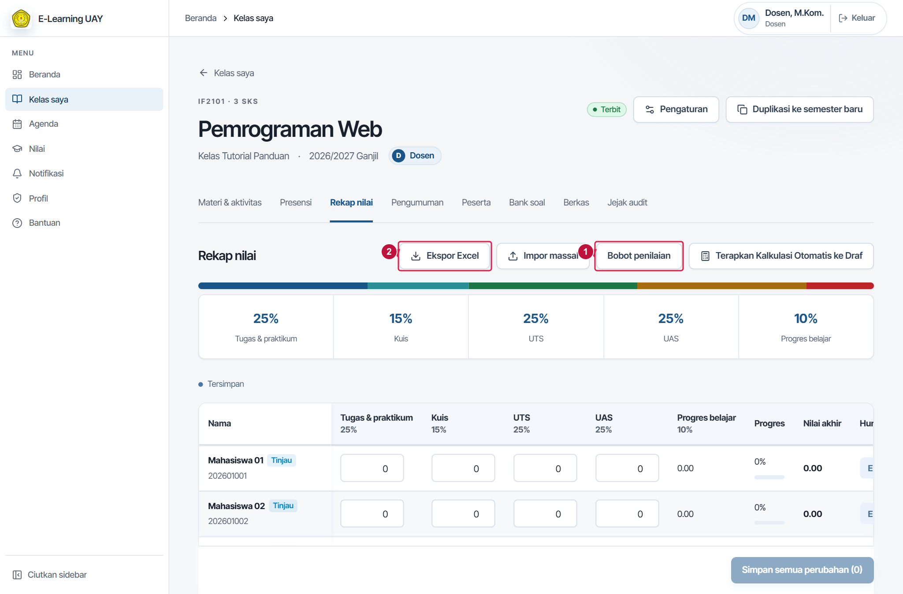

Penanda gambar: 1 Bobot; 2 Ekspor

### Input, pilihan, dan tombol

| Kontrol di layar | Nilai atau contoh | Fungsi dan akibat |
| --- | --- | --- |
| Nilai kategori / Nilai Akhir Bagian | Skor 0 sampai 100, contoh 85 | Angka pada skala kategori. Skor kosong dapat diperhitungkan sebagai 0. |
| Gunakan Nilai Saran | Tombol pada rincian kategori | Menyalin saran hasil kegiatan ke nilai yang sedang diedit. Simpan ke Draf agar tersimpan. |
| Terapkan Kalkulasi Otomatis ke Draf | Tombol dengan konfirmasi | Menerapkan saran kategori otomatis ke draf banyak mahasiswa. Periksa data setelahnya. |
| Simulasi nilai akhir | Jumlah nilai kategori x bobot / 100 | Pratinjau hasil sebelum menyimpan/publikasi. |
| Simpan ke Draf / Simpan | Tombol sesuai panel | Menyimpan komponen nilai tanpa langsung mempublikasikan nilai akhir. |
| Alasan perubahan / koreksi | Minimal 5 karakter saat mengoreksi nilai sebelumnya atau terbit | Dasar koreksi dicatat dan diperlukan untuk perubahan tertentu. |
| Hitung nilai akhir | Tombol | Menghitung berdasarkan komponen dan bobot tersimpan. Bobot invalid/perubahan belum tersimpan menghambatnya. |
| Persetujuan nilai kosong | ON = menyetujui kosong dihitung 0. OFF = publikasi tertahan jika ada nilai kosong | Centang setelah memeriksa peserta dan kategori yang kosong. |
| Publikasikan nilai akhir | Tombol | Menerbitkan dan mengunci hasil. Menunggu bobot valid, tidak ada perubahan belum tersimpan, koreksi selesai, dan persetujuan kosong bila perlu. |
| Ekspor Excel | Tombol | Mengunduh rekap .xlsx. Ekspor tidak menggantikan publikasi nilai. |

### Catatan penggunaan

Contoh nilai kategori 80, 90, 70, 75, 85 dengan bobot 10, 20, 10, 25, 35 menghasilkan 81,50. Pada skala 2026.1 hasilnya A- dan indeks 3,75.

## D16 — Mengelola peserta pengumuman berkas dan duplikasi

**Peran:** Dosen.

**Tujuan:** Menyiapkan operasional kelas dan memindahkan bahan ke semester baru.

**Buka:** Tab Peserta, Pengumuman, Berkas, Jejak audit, dan Duplikasi ke semester baru

**Sebelum mulai:** Berhak mengelola kelas. Periksa tujuan sebelum mengubah kepesertaan atau status.

### Langkah

1. Pada Peserta, klik Daftarkan peserta. Cari nama/NIM, pilih mahasiswa, lalu Simpan semua perubahan. Gunakan Nonaktifkan peserta/Aktifkan peserta untuk mengubah hak partisipasi.
2. Pada Pengumuman, klik Buat pengumuman. Isi Judul dan Isi pengumuman, atur Diterbitkan serta checkbox Penting, lalu simpan draf atau publikasikan.
3. Pada Berkas, periksa status dan file yang digunakan. Gunakan Pindahkan ke sampah hanya untuk file yang memang tidak diperlukan. Gunakan Pulihkan jika masih dalam masa pemulihan.
4. Pada Jejak audit, baca pelaku, waktu, peristiwa, serta perubahan sebelum/sesudah untuk memeriksa koreksi.
5. Untuk semester baru, klik Duplikasi ke semester baru. Isi Nama kelas dan Tahun akademik & Semester Baru, lalu Simpan semua perubahan.
6. Buka kelas hasil duplikasi. Periksa materi draf, perbarui jadwal, tetapkan peserta semester baru, dan terbitkan isi yang siap.

**Periksa hasil:** Peserta dan komunikasi sesuai kelas. Kelas hasil duplikasi siap ditata untuk semester baru.

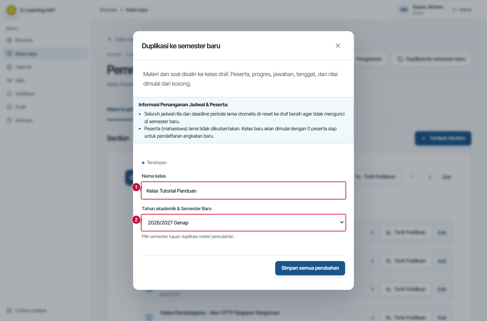

Penanda gambar: 1 Nama; 2 Semester

### Input, pilihan, dan tombol

| Kontrol di layar | Nilai atau contoh | Fungsi dan akibat |
| --- | --- | --- |
| Nonaktifkan peserta | Tombol dengan konfirmasi | Menutup hak partisipasi mahasiswa pada kelas tanpa menghapus riwayat sebelumnya. |
| Aktifkan peserta | Tombol | Mengembalikan hak partisipasi peserta pada kelas. |
| Judul / Isi pengumuman | Teks wajib | Pesan kepada kelas. |
| Diterbitkan | Tanggal-jam pengumuman atau kosong | Menjadwalkan waktu publikasi pengumuman. |
| Penting | ON = tandai prioritas. OFF = pengumuman biasa | Memberi penanda penting pada pengumuman. |
| Pindahkan ke sampah | Tombol berkas | Materi yang memakai file dapat kehilangan akses unduh sampai file dipulihkan. |
| Pulihkan | Tombol berkas di sampah | Memulihkan selama masa retensi yang ditampilkan, saat ini 7 hari. |
| Nama kelas duplikasi | Teks, contoh Kelas A | Nama kelas baru, bukan pengganti nama kelas lama. |
| Tahun akademik & Semester Baru | Pilihan semester tujuan | Menentukan periode kelas baru. |
| Simpan duplikasi | Tombol | Menyalin struktur materi/soal ke kelas draf. Peserta, progres, jawaban, nilai, dan jadwal lama tidak dibawa sebagai hasil belajar baru. |

### Catatan penggunaan

Untuk pendaftaran dan impor peserta secara lengkap, ikuti A3 dan A4. Duplikasi tidak otomatis membuka perkuliahan semester baru.

## A1 — Memeriksa cakupan program studi

**Peran:** Admin Prodi.

**Tujuan:** Menjalankan administrasi pada prodi yang ditugaskan.

**Buka:** Beranda administrasi kemudian Katalog mata kuliah atau Kelola kelas

**Sebelum mulai:** Masuk sebagai Admin prodi dan memiliki cakupan prodi dari SSO.

### Langkah

1. Buka Beranda. Periksa Cakupan program studi sebelum memulai administrasi.
2. Klik Katalog mata kuliah untuk mengelola daftar mata kuliah. Klik Kelola kelas untuk mengelola rombel semester.
3. Cari kode/nama yang dibutuhkan dan periksa status kelas. Buka kartu kelas untuk meninjau pengajar dan peserta.
4. Jika prodi yang ditugaskan tidak tampil, minta pengelola SSO/akademik memeriksa afiliasi. Jangan mengganti data prodi lain untuk mengatasi keterbatasan akses.

**Periksa hasil:** Data yang ditinjau sesuai program studi dalam cakupan akun.

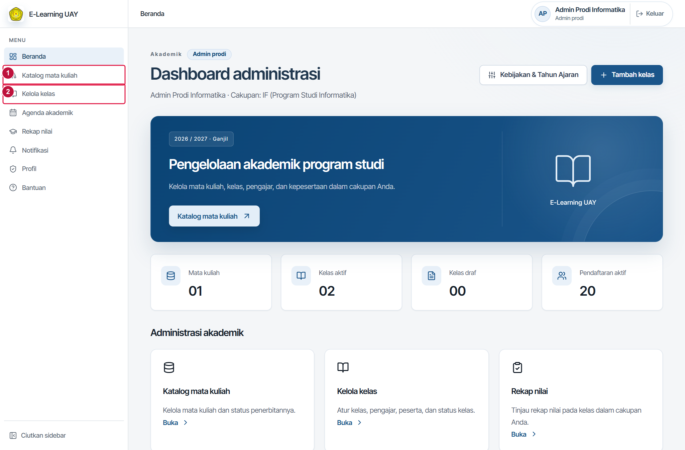

Penanda gambar: 1 Katalog; 2 Kelas

### Input, pilihan, dan tombol

| Kontrol di layar | Nilai atau contoh | Fungsi dan akibat |
| --- | --- | --- |
| Cakupan | Kode/nama prodi yang ditugaskan | Batas data administrasi dan pencarian pengguna yang dapat diakses. |
| Katalog mata kuliah | Menu | Mengelola identitas mata kuliah dan statusnya. |
| Kelola kelas | Menu | Mengelola rombel, periode, pengampu, dan kepesertaan. |
| Rekap nilai | Menu | Meninjau hasil kelas dalam cakupan akun. |

### Catatan penggunaan

Dosen lintas prodi perlu afiliasi/penugasan yang sesuai. Pemilihan pengajar tidak mengganti peran dan cakupan akun SSO.

## A2 — Menambahkan mata kuliah dan rombel

**Peran:** Admin Prodi, Super Admin.

**Tujuan:** Menyiapkan mata kuliah serta kelas sebelum perkuliahan.

**Buka:** Katalog mata kuliah kemudian Tambah mata kuliah, lalu Kelola kelas kemudian Tambah kelas

**Sebelum mulai:** Kode kurikulum, nama mata kuliah, prodi, SKS, semester, dan pengajar sudah diketahui.

### Langkah

1. Klik Tambah mata kuliah. Isi Kode, Kode program studi, Judul, Deskripsi, SKS, dan Status. Simpan.
2. Buka Kelola kelas dan klik Tambah kelas. Pilih Mata kuliah yang baru disiapkan atau yang sudah tersedia.
3. Isi Nama kelas dan Tahun akademik, misalnya Kelas A dan 2026/2027 Ganjil. Pilih Draf selama kelas belum siap.
4. Untuk pendaftaran mandiri, isi Kunci pendaftaran mandiri minimal enam karakter. Biarkan kosong jika peserta akan didaftarkan pengelola.
5. Cari pengampu minimal dua karakter dari nama/NIDN, pilih hasilnya, lalu Simpan semua perubahan. Buka kelas untuk memeriksa pengampu dan metadata.

**Periksa hasil:** Mata kuliah dan rombel tersedia dengan pengampu serta periode yang benar.

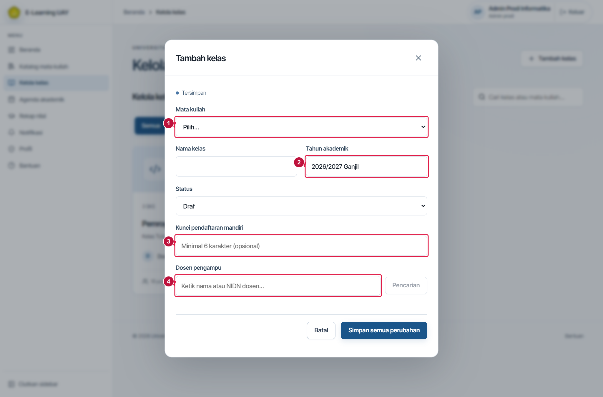

Penanda gambar: 1 Mata kuliah; 2 Tahun; 3 Kunci; 4 Pengampu

### Input, pilihan, dan tombol

| Kontrol di layar | Nilai atau contoh | Fungsi dan akibat |
| --- | --- | --- |
| Kode | Teks wajib, contoh IF2101 | Kode mata kuliah kurikulum. Periksa agar tidak tertukar/duplikat. |
| Kode program studi | Pilihan prodi dalam cakupan | Menempatkan mata kuliah di program studi yang benar. |
| Judul / Deskripsi mata kuliah | Nama dan deskripsi | Identitas kurikulum yang diwarisi kartu kelas. |
| SKS | Bilangan 1 sampai 12, contoh 3 | Beban studi mata kuliah. |
| Mata kuliah pada kelas | Pilihan mata kuliah yang belum diarsipkan | Menghubungkan rombel dengan identitas mata kuliah. |
| Nama kelas | Teks wajib maksimum 200 karakter, contoh Kelas A | Membedakan rombel pada mata kuliah dan periode yang sama. |
| Tahun akademik | Teks/periode yang ditampilkan, contoh 2026/2027 Ganjil | Menentukan semester rombel. |
| Status | Draf atau Terbit untuk kelas baru | Draf untuk persiapan. Terbit memungkinkan akses peserta aktif sesuai publikasi isi. |
| Kunci pendaftaran mandiri | Opsional, minimal 6 karakter, contoh UAY2026 | Mengizinkan mahasiswa bergabung memakai kunci. Jangan bagikan di ruang publik. |
| Dosen pengampu | Cari nama/NIDN minimal 2 karakter dan pilih hasil | Hanya pengguna yang dipilih masuk penugasan. Mengetik nama saja belum menugaskan dosen. |
| Hapus pengampu terpilih | Tombol x pada nama pilihan | Menghapus pilihan pengampu dari draf sebelum Simpan. |

### Catatan penggunaan

Satu mata kuliah dapat memiliki beberapa rombel. Periksa periode dan nama rombel sebelum menambah kelas agar tidak membuat kelas ganda.

## A3 — Mendaftarkan dan mengaktifkan peserta

**Peran:** Admin Prodi, Super Admin, Dosen.

**Tujuan:** Memastikan daftar peserta sesuai kelas semester berjalan.

**Buka:** Kelola kelas kemudian kelas kemudian Peserta

**Sebelum mulai:** Data kepesertaan/KRS sudah disetujui dan identitas mahasiswa tersedia di SSO.

### Langkah

1. Buka kelas yang benar, lalu tab Peserta. Bandingkan daftar dengan peserta yang seharusnya mengikuti kelas.
2. Klik Daftarkan peserta. Isi pencarian nama, NIM, atau email dan klik Pencarian.
3. Centang Pilih pada mahasiswa yang sesuai. Periksa jumlah mahasiswa dipilih, lalu klik Simpan semua perubahan.
4. Untuk mahasiswa yang tidak berpartisipasi lagi, klik Nonaktifkan peserta dan baca konfirmasi. Untuk mengembalikan akses, klik Aktifkan peserta.
5. Periksa daftar akhir, NIM, dan status aktif. Untuk jumlah besar gunakan impor pada A4.

**Periksa hasil:** Peserta aktif sesuai daftar yang disetujui dan aksesnya benar.

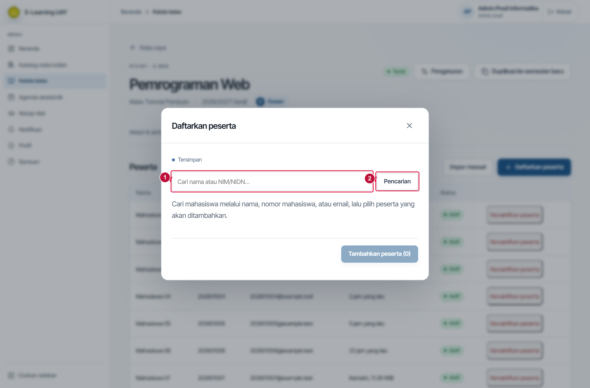

Penanda gambar: 1 Cari; 2 Pencarian

### Input, pilihan, dan tombol

| Kontrol di layar | Nilai atau contoh | Fungsi dan akibat |
| --- | --- | --- |
| Cari nama atau NIM/NIDN | Teks, contoh 202601005 | Mencari akun dalam cakupan akses. |
| Pencarian | Tombol | Menampilkan hasil yang dapat didaftarkan. |
| Pilih | ON = masukkan ke daftar pilihan. OFF = batalkan pilihan | Memilih mahasiswa yang akan diproses ketika Simpan. |
| Simpan semua perubahan | Tombol dialog peserta | Mendaftarkan/mengaktifkan peserta yang dipilih. |
| Nonaktifkan peserta | Tombol pada baris peserta | Menutup hak partisipasi. Riwayat tidak dihapus. |
| Aktifkan peserta | Tombol pada peserta nonaktif | Mengembalikan akses belajar kelas sesuai status kelas. |

### Catatan penggunaan

Periksa NIM, bukan hanya kemiripan nama. Mahasiswa di luar cakupan dapat tidak muncul dalam pencarian.

## A4 — Impor peserta nilai atau bank soal

**Peran:** Admin Prodi, Super Admin, Dosen.

**Tujuan:** Memasukkan banyak data setelah meninjau tiap baris.

**Buka:** Tab Peserta, Rekap nilai, atau Bank soal kemudian Impor massal

**Sebelum mulai:** Siapkan daftar yang disetujui. Gunakan template dari dialog yang sama.

### Langkah

1. Klik Impor massal dan pilih Jenis data. Untuk Nilai kategori pilih kategori tujuan, untuk Bank soal pilih bank tujuan.
2. Klik Unduh template. Isi kolom sesuai template dan simpan .xlsx atau .csv. Simpan NIM sebagai teks agar angka nol di depan tetap utuh.
3. Klik Pilih berkas. Tunggu pratinjau. Baca jumlah Siap impor dan Bermasalah serta isi setiap baris.
4. Perbaiki data yang salah. Centang Abaikan untuk baris yang sengaja tidak dimasukkan. Centang Timpa hanya jika pembaruan data sebelumnya memang disetujui.
5. Untuk koreksi nilai yang membutuhkan alasan, isi Alasan koreksi minimal lima karakter.
6. Klik Impor data siap setelah meninjau. Periksa pesan berhasil dan buka daftar peserta/nilai/bank untuk memastikan hasilnya.

**Periksa hasil:** Baris yang disetujui masuk ke sasaran yang benar dan baris bermasalah telah ditangani.

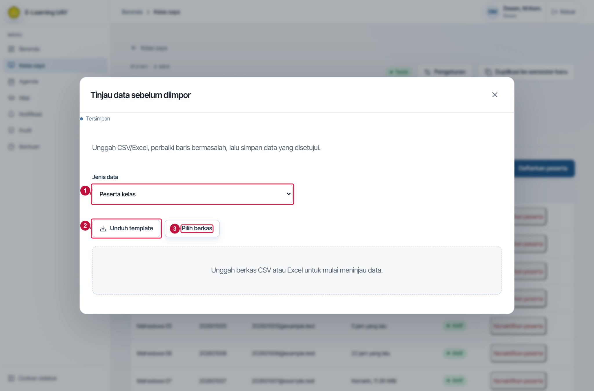

Penanda gambar: 1 Jenis; 2 Template; 3 Berkas

### Input, pilihan, dan tombol

| Kontrol di layar | Nilai atau contoh | Fungsi dan akibat |
| --- | --- | --- |
| Jenis data | Peserta kelas (ENROLLMENT), Nilai kategori (GRADES), Bank soal (QUESTIONS) | Menentukan jenis template dan tujuan impor. |
| Kategori nilai / Bank soal | Pilihan target wajib selain impor peserta | Mengarahkan nilai ke kategori atau soal ke bank yang benar. |
| Unduh template | Tombol menghasilkan .xlsx | Menyediakan nama kolom dan contoh yang sesuai jenis impor. |
| Peserta kelas | Kolom identifierValue, email | Isi NIM/identitas dan email sesuai akun kampus. Contoh latihan 202601001. |
| Nilai kategori | Kolom identifierValue, score | Isi identitas dan skor kategori 0 sampai 100, misalnya 85. |
| Bank soal | Kolom text, type, points, options, answerKey, rubric | Isi tipe kode sesuai template. options/answerKey/rubric menggunakan format JSON dari contoh template. |
| Pilih berkas | CSV/XLSX maksimum 10 MB, 1 sampai 500 baris data | Membaca lembar pertama untuk pratinjau. Baris header wajib, nama kolom jangan digandakan. |
| Abaikan | ON = baris tidak diimpor. OFF = tetap diperiksa | Memilih pengecualian yang disengaja. |
| Timpa | ON = mengizinkan penggantian data sebelumnya. OFF = tidak menimpa | Periksa Data sebelumnya dan Data baru sebelum mengaktifkannya. |
| Alasan koreksi | Minimal 5 karakter bila mengubah nilai yang membutuhkan alasan | Merekam dasar perubahan nilai. |
| Impor data siap | Tombol setelah pratinjau valid | Menjalankan impor baris yang siap dan disetujui. Mengunggah berkas saja belum menjalankan impor. |

### Catatan penggunaan

Dosen dan Super admin yang berhak mengelola kelas menggunakan alur impor yang sama. Jangan mengimpor ke kategori atau bank lain hanya untuk melewati kesalahan.

## A5 — Memantau kelas dan mengatur arsip

**Peran:** Admin Prodi, Super Admin.

**Tujuan:** Meninjau kesiapan kelas dan status akhir perkuliahan.

**Buka:** Kelola kelas kemudian kelas kemudian Pengaturan

**Sebelum mulai:** Periode dan status administrasi kelas sudah disepakati pengelola.

### Langkah

1. Cari kelas semester berjalan dan buka. Periksa pengampu, peserta, Section, dan isi yang sudah dipublikasikan.
2. Buka Presensi/Rekap nilai untuk memantau pencatatan serta penilaian. Gunakan ekspor sesuai kebutuhan: CSV presensi atau Excel nilai.
3. Klik Pengaturan. Periksa Nama kelas, Tahun akademik, Status, dan Kunci pendaftaran mandiri.
4. Pilih Terbit jika kelas siap digunakan. Jika perkuliahan berakhir dan disetujui untuk arsip, pilih Diarsipkan lalu baca dan setujui konfirmasi.
5. Untuk kelas arsip yang perlu dilanjutkan, gunakan Buka kembali kelas dan baca konfirmasi. Periksa kembali jadwal serta penguncian nilai.

**Periksa hasil:** Status kelas sesuai kondisi perkuliahan dan data siap ditinjau.

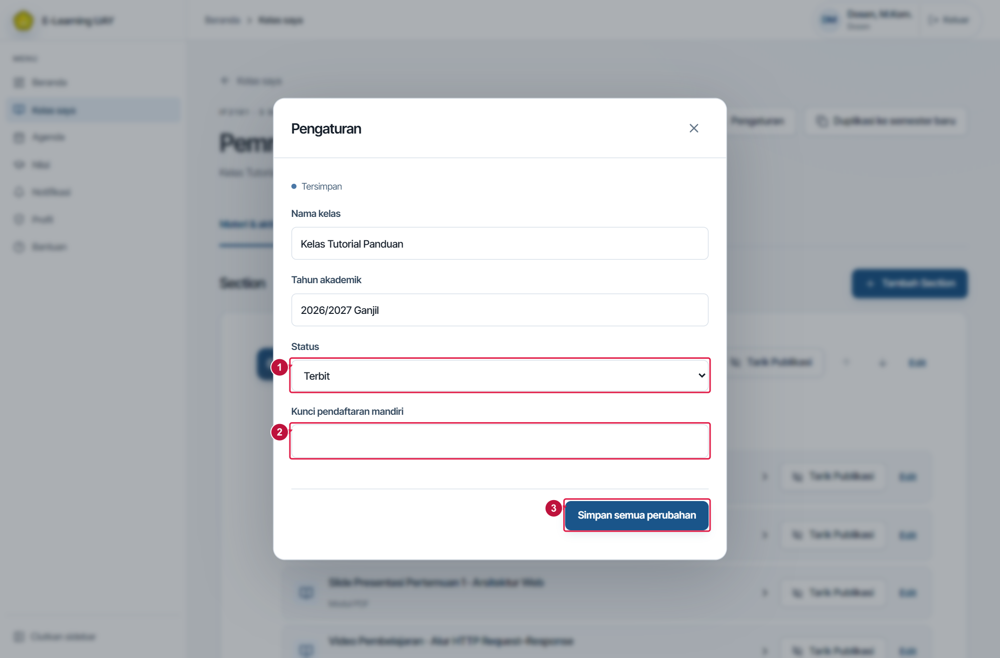

Penanda gambar: 1 Status kelas; 2 Kunci; 3 Simpan

### Input, pilihan, dan tombol

| Kontrol di layar | Nilai atau contoh | Fungsi dan akibat |
| --- | --- | --- |
| Status Draf | Pilihan status | Kelas tahap persiapan. |
| Status Terbit | Pilihan status | Kelas aktif yang dapat diakses peserta aktif sesuai publikasi isi. |
| Status Diarsipkan | Pilihan status dan konfirmasi | Menjadikan aktivitas kelas hanya-baca selama diarsipkan. |
| Kunci pendaftaran mandiri pada Pengaturan | Minimal 6 karakter jika diisi | Mengganti kunci dengan nilai baru. Kolom kosong mempertahankan kunci yang ada pada formulir ini. |
| Buka kembali kelas | Tombol kelas arsip | Mengubah status kembali Terbit setelah konfirmasi. Nilai akhir yang sudah dikunci tidak otomatis dibuka. |
| Ekspor Rekap (CSV) / Ekspor Excel | Tombol di fitur masing-masing | Menghasilkan rekap presensi atau nilai sesuai cakupan kelas. |

### Catatan penggunaan

Arsip kelas dan penguncian nilai akhir adalah dua status berbeda. Periksa keduanya sebelum melanjutkan aktivitas.

## S1 — Meninjau administrasi seluruh program studi

**Peran:** Super Admin.

**Tujuan:** Mengelola universitas dengan cakupan data yang sesuai.

**Buka:** Beranda administrasi kemudian Katalog mata kuliah atau Kelola kelas

**Sebelum mulai:** Masuk sebagai Super admin.

### Langkah

1. Buka Beranda. Periksa label Cakupan Seluruh program studi.
2. Tinjau jumlah mata kuliah, kelas terbit/draf, dan pendaftaran aktif. Klik menu pengelolaan untuk melihat data rinci.
3. Cari kode/nama kelas dan buka kelas yang perlu ditinjau. Periksa prodi, pengampu, dan periode sebelum melakukan perubahan.
4. Gunakan A2 sampai A5 untuk pengelolaan mata kuliah, kelas, peserta, impor, dan arsip sesuai kewenangan Super Admin.
5. Untuk masalah akses pengguna, arahkan perubahan role/afiliasi ke pengelola SSO. Periksa Profil dan jejak audit untuk mendukung penelusuran.

**Periksa hasil:** Pemantauan dan administrasi dilakukan pada prodi/kelas yang dimaksud.

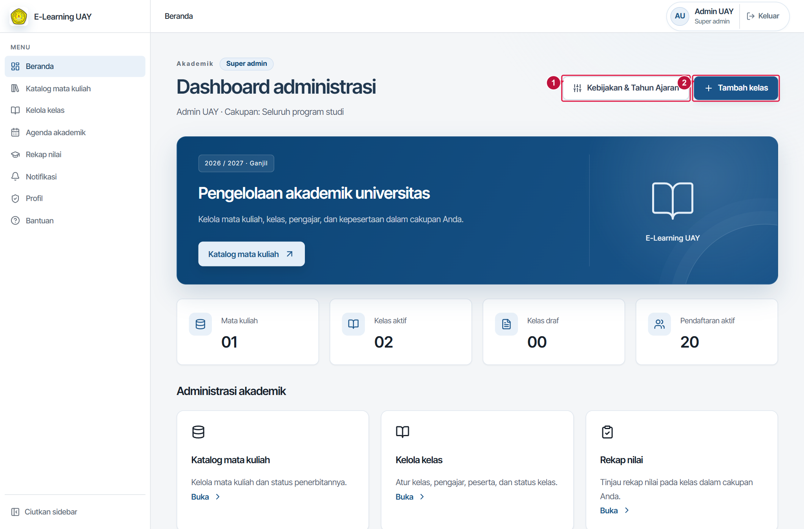

Penanda gambar: 1 Kebijakan; 2 Tambah kelas

### Input, pilihan, dan tombol

| Kontrol di layar | Nilai atau contoh | Fungsi dan akibat |
| --- | --- | --- |
| Cakupan Seluruh program studi | Status cakupan akun | Super admin dapat meninjau data lintas prodi. |
| Katalog mata kuliah / Kelola kelas | Menu administrasi | Mengakses kurikulum dan rombel seluruh universitas sesuai hak Super admin. |
| Rekap nilai / Agenda akademik | Menu | Meninjau hasil dan jadwal yang tersedia. |
| Jejak audit kelas | Tab pada kelas | Membaca aktivitas dan perubahan data untuk penelusuran. |

### Catatan penggunaan

Pimpinan menggunakan role dan cakupan yang diberikan kampus. Versi ini tidak menyediakan role Pimpinan terpisah dengan kewenangan tersendiri.

## S2 — Mengatur tahun ajaran dan banner semester

**Peran:** Super Admin.

**Tujuan:** Menetapkan periode aktif dan pilihan semester untuk administrasi.

**Buka:** Beranda kemudian Kebijakan & Tahun Ajaran kemudian Tahun Ajaran & Semester

**Sebelum mulai:** Daftar periode akademik dan semester aktif sudah ditetapkan kampus.

### Langkah

1. Klik Kebijakan & Tahun Ajaran pada Beranda. Dialog Pengaturan & Tata Kelola Akademik terbuka. Pilih Tahun Ajaran & Semester.
2. Pilih Tahun Akademik Aktif. Periksa Label Banner Portal Landing yang ikut diperbarui, lalu sesuaikan dengan label semester yang disepakati.
3. Untuk periode baru, ketik contoh 2027/2028 Ganjil pada Tambah tahun ajaran, lalu klik + Tambah Semester.
4. Periksa daftar semester. Gunakan x pada semester tidak aktif jika perlu menghapusnya dari pilihan. Jangan hapus pilihan yang masih dibutuhkan.
5. Klik Simpan Perubahan Kebijakan. Buka kembali pengaturan dan halaman publik untuk memeriksa periode serta banner.

**Periksa hasil:** Semester aktif, daftar pilihan, dan banner sesuai periode kampus.

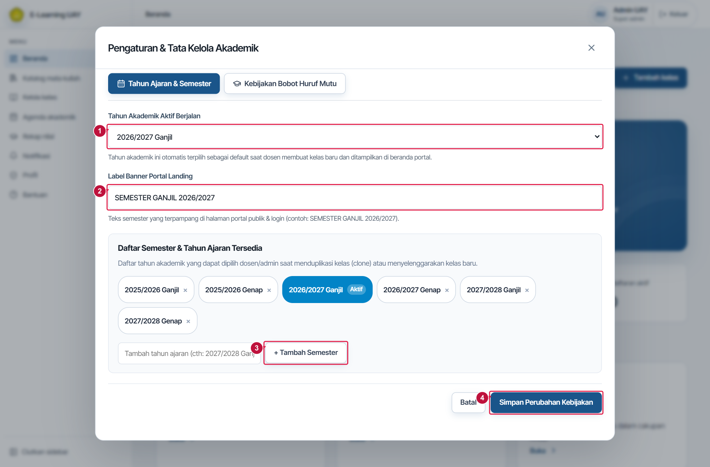

Penanda gambar: 1 Semester aktif; 2 Label; 3 Tambah; 4 Simpan

### Input, pilihan, dan tombol

| Kontrol di layar | Nilai atau contoh | Fungsi dan akibat |
| --- | --- | --- |
| Tahun Akademik Aktif Berjalan | Pilihan periode, contoh 2026/2027 Ganjil | Menjadi acuan periode aktif administrasi. |
| Label Banner Portal Landing | Teks wajib, contoh SEMESTER GANJIL 2026/2027 | Teks semester pada halaman publik. Mengubah label tidak memindahkan data kelas lama. |
| Tambah tahun ajaran | Teks periode baru, contoh 2027/2028 Ganjil | Menyiapkan pilihan baru sebelum ditambahkan. |
| + Tambah Semester | Tombol | Menambahkan periode ke draf daftar, tidak langsung menyimpan ke server. |
| x Hapus semester dari daftar | Tombol pada semester yang tidak aktif | Menghapus dari daftar pilihan. Setidaknya satu periode harus tetap tersedia. |
| Simpan Perubahan Kebijakan | Tombol | Menyimpan perubahan semester, banner, dan pengaturan akademik dalam dialog. |

### Catatan penggunaan

Mengganti semester aktif tidak mendaftarkan ulang peserta atau menerbitkan kelas semester baru. Siapkan rombel dan kepesertaan dengan A2/A3.

## S3 — Menetapkan kebijakan skala nilai dan ambang hadir

**Peran:** Super Admin.

**Tujuan:** Menetapkan acuan perhitungan untuk periode yang berlaku.

**Buka:** Pengaturan & Tata Kelola Akademik kemudian Kebijakan Bobot Huruf Mutu

**Sebelum mulai:** Versi kebijakan dan ambang kehadiran sudah disetujui kampus.

### Langkah

1. Buka tab Kebijakan Bobot Huruf Mutu. Pilih Kebijakan Konversi Huruf Mutu Aktif.
2. Baca tabel konversi versi yang dipilih. Pastikan batas skor dan indeks mutu sesuai keputusan akademik.
3. Isi Ambang Batas Kehadiran Mengikuti Ujian (%), misalnya 75. Rentang isian 50 sampai 100.
4. Klik Simpan Perubahan Kebijakan. Buka lagi untuk memastikan pengaturan tersimpan.
5. Minta pengampu meninjau versi skala pada Bobot penilaian kelas sebelum penerbitan nilai. Periksa rekap kehadiran sebelum menggunakan hasil kelayakan sebagai dasar keputusan.

**Periksa hasil:** Versi kebijakan dan ambang yang diisikan tersimpan.

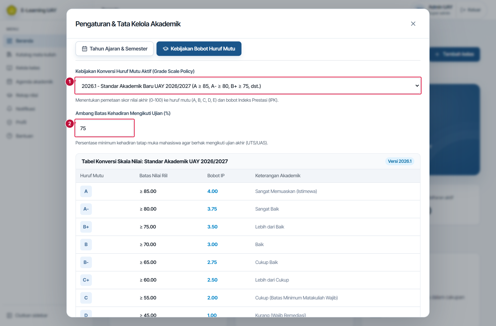

Penanda gambar: 1 Versi; 2 Ambang

### Input, pilihan, dan tombol

| Kontrol di layar | Nilai atau contoh | Fungsi dan akibat |
| --- | --- | --- |
| Kebijakan Konversi Huruf Mutu Aktif | 2026.1 atau 2024.1 | Menentukan acuan default konversi nilai. Kelas juga menyimpan versi skalanya. |
| Ambang Batas Kehadiran Mengikuti Ujian (%) | Bilangan 50 sampai 100, default 75 | Menyimpan kebijakan ambang kehadiran universitas. |
| Tabel Konversi Skala Nilai | Tabel baca saja | Menampilkan batas skor, huruf, dan indeks versi terpilih. |
| Simpan Perubahan Kebijakan | Tombol | Menerapkan pilihan kebijakan dalam pengaturan sistem. |

### Catatan penggunaan

Nilai historis yang sudah diterbitkan/dikunci mempertahankan kebijakannya. Mengubah default tidak menulis ulang nilai historis.

Perubahan ambang tersimpan langsung dipakai pada perhitungan dan label rekap presensi. Perubahan skala default berlaku pada kelas baru dan hasil duplikasi; nilai akhir yang sudah diterbitkan tidak dihitung ulang.

## R1 — Membuka pemantauan akademik

**Peran:** Rektor, Super Admin.

**Tujuan:** Melihat kondisi akademik universitas melalui satu akun kampus.

**Buka:** Pemantauan Akademik

**Sebelum mulai:** Akun Rektor atau Super Admin telah masuk. Pilih semester dan periode yang hendak dibaca.

### Langkah

1. Masuk dengan akun kampus yang memiliki peran Rektor. Pada demo, pilih akun Rektor pada pemilih akun.
2. Buka menu Pemantauan Akademik. Halaman Ringkasan menampilkan dosen beraktivitas, pekerjaan belum dinilai, dan nilai yang sudah dibagikan.
3. Baca Data terakhir sebagai waktu kondisi data. Waktu Dimuat menunjukkan kapan halaman mengambil data; pemeriksaan dilakukan setiap lima menit.
4. Periksa label Demo — data simulasi. Label ini berarti angka merupakan contoh, bukan hasil kegiatan kampus.

**Periksa hasil:** Laporan dan rincian yang tampil mengikuti filter; tidak ada perubahan pada data akademik.

### Input, pilihan, dan tombol

| Kontrol di layar | Nilai atau contoh | Fungsi dan akibat |
| --- | --- | --- |
| Pemantauan Akademik | Menu utama rektor | Membuka laporan tanpa mengubah kelas atau nilai. |
| Bantuan | Buka buku panduan (tab baru) | Membuka panduan yang mengikuti peran akun. |

### Catatan penggunaan

Akun rektor hanya melihat laporan. Akun ini tidak mengubah materi, peserta, tugas, atau nilai.

Angka pada demo bersifat simulasi. Pada lingkungan terhubung, laporan berasal dari data e-learning.

## R2 — Memilih periode dan membaca ringkasan

**Peran:** Rektor, Super Admin.

**Tujuan:** Membandingkan kegiatan dalam periode dengan kondisi kelas saat data terakhir diperbarui.

**Buka:** Pemantauan Akademik

**Sebelum mulai:** Akun Rektor atau Super Admin telah masuk. Pilih semester dan periode yang hendak dibaca.

### Langkah

1. Pilih Ubah filter, lalu tentukan semester, tanggal awal dan akhir, program studi, dosen, atau kelas.
2. Gunakan periode yang sama saat membandingkan laporan. Pilihan filter tersimpan pada alamat halaman.
3. Lihat jumlah dosen beraktivitas dan rekap program studi. Klik Lihat dosen & kelas untuk menelusuri rinciannya.
4. Baca pekerjaan belum dinilai dan nilai sudah dibagikan sebagai kondisi kelas pada Data terakhir, bukan tambahan kegiatan pada setiap muat ulang.

**Periksa hasil:** Laporan dan rincian yang tampil mengikuti filter; tidak ada perubahan pada data akademik.

### Input, pilihan, dan tombol

| Kontrol di layar | Nilai atau contoh | Fungsi dan akibat |
| --- | --- | --- |
| Ubah filter | Semester, periode, prodi, dosen, kelas | Membatasi laporan dan unduhan dengan pilihan yang sama. |
| Reset filter | Pilihan awal laporan | Mengembalikan cakupan laporan. |

### Catatan penggunaan

Masuk akun, membuka kelas, dan kegiatan akademik adalah tiga hal berbeda. Membuka kelas saja belum membuktikan pelaksanaan perkuliahan.

Jika belum ada pekerjaan yang menjadi dasar persentase, tampilan menyebut Belum ada data. Tidak ada skor atau peringkat kinerja otomatis.

## R3 — Menelusuri dosen dan kelas

**Peran:** Rektor, Super Admin.

**Tujuan:** Mengetahui kegiatan yang dilakukan dosen serta pekerjaan penilaian pada kelasnya.

**Buka:** Pemantauan Akademik

**Sebelum mulai:** Akun Rektor atau Super Admin telah masuk. Pilih semester dan periode yang hendak dibaca.

### Langkah

1. Buka Dosen & kelas. Cari nama dosen atau persempit pilihan program studi.
2. Pilih nama dosen untuk membaca kegiatan, kelas yang diampu, dan kontribusinya pada setiap kelas.
3. Buka kelas untuk memeriksa pertemuan, materi, tugas, kuis, dan perkembangan penilaian.
4. Pisahkan pekerjaan belum dinilai, nilai draf, nilai yang sudah dibagikan, dan riwayat koreksi. Perhatikan umur antrean yang ditampilkan.

**Periksa hasil:** Laporan dan rincian yang tampil mengikuti filter; tidak ada perubahan pada data akademik.

### Input, pilihan, dan tombol

| Kontrol di layar | Nilai atau contoh | Fungsi dan akibat |
| --- | --- | --- |
| Nama dosen | Dosen yang dipilih | Membuka rincian kegiatan pelaku tersebut. |
| Nama kelas | Kelas yang dipilih | Membuka kondisi kelas dan pekerjaan penilaian. |

### Catatan penggunaan

Pada kelas dengan beberapa pengampu, kegiatan dicatat atas nama pelakunya. Antrean penilaian adalah pekerjaan kelas dan tidak dijumlahkan berulang untuk setiap pengampu.

Penilaian otomatis kuis dibedakan dari penilaian manual dosen. Kiriman tugas yang sudah digantikan tidak dihitung kembali sebagai pekerjaan menunggu penilaian.

Identitas mahasiswa, nilai individual, jawaban, dan isi umpan balik mahasiswa tidak ditampilkan dalam laporan rektor.

## R4 — Membaca riwayat kegiatan dan rentang masuk

**Peran:** Rektor, Super Admin.

**Tujuan:** Menelusuri urutan kegiatan serta waktu masuk dan keluar yang tercatat.

**Buka:** Pemantauan Akademik

**Sebelum mulai:** Akun Rektor atau Super Admin telah masuk. Pilih semester dan periode yang hendak dibaca.

### Langkah

1. Buka Riwayat kegiatan atau riwayat pada rincian dosen. Pilih dosen dan tanggal yang ingin dilihat.
2. Baca grafik harian dari 00.00 sampai 24.00 sesuai zona waktu perangkat. Kegiatan malam dan sesi yang melewati tengah malam tetap ditampilkan.
3. Perhatikan rentang masuk sampai keluar yang tercatat. Jika waktu keluar tidak tercatat, gunakan keterangan tersebut; jangan menganggap sesi berlangsung hingga saat ini.
4. Pilih baris kegiatan untuk melihat waktu, tindakan, objek, kelas, dan pelakunya. Pisahkan kegiatan dosen, administrator, serta proses otomatis.

**Periksa hasil:** Laporan dan rincian yang tampil mengikuti filter; tidak ada perubahan pada data akademik.

### Input, pilihan, dan tombol

| Kontrol di layar | Nilai atau contoh | Fungsi dan akibat |
| --- | --- | --- |
| Grafik harian | 00.00–24.00, waktu lokal | Memperlihatkan kapan sesi dan kegiatan tercatat pada hari tersebut. |
| Riwayat kegiatan | Baris kegiatan dan rentang waktunya | Membantu menelusuri urutan tindakan tanpa mengubah data. |

### Catatan penggunaan

Rentang masuk bukan durasi bekerja atau durasi mengajar. Waktu pengerjaan yang ditampilkan hanya berasal dari awal dan akhir tindakan yang tercatat.

Lima perubahan pada satu materi adalah lima tindakan pada satu materi. Memperbarui halaman tidak menciptakan kegiatan baru.

Laporan ini belum menyediakan presensi, forum diskusi, atau kehadiran telekonferensi.

## R5 — Mengunduh laporan dan memahami kendala

**Peran:** Rektor, Super Admin.

**Tujuan:** Menyimpan laporan sesuai pilihan filter dan menangani pemuatan yang gagal.

**Buka:** Pemantauan Akademik

**Sebelum mulai:** Akun Rektor atau Super Admin telah masuk. Pilih semester dan periode yang hendak dibaca.

### Langkah

1. Tentukan filter sebelum mengunduh. Dari Ringkasan, daftar dosen, atau rincian yang dibuka, pilih Unduh tabel atau Unduh laporan.
2. Unduh tabel menghasilkan CSV berisi seluruh baris yang cocok, termasuk baris pada halaman tabel lainnya.
3. Unduh laporan menghasilkan PDF dengan ringkasan atau rincian halaman, filter, cara membaca indikator, waktu data, dan label demo bila digunakan.
4. Jika data gagal dimuat, gunakan Coba lagi. Jika sesi masuk berakhir, masuk kembali melalui akun kampus. Untuk meminta perubahan peran, hubungi pengelola akun kampus.

**Periksa hasil:** Laporan dan rincian yang tampil mengikuti filter; tidak ada perubahan pada data akademik.

### Input, pilihan, dan tombol

| Kontrol di layar | Nilai atau contoh | Fungsi dan akibat |
| --- | --- | --- |
| Unduh tabel | CSV | Menyimpan seluruh baris yang cocok dengan filter. |
| Unduh laporan | PDF | Menyimpan laporan dari tampilan yang sedang dibuka. |
| Coba lagi | Saat pemuatan gagal | Mengambil ulang data tanpa mengubah aktivitas akademik. |

### Catatan penggunaan

Tanggal dan jam pada layar serta laporan mengikuti zona waktu perangkat; periksa label zona atau offset yang tercetak.

Laporan adalah alat pertimbangan rektor. Angka kegiatan tidak menjadi penilaian otomatis atas kualitas pembelajaran.

## Konversi nilai

Gunakan versi skala pada kelas. Total bobot kategori harus 100 persen. Mengubah skala default tidak menghitung ulang nilai akhir yang telah diterbitkan.

### Skala 2026.1

| Skor minimum | Huruf mutu | Indeks mutu |
| --- | --- | --- |
| ≥ 85 | A | 4,00 |
| ≥ 80 | A- | 3,75 |
| ≥ 75 | B+ | 3,50 |
| ≥ 70 | B | 3,00 |
| ≥ 65 | B- | 2,75 |
| ≥ 60 | C+ | 2,50 |
| ≥ 55 | C | 2,00 |
| ≥ 45 | D | 1,00 |
| ≥ 0 | E | 0,00 |

### Skala 2024.1

| Skor minimum | Huruf mutu | Indeks mutu |
| --- | --- | --- |
| ≥ 80 | A | 4,00 |
| ≥ 70 | B | 3,00 |
| ≥ 60 | C | 2,00 |
| ≥ 50 | D | 1,00 |
| ≥ 0 | E | 0,00 |

## Solusi kendala

### Kelas saya kosong

**Peran:** Super Admin, Admin Prodi, Dosen, Mahasiswa.

Periksa semester, role, afiliasi, penugasan dosen, dan status peserta. Minta admin prodi memeriksa kepesertaan/penugasan.

### Materi sudah terbit tetapi mahasiswa belum melihatnya

**Peran:** Super Admin, Admin Prodi, Dosen.

Periksa status kelas Terbit, Section terbit, materi terbit, jadwal akses, dan peserta aktif.

### Kode presensi ditolak

**Peran:** Mahasiswa.

Salin enam karakter yang saat ini ditampilkan pengajar tanpa spasi. Kode dapat berisi huruf. Periksa apakah sesi sudah ditutup atau kode diganti.

### Sesi presensi terjadwal belum dibuka

**Peran:** Super Admin, Admin Prodi, Dosen, Mahasiswa.

Periksa tanggal dan jam lokal, waktu mulai, dan sesi yang dipilih. Muat ulang tab Presensi ketika waktu mulai tercapai.

### Unggahan berhasil tetapi tugas tidak muncul dalam riwayat

**Peran:** Mahasiswa.

Unggah file dahulu lalu klik Kumpulkan tugas. Periksa pesan berhasil dan Riwayat pengumpulan, bukan hanya nama file unggahan.

### Tombol Kumpulkan tugas tidak aktif

**Peran:** Mahasiswa.

Periksa jadwal buka, tenggat, izin terlambat, batas toleransi, jumlah versi, kelas arsip, dan nilai akhir terkunci.

### Jawaban kuis belum tersimpan

**Peran:** Mahasiswa.

Periksa koneksi dan pesan penyimpanan jawaban. Server hanya dapat mengumpulkan jawaban yang telah diterimanya.

### Nilai kuis atau tugas belum terlihat

**Peran:** Mahasiswa.

Penilaian mungkin belum selesai atau hasil belum dipublikasikan. Periksa Riwayat dan tanyakan kepada pengajar.

### Publikasikan nilai akhir tidak aktif

**Peran:** Super Admin, Admin Prodi, Dosen.

Periksa bobot total 100, perubahan sudah disimpan, semua penilaian selesai, dan persetujuan nilai kosong jika diperlukan.

### Bobot penilaian tidak dapat diubah

**Peran:** Super Admin, Admin Prodi, Dosen.

Nilai akhir mungkin sudah dikunci atau kelas diarsipkan. Periksa status sebelum mengubah rancangan penilaian.

### Impor bermasalah

**Peran:** Super Admin, Admin Prodi, Dosen.

Gunakan template yang sama, NIM sebagai teks, nama kolom benar, skor valid, target kategori/bank dipilih, dan tinjau opsi Timpa/Abaikan.

### Halaman gagal ditampilkan

**Peran:** Super Admin, Admin Prodi, Dosen, Mahasiswa, Rektor.

Klik Muat ulang bagian ini atau buka kembali halaman. Bila tetap gagal, catat pesan dan Nomor permintaan jika ada untuk bantuan prodi.

### Jam pada perangkat berbeda

**Peran:** Super Admin, Admin Prodi, Dosen, Mahasiswa, Rektor.

Sesuaikan zona waktu perangkat. Seluruh tanggal-jam mengikuti zona perangkat dan menampilkan offset sebenarnya. Jadwal tetap mengacu pada timestamp UTC yang sama.

### Draf hilang saat pindah perangkat

**Peran:** Super Admin, Admin Prodi, Dosen, Mahasiswa.

Draf lokal tersimpan pada browser asal. Simpan ke server sebelum berpindah perangkat. Jangan menganggap autosave lokal sebagai pengumpulan/publikasi.
