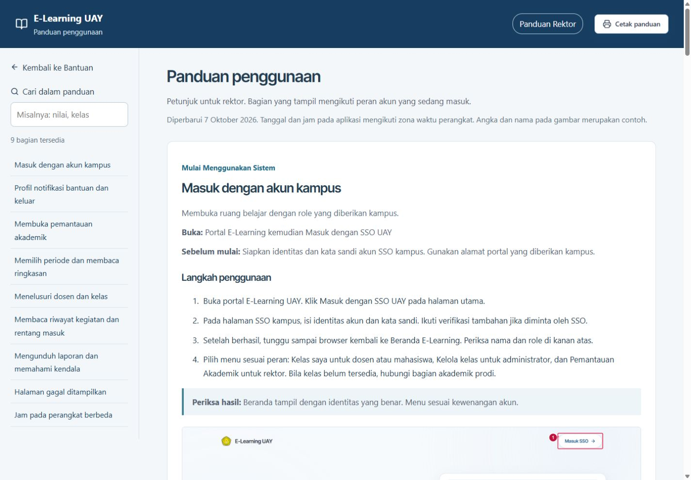
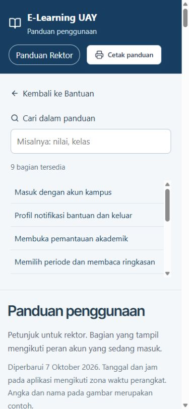

# Verifikasi pembaruan panduan 7 Oktober 2026

Panduan aplikasi, buku, dan slide menggunakan edisi yang sama. Menu Bantuan tersedia untuk Mahasiswa, Dosen, Admin Prodi, Super Admin, dan Rektor. Tautan **Buka buku panduan (tab baru)** membuka `/Panduan/panduan.html`, dengan isi mengikuti peran pada sesi akun. Panduan HTML memakai langkah bernomor tanpa checklist atau kotak centang. Formulir pengujian pada portal QA tetap menyediakan pencatatan hasil manual.

## Hasil otomatis

Run `4495667d-8122-4711-9503-59e421408cc5` pada working copy mencatat 354 kasus dalam katalog: 163 lulus, 0 gagal, 0 terblokir, dan 191 belum diuji otomatis. Suite domain dan integrasi selesai dengan exit code 0, masing-masing mencatat 138 dan 119 hasil assertion. Angka assertion bukan jumlah kasus katalog.

Pengujian panduan mencakup lima peran, peran tidak dikenal, parameter `role` pada URL, tautan tab baru, dan ketiadaan kotak centang pada halaman HTML. Kasus REC tambahan mencakup akses rektor, filter, sumber data, penilaian, rentang sesi, waktu lokal, privasi, serta ekspor. Rincian pemetaan tersedia pada [katalog](catalog.json) dan [hasil otomatis](AUTOMATED-RESULTS.md).

`npm run build`, `npm run qa:build`, `npm run qa:test`, dan `npm run docs:guide:check` berhasil. Build menghasilkan halaman utama dan entri `Panduan/panduan.html`.

## Pemeriksaan melalui browser lokal

Tautan di Bantuan akun rektor membuka tab baru dan mempertahankan tab aplikasi. Panduan rektor memuat 9 bagian; pencarian menyaring bagian yang relevan. Tampilan diperiksa pada lebar 1440 dan 390 piksel, tanpa luapan horizontal halaman maupun kotak centang.

Sesudah logout, pemuatan ulang tab panduan meminta pengguna masuk kembali. Setelah masuk sebagai mahasiswa, panduan berubah menjadi 20 bagian mahasiswa. Parameter `?role=SUPER_ADMIN` tetap menampilkan panduan mahasiswa dan tidak menambahkan bagian administrator atau rektor. Pengujian ini tidak mengklaim verifikasi pergantian sesi otomatis hanya melalui perpindahan fokus tab.

## Pemeriksaan bahan panduan

Buku Word dirender menjadi PDF 80 halaman. Seluruh halaman diperiksa sebagai gambar: teks, tabel, tangkapan layar, nomor halaman, serta pergantian bagian. PPT berisi 28 slide; seluruh slide dirender dan diperiksa. Validasi struktur PPT selesai tanpa temuan. Pemeriksaan tersebut menggunakan hasil render, bukan membuka berkas melalui Microsoft Word atau PowerPoint.

Materi mencakup akses satu pintu, rektor hanya membaca laporan, perbedaan kegiatan dalam periode dan kondisi data terakhir, grafik harian 24 jam, rentang masuk/keluar yang tercatat, waktu lokal perangkat, kontribusi pengampu, penilaian manual dan otomatis, kiriman pengganti, serta CSV/PDF. Sumber presensi, forum, dan telekonferensi belum tersedia dalam laporan rektor; fitur presensi pada e-learning tetap dijelaskan bagi dosen dan mahasiswa.

## Batas pemeriksaan

191 kasus katalog yang belum diuji otomatis tetap memerlukan bukti manual sesuai cakupannya. Pemeriksaan lokal tidak membuktikan integrasi SSO atau File Service kampus, penerapan pada VPS, maupun perilaku cetak HTML melalui dialog cetak browser. Buku dan slide untuk dibagikan memuat seluruh peran; pembatasan isi sesuai sesi berlaku pada panduan HTML di aplikasi.
