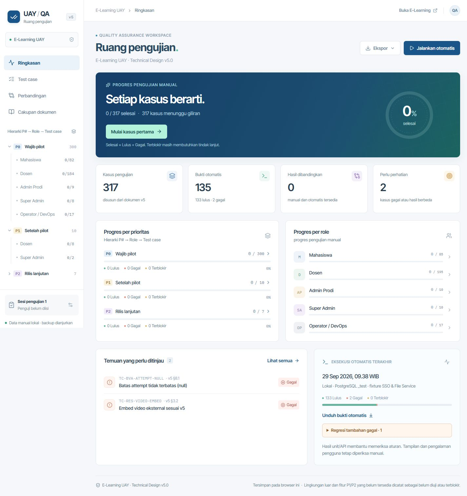

# Verifikasi portal QA

Tanggal: 29 September 2026. Website lokal: `http://127.0.0.1:5174/`.

| Pemeriksaan | Hasil |
| --- | --- |
| `npm run qa:build` | Lulus: katalog, TypeScript dan bundle Vite. |
| `npm run qa:test` | 8/8 lulus: struktur/coverage katalog, perbandingan, ringkasan, backup, CSV, URL dan pencatatan React. |
| Desktop 1440 × 1000 | Dashboard, progres P#/role, temuan dan hasil terbaru tampil; tidak ada overflow mendatar halaman. |
| Ponsel 390 × 844 | Menu hierarki membuka P1 → Dosen dan menampilkan 8 kasus. Detail kasus menjadi satu kolom. Halaman tetap selebar 375 px area konten; tabel 780 px bergulir di dalam wadah 337 px. |
| Hasil manual sementara | Catatan, status dan centang tersimpan setelah reload. Manual Lulus + otomatis Gagal menampilkan Berbeda. Data percobaan kemudian dikosongkan dan status dikembalikan ke Belum diuji; progres awal tetap 0/317. |
| Runner dari tombol | Berhasil memulai suite dan memperbarui laporan sampai fase `complete`. Pembacaan laporan dibuffer agar stream statis tidak mengunci pergantian file pada Windows. |
| Bukti terbaru | Run `d78f9c3a-9a7d-4c9a-b161-79b98cf45b4a`: 133 lulus, 2 gagal, 0 terblokir, 182 belum diuji otomatis; satu regresi tambahan dashboard tercatat. |
| Keterlacakan hasil | SHA-256 katalog sama dengan laporan; 135 kasus memiliki event assertion terminal tertentu. |
| Isi CSV | Unit test memverifikasi langkah, escaping kutip/newline, BOM dan perlindungan formula. |
| Unduhan CSV di browser aplikasi | Tombol dipicu, menu tertutup dan tidak ada error JavaScript. Event unduhan tidak diterima dalam 10 detik; penyimpanan file dari browser aplikasi belum terkonfirmasi. Bila unduhan tidak muncul, buka alamat portal di browser biasa. |

Verifikasi portal berbeda dengan penerimaan E-Learning. Pengujian otomatis memakai PostgreSQL `_test` dan fixture lokal; layanan SSO/File Service kampus, VPS, Redis produksi dan performa pilot membutuhkan pengujian di lingkungan terkait. Lihat [temuan produk](FINDINGS.md) dan [hasil otomatis lengkap](AUTOMATED-RESULTS.md).
